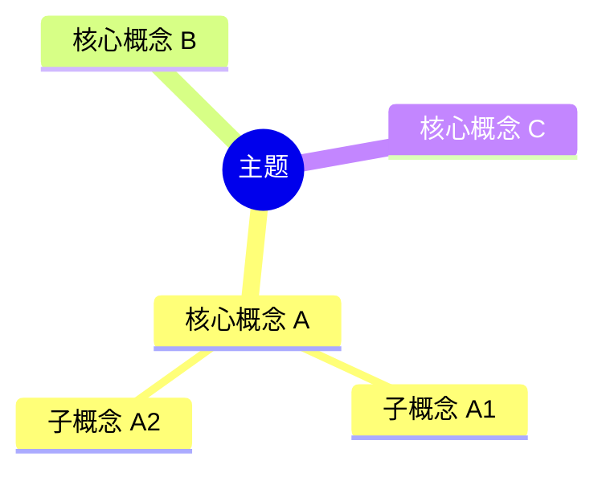

# Knowledge Article Generator

这个 skill 用于在用户要求“针对某个内容生成知识文档”时，按照固定的教学型结构输出，确保内容适合学习、复习和后续沉淀。

## 何时触发

在以下场景优先触发：

- 用户要求“生成知识文档”“整理成文档”“写一篇教程”“输出学习资料”
- 用户希望围绕某个概念、技术、工具、协议、框架生成系统化说明
- 用户明确希望内容不是零散回答，而是可保存、可复习、可长期阅读的知识文档
- 用户要求“给我一个完整结构”“从入门到实践讲清楚”“顺便给案例和 demo”

在以下场景不要强行触发：

- 用户只要一句话定义或一个简短结论
- 用户只是问单个报错怎么解决，不需要沉淀成文档
- 用户已经指定完全不同的文档结构

## 输出目标

生成的内容必须适合“先建立全局认知，再逐步深入，再落到实操”。

除非用户明确要求其他格式，否则默认使用下面 6 个固定部分，且顺序不要变。

另外，这个 skill 不只负责“生成内容”，还负责“落到文件”：

- 生成知识时，默认要创建一个主题文件夹
- 在该文件夹内创建一个 Markdown 文档
- 把生成的知识内容完整写入文档
- 如果目标文件夹已经存在，则直接在该文件夹内生成文件，不重复创建目录

## 文件落盘规则

### 默认行为

当用户要求生成知识文档时，默认执行以下动作：

1. 根据主题确定一个目录名
2. 在合适的位置创建该目录
3. 在目录中创建一个 Markdown 文件
4. 将知识内容写入该文件

也就是说，最终结果不应只是聊天窗口里的内容，还应有实际文档文件。

### 文件夹命名建议

目录名优先按主题语义命名，要求：

- 简洁
- 可读
- 适合作为长期知识目录
- 优先使用英文、小写、中划线风格，除非项目已有其他命名习惯

例如：

- `k8s`
- `kubernetes`
- `react-state-management`
- `typescript-generics`
- `mcp`

### 文件名规则

默认文件名优先使用：

- `knowledge.md`

如果用户明确要求其他文件名，再按用户要求处理。

如果目录中已经存在 `knowledge.md`，处理优先级如下：

1. 如果用户表达像“生成一篇知识文档”“输出成文档”，默认覆盖或重写 `knowledge.md`
2. 如果用户表达像“补充”“追加”“继续完善”，则在现有 `knowledge.md` 基础上更新
3. 如果用户明确要求保留旧版本，则创建新文件，例如：
   - `knowledge-v2.md`
   - `<topic>.md`

### 文件夹已存在时

如果目录已存在：

- 不要报错
- 不要重复创建同名目录
- 直接在该目录内创建或更新 Markdown 文件

### 保存位置选择

优先级如下：

1. 如果用户明确给了目标路径，严格使用该路径
2. 如果项目内已经存在相关主题目录，优先复用该目录
3. 如果没有现成目录，则在当前项目下创建与主题对应的新目录

### 输出给用户时的要求

完成生成后，要同时告诉用户：

- 文档生成到了哪里
- 文件路径是什么
- 如果创建了新目录，也说明目录名

## 固定文档结构

### 1. 知识点简介

目标：

- 用尽量白话的方式说明“这是什么”
- 说明它大概解决什么问题
- 说明它通常会在什么场景下出现

要求：

- 先讲直觉，再讲术语
- 控制在用户能快速建立第一印象的长度
- 不要一开始堆太多定义

推荐小标题：

- `## 1. 知识点简介`

### 2. 脑图

目标：

- 先给用户一张“知识地图”
- 帮用户理解这个主题下面有哪些核心分支
- 让用户先有整体感，再进入细节

要求：

- 用 `mermaid` 脑图格式输出
- 脑图内容要体现主题、子主题、关键概念
- 结构清晰，不要过深，一般控制在 2 到 4 层

推荐小标题：

- `## 2. 脑图`

推荐格式示例：



### 3. 相关知识点的关系

目标：

- 解释这些知识点之间如何关联
- 说明先学什么、后学什么
- 说明哪些概念是并列关系、依赖关系、包含关系、对比关系

要求：

- 不要只列名词，要解释关系
- 尽量从“学习路径”和“工程关系”两个角度解释
- 如果有容易混淆的点，要点出来

推荐小标题：

- `## 3. 相关知识点的关系`

可以优先使用这些关系词：

- `前置依赖`
- `并列概念`
- `包含关系`
- `实现关系`
- `对比关系`
- `常见混淆点`

### 4. 详细介绍每个知识点

目标：

- 对脑图里的核心知识点逐个展开
- 让用户从“知道名字”进入“真正理解”

要求：

- 每个知识点尽量使用统一结构
- 优先按“它是什么 -> 解决什么问题 -> 怎么用/怎么理解 -> 注意事项”展开
- 如果主题偏技术，可以加入最小代码片段或命令示例
- 如果知识点很多，优先讲最关键的，不要平均用力

推荐小标题：

- `## 4. 详细介绍每个知识点`

推荐子结构：

- `### 4.1 <知识点名>`
- `它是什么`
- `它解决什么问题`
- `核心机制 / 核心用法`
- `注意事项`

### 5. 实际案例讲解

目标：

- 用一个具体场景把前面的抽象知识串起来
- 让用户知道这些概念在真实任务中是怎么协作的

要求：

- 案例要尽量贴近主题本身
- 先说业务/任务背景，再讲每一步发生了什么
- 明确指出案例里对应了哪些知识点
- 如果合适，补充输入、处理过程、输出结果

推荐小标题：

- `## 5. 实际案例讲解`

推荐案例结构：

- `场景背景`
- `目标`
- `步骤拆解`
- `案例里对应的知识点`
- `最终结果`

### 6. Demo 指导

目标：

- 让用户不是“看懂”，而是“亲手做一遍”
- 给出一套能走通流程的最小实践

要求：

- 步骤要具体，可执行
- 如果是技术主题，要尽量给目录、命令、代码骨架、验证方式
- 如果不是代码主题，也要给出可操作的练习步骤
- 最后必须告诉用户如何判断自己做通了

推荐小标题：

- `## 6. Demo 指导`

推荐子结构：

- `前置准备`
- `第 1 步`
- `第 2 步`
- `第 3 步`
- `验证方式`
- `你完成后应该看到什么`

## 写作风格要求

- 默认面向初学者到进阶初学者
- 语言清晰、白话、结构化
- 先建立整体，再展开细节
- 少讲空洞定义，多讲“为什么会有它”“你怎么用它”
- 如果主题是编程/工程相关，优先给最小可运行示例
- 如果用户没有要求深入实现细节，不要一开始讲得过深

## 输出模板

默认按下面格式生成：

```markdown
# <主题名>

## 1. 知识点简介

<简介内容>

## 2. 脑图


## 3. 相关知识点的关系

<关系说明>

## 4. 详细介绍每个知识点

### 4.1 <知识点 1>
<详细说明>

### 4.2 <知识点 2>
<详细说明>

## 5. 实际案例讲解

<案例内容>

## 6. Demo 指导

<一步步操作指导>
```

## 生成时的工作流程

### 第一步：识别主题范围

先判断用户给的主题属于哪一类：

- 概念型：如 `MCP`、`Promise`、`Docker`
- 工具型：如 `Vite`、`Webpack`、`Git`
- 框架型：如 `React`、`Vue`
- 工程实践型：如 `前后端联调`、`CI/CD`

然后决定文档深度：

- 用户只给大主题时，先覆盖核心主干
- 用户给很窄的话题时，聚焦该子主题，不要盲目扩写

### 第二步：先搭骨架再填充

先在脑中确定：

- 这个主题最重要的 3 到 7 个核心知识点是什么
- 它们之间的关系是什么
- 最适合用什么案例来串联
- 最适合给什么 demo 来练手

### 第三步：保证案例和 demo 贴题

不要写泛泛案例。

例如：

- 用户要 `MCP`，案例就应该是“客户端调用 MCP Server 完成一次工具调用”
- 用户要 `React 状态管理`，案例就应该是“一个页面如何共享和更新状态”

### 第四步：确保 demo 可落地

demo 不能只是“你可以试试看”，而应该尽量变成：

- 建什么目录
- 写什么文件
- 跑什么命令
- 预期看到什么结果

### 第五步：把内容写入文档

在完成内容生成后，必须继续完成文件落盘：

- 确定目录名
- 检查目录是否存在
- 不存在则创建
- 存在则直接复用
- 在目录内创建或更新 `knowledge.md`

如果用户没有指定路径，不要停留在“只输出正文”，而要主动保存成文档。

## 质量检查清单

生成完成前，检查以下几点：

- 是否已经创建目录并写入 Markdown 文件
- 是否包含 6 个固定部分
- 脑图是否真的体现了核心知识结构
- 第 3 部分是否明确说明了知识点之间的关系
- 第 4 部分是否逐个展开了关键知识点
- 第 5 部分是否有真实场景案例
- 第 6 部分是否给了可执行 demo
- 用户读完后是否既能建立认知，又能动手实践

## 特殊情况处理

### 用户要求非常简短

仍然保持 6 段结构，但每段压缩长度。

### 用户要求非常深入

仍然保持 6 段结构，但在第 4、5、6 部分展开更细。

### 用户已经指定结构

如果用户明确给了新的结构，以用户要求为准；否则坚持本 skill 的默认结构。

### 用户只说“帮我生成某个知识”

默认理解为：

- 既要生成内容
- 也要创建目录和 Markdown 文件
- 文件夹存在则复用
- 文件默认写入 `knowledge.md`

## 示例触发语句

以下用户表达通常应触发本 skill：

- `帮我针对 MCP 生成一篇知识文档`
- `把 React 状态管理整理成知识文档`
- `给我写一篇关于 Docker 的学习材料`
- `围绕 TypeScript 泛型生成一个教程，最好带案例和 demo`
