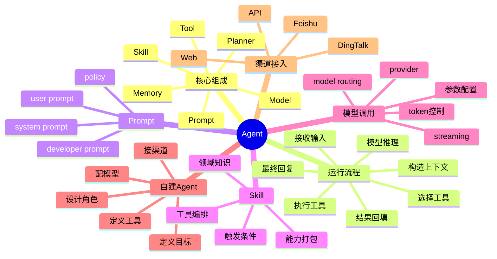

# Agent 知识文档

## 1. 知识点简介

Agent 可以先理解成“会思考、会选择、会调用外部能力的大模型应用”。

普通聊天模型通常只做一件事：根据上下文生成下一段文本。

而 Agent 会在这个基础上多做几层工作：

- 理解用户目标，而不是只回答一句话
- 根据系统 prompt、角色设定和约束决定自己应该扮演什么角色
- 根据 skill / tool 的描述决定要不要调用外部能力
- 根据执行结果继续思考，直到任务完成或无法继续
- 最后再把过程整理成适合用户看的结果

所以你可以把 Agent 理解成：

> Agent = 大模型 + 角色设定 + 规划逻辑 + 工具/技能 + 记忆/上下文 + 执行循环

它典型出现的场景有这些：

- AI 编程助手
- 企业知识问答助手
- 数据分析助手
- 工单或客服机器人
- 接在钉钉、飞书、Slack、Web 页面里的业务机器人

如果再说得更直白一点：

- `prompt` 决定它“像谁、按什么规则说话”
- `skill / tool` 决定它“能做什么”
- `model` 决定它“推理和生成能力怎么样”
- `agent runtime` 决定它“怎么把这些东西串起来”

## 2. 脑图



## 3. 相关知识点的关系

`前置依赖`

- `Model` 是 Agent 的推理核心，没有模型，Agent 只是配置壳子。
- `Prompt` 是模型的操作说明书，没有 prompt，模型就不知道自己应该扮演什么角色。

`包含关系`

- `Agent` 通常包含 `prompt`、`memory`、`tool/skill`、`model`、`runtime`、`channel adapter` 这些部分。
- `Skill` 往往不是单纯一个函数，而是一组“触发条件 + 领域知识 + 工具调用规则 + 输出格式”的组合。

`实现关系`

- `Prompt` 负责定义行为边界。
- `Model` 负责推理、决策、总结。
- `Tool` 负责实际执行。
- `Skill` 负责把某类任务包装成可复用能力。
- `Runtime` 负责调度循环，例如“思考 -> 调工具 -> 读结果 -> 再思考”。

`并列概念`

- `Tool` 和 `Skill` 很接近，但不完全一样。Tool 更像单个函数；Skill 更像可复用工作模式。
- `Prompt Engineering` 和 `Agent Design` 也不是一回事。前者更关注提示词，后者更关注系统整体协作。

`对比关系`

- 普通 ChatBot：主要是“输入一句，输出一句”。
- Agent：主要是“理解目标、规划步骤、调用能力、整合结果”。

`常见混淆点`

- 很多人把 `prompt` 当成 agent 本体。其实 prompt 只是 agent 的一层。
- 很多人把 `tool` 和 `skill` 混为一谈。可以简单记成：tool 更细，skill 更粗。
- 很多人以为 agent 会直接调用模型。实际上中间通常还隔着 `model provider`、`router`、`policy`、`token 控制`、`上下文压缩` 等层。
- 很多人以为接入钉钉或飞书后机器人就“智能了”。其实聊天平台只是入口，智能仍然来自后端 agent 系统。

建议按这个顺序理解：

1. 先理解 Agent 比普通聊天模型多了什么
2. 再理解 Prompt、Skill、Tool、Model 各自负责什么
3. 再理解一次完整调用链路
4. 最后再动手做一个最小 Agent

## 4. 详细介绍每个知识点

### 4.1 Agent 的基本原理

它是什么

- Agent 是围绕目标执行的 LLM 应用。
- 它不是单次文本生成，而是“带状态、带规则、带外部能力”的执行体。

它解决什么问题

- 让大模型不只是会回答，还会查数据、调工具、执行流程
- 让同一个模型在不同角色下复用
- 让 AI 能接进真实业务系统

核心机制 / 核心用法

最常见的 Agent 执行循环可以画成这样：

```text
用户输入
-> runtime 收到请求
-> 拼装 system prompt / memory / 历史消息 / tools
-> 调用模型
-> 模型决定直接回答，或者选择 skill / tool
-> runtime 执行 skill / tool
-> 把执行结果回填到上下文
-> 再次调用模型
-> 输出最终答案
```

再进一步，可以把它理解成两层：

- 推理层：由模型负责理解、判断、总结
- 执行层：由 runtime、tool、skill、外部 API 负责执行

注意事项

- Agent 不等于“模型自己会做事”，它是“模型 + 外部执行系统”的组合
- Agent 的稳定性通常取决于 prompt、tool schema、错误处理，而不只是模型本身

### 4.2 Prompt 的原理

它是什么

- Prompt 是模型执行任务时看到的指令集合。
- 在工程系统里，prompt 一般分层，而不是只有用户那一句话。

它解决什么问题

- 规定角色、边界、语气、目标
- 约束模型不要乱做事
- 告诉模型什么时候该调用工具，什么时候直接回答

核心机制 / 核心用法

常见分层如下：

```text
system prompt
  定义身份、规则、输出边界
developer prompt
  定义产品策略、流程、风格、业务限制
user prompt
  用户当前问题
tool result
  工具返回结果
history
  历史对话
```

其中最重要的是 `system prompt`，因为它决定了 agent 的“人格”和“权限边界”。

一个最小 system prompt 长这样：

```text
你是一个企业知识助手。
你的目标是准确回答用户问题。
如果问题涉及知识库以外内容，先调用 search_docs。
如果调用失败，明确告知失败原因，不要编造。
输出要简洁、结构化。
```

注意事项

- prompt 不是越长越好，关键是边界清晰
- 把高风险规则写进 system prompt，通常比只写在前端说明里更可靠
- prompt 不能代替权限控制，真正危险的动作仍要靠服务端约束

### 4.3 Skill 和 Tool 的原理

它是什么

- `Tool` 更像函数，例如 `search_docs(keyword)`、`query_order(order_id)`。
- `Skill` 更像一个能力包，例如“代码审查”“报表查询”“知识文档生成”。

它解决什么问题

- Tool 解决“具体动作怎么做”
- Skill 解决“某类任务怎么复用”

核心机制 / 核心用法

一个 tool 通常有这几部分：

- 名称
- 描述
- 参数 schema
- 执行逻辑
- 返回结果

一个 skill 通常额外再有这些内容：

- 触发条件
- 任务边界
- 领域说明
- 推荐流程
- 可能调用哪些 tool

可以这样记忆：

```text
tool = 可执行函数
skill = 可复用工作流模板
```

在很多工程系统里，skill 的真实作用不是“替代工具”，而是：

- 限定某类任务的最佳实践
- 提前写好 prompt 补充内容
- 把复杂任务拆成更稳定的流程

比如“知识文档生成”这个 skill，通常会告诉 agent：

- 什么时候触发
- 文档应该用什么固定结构
- 最终必须落盘
- 输出给用户时要包含路径

注意事项

- tool 名称和描述非常关键，模型能不能调对，很大程度取决于 schema 设计
- skill 不宜过泛，否则会变成“什么都能做，什么都做不好”

### 4.4 Agent 调用 Skill / Tool 的原理

它是什么

- 这是 Agent 最核心的执行链路。

它解决什么问题

- 让模型从“只会说”变成“会调用外部能力”

核心机制 / 核心用法

最常见流程如下：

```text
1. runtime 把当前可用 tools / skills 描述给模型
2. 模型根据用户问题和描述，判断是否需要调用
3. 如果需要，模型返回结构化调用意图
4. runtime 验证参数、权限、上下文
5. runtime 执行具体 tool / skill
6. runtime 把结果作为新的上下文喂回模型
7. 模型基于结果继续生成最终答复
```

以“查订单状态”为例：

```text
用户：帮我查订单 A123
模型：识别到需要 tool get_order_status
runtime：执行 get_order_status({ orderId: "A123" })
tool：调用业务 API 返回 paid
runtime：把结果回填给模型
模型：输出“订单 A123 当前状态为已支付”
```

这个过程里，真正执行的是 runtime，不是模型自己直接去请求接口。

注意事项

- 运行时必须做参数校验，不能无条件执行模型给出的调用参数
- 高风险动作要做人类确认或白名单限制
- tool 返回值尽量稳定，方便模型继续消费

### 4.5 Agent 调用具体模型的原理

它是什么

- 这是“agent 为什么能连到 Claude、Gemini、OpenAI、DeepSeek、Qwen 等模型”的关键层。

它解决什么问题

- 让同一套 agent 配置可以切到不同模型
- 让系统按任务路由不同模型
- 让平台统一管理 API Key、限流、超时和成本

核心机制 / 核心用法

一般会分成四层：

```text
Agent
-> Model Router
-> Provider Adapter
-> 具体模型 API
-> 返回结果
```

各层职责：

- `Agent`：声明自己想用哪个模型或模型策略
- `Model Router`：决定实际选哪个模型
- `Provider Adapter`：把统一调用格式转换成不同厂商接口格式
- `具体模型 API`：真正完成推理

一个典型配置思路大概是：

```json
{
  "models": {
    "providers": {
      "anthropic": {
        "baseUrl": "https://example-anthropic-proxy",
        "api": "anthropic-messages",
        "models": [
          {
            "id": "claude-sonnet",
            "contextWindow": 128000
          }
        ]
      },
      "openai": {
        "baseUrl": "https://example-openai-proxy",
        "api": "openai-responses",
        "models": [
          {
            "id": "gpt-4.1"
          }
        ]
      }
    }
  },
  "agents": {
    "defaults": {
      "model": {
        "primary": "anthropic/claude-sonnet"
      }
    }
  }
}
```

运行时发生的事大概是：

```text
agent 发现自己默认模型是 anthropic/claude-sonnet
-> router 找到 anthropic provider
-> adapter 按 anthropic 的消息协议组包
-> 发请求到 provider/baseUrl
-> 拿到结果
-> 再决定是否继续工具循环
```

注意事项

- “Agent 选模型”和“模型真的被调用”之间通常隔着一层 provider/router
- 多模型系统里，建议区分主模型、低成本模型、embedding 模型、rerank 模型
- 不同模型对 tool calling、长上下文、视觉能力、推理稳定性的支持不一样

### 4.6 Memory、Session 和上下文压缩

它是什么

- 这是 Agent 能保持多轮会话和长期任务状态的基础。

它解决什么问题

- 保持上下文连续
- 让用户不用每轮都重新解释背景
- 避免 token 爆炸

核心机制 / 核心用法

常见做法有三种：

- 短期记忆：当前会话历史
- 长期记忆：用户画像、偏好、业务记录
- 压缩摘要：把过长历史总结成摘要再继续喂给模型

实际运行里，经常是：

```text
历史消息太长
-> runtime 做截断或摘要
-> 保留 system prompt 和关键状态
-> 把压缩结果拼进下一次模型调用
```

注意事项

- 记忆越多不一定越好，错误记忆会污染后续回答
- 长期记忆要区分“事实数据”和“临时推断”

### 4.7 Channel Adapter：为什么 Agent 能接到钉钉或飞书里

它是什么

- 渠道层负责把聊天平台消息转成 agent 请求，再把 agent 结果回发到聊天平台。

它解决什么问题

- 让同一个 agent 不只在 Web 页面里使用，还能在企业 IM 里使用

核心机制 / 核心用法

本质上是一个适配层：

```text
钉钉 / 飞书 / Slack / Web
-> channel adapter
-> agent runtime
-> model / skill / tool
-> channel adapter
-> 回消息给平台
```

所以聊天平台本身通常不负责“推理”，它负责：

- 收消息
- 鉴权
- 回调
- 推消息
- 维护 conversationId / chatId / userId

注意事项

- 平台渠道只是输入输出层，不是 agent 核心
- 接入 IM 后要处理会话隔离、@机器人规则、重试、幂等和限流

## 5. 实际案例讲解

场景背景

- 你想做一个“团队知识助手”
- 这个助手既能回答文档问题，也能查简单业务数据
- 最后你希望它接到钉钉或飞书群里用

目标

- 定义一个自己的 agent
- 给它 prompt
- 给它两个 tool
- 让它跑在一个后端服务里
- 再让钉钉或飞书把消息转发给它

步骤拆解

第一步，定义 Agent 身份。

```text
你是团队知识助手。
优先回答项目文档相关问题。
如果问题涉及业务订单，调用 query_order。
如果问题涉及知识库，调用 search_docs。
不确定时明确说明，不要编造。
```

第二步，定义 tools。

- `search_docs(keyword)`：搜索知识文档
- `query_order(orderId)`：查询订单状态

第三步，配置模型。

- 主模型使用一个通用聊天模型，例如 Claude / Gemini / GPT / Qwen 中任意一个
- 如果任务只是简单重写或摘要，也可以切低成本模型

第四步，跑 agent runtime。

它要负责：

- 接收请求
- 构造 prompt 和 tools
- 调模型
- 执行 tools
- 回填结果
- 输出最终回答

第五步，接钉钉或飞书。

消息流转如下：

```text
用户在群里 @机器人
-> 平台把消息发给你的 webhook
-> 你的 webhook 服务提取 text / user / conversation
-> 转成 agent 请求
-> agent 返回文本
-> webhook 服务把文本再发回群里
```

案例里对应的知识点

- `Prompt`：决定助手角色和边界
- `Tool`：负责查文档、查订单
- `Model`：负责理解问题并决定是否调工具
- `Runtime`：负责整个循环
- `Channel Adapter`：负责钉钉/飞书消息转发

最终结果

- 用户看到的是一个群机器人
- 但后端真正工作的，是你定义的 agent runtime

## 6. Demo 指导

前置准备

- Node.js 18+ 或 20+
- 一个可用的大模型 API Key
- 一个最小 HTTP 服务
- 如果要接钉钉或飞书，准备一个可访问的 webhook 服务地址

第 1 步：定义一个最小 Agent 配置

可以先新建一个 `demo-agent.json`，内容如下：

```json
{
  "id": "team-helper",
  "name": "团队知识助手",
  "description": "回答项目知识、查询简单订单信息",
  "model": {
    "primary": "anthropic/claude-sonnet"
  },
  "systemPrompt": [
    "你是团队知识助手。",
    "优先回答项目知识库问题。",
    "涉及订单状态时调用 query_order。",
    "不知道就明确说不知道，不要编造。"
  ],
  "tools": [
    "search_docs",
    "query_order"
  ]
}
```

这份配置表达了三件事：

- 这个 agent 是谁
- 它默认用哪个模型
- 它能调用哪些工具

第 2 步：写一个最小 runtime demo

下面用 Node.js 写一个极简版本，只展示核心链路。

```js
import express from "express";

const app = express();
app.use(express.json());

const tools = {
  async search_docs({ keyword }) {
    const docs = [
      "agent 是由模型、prompt、tool、memory、runtime 组成的系统",
      "skill 更像可复用工作流，tool 更像函数",
    ];
    return docs.filter((item) => item.includes(keyword)).join("\n") || "未找到相关文档";
  },

  async query_order({ orderId }) {
    const mock = {
      A123: "已支付",
      B456: "已发货",
    };
    return mock[orderId] || "订单不存在";
  },
};

function buildMessages(userText) {
  return [
    {
      role: "system",
      content:
        "你是团队知识助手。涉及订单状态时调用 query_order；涉及知识说明时调用 search_docs；不确定不要编造。",
    },
    {
      role: "user",
      content: userText,
    },
  ];
}

async function callModel(messages) {
  // 这里用伪代码表示，真实项目里替换成 OpenAI / Anthropic / Gemini SDK 调用
  const userText = messages[messages.length - 1].content;

  if (userText.includes("订单")) {
    return {
      type: "tool_call",
      name: "query_order",
      arguments: { orderId: "A123" },
    };
  }

  if (userText.includes("agent") || userText.includes("skill")) {
    return {
      type: "tool_call",
      name: "search_docs",
      arguments: { keyword: "agent" },
    };
  }

  return {
    type: "final",
    content: "这是一个无需调用工具的直接回答。",
  };
}

app.post("/agent/chat", async (req, res) => {
  const userText = req.body.text || "";
  const messages = buildMessages(userText);
  const decision = await callModel(messages);

  if (decision.type === "tool_call") {
    const toolResult = await tools[decision.name](decision.arguments);
    return res.json({
      ok: true,
      mode: "tool",
      tool: decision.name,
      result: toolResult,
      answer: `我调用了 ${decision.name}，结果如下：\n${toolResult}`,
    });
  }

  return res.json({
    ok: true,
    mode: "final",
    answer: decision.content,
  });
});

app.listen(3000, () => {
  console.log("agent demo listening on http://localhost:3000");
});
```

这段 demo 没有接真实模型，但它把 Agent 最核心的结构表达出来了：

```text
prompt -> model decision -> tool call -> result -> final answer
```

第 3 步：替换成真实模型调用

如果你接 OpenAI 风格接口，最小思路如下：

```js
import OpenAI from "openai";

const client = new OpenAI({
  apiKey: process.env.OPENAI_API_KEY,
  baseURL: process.env.OPENAI_BASE_URL,
});

async function callRealModel(messages) {
  const resp = await client.chat.completions.create({
    model: "gpt-4.1",
    messages,
    temperature: 0.2,
  });

  return resp.choices[0].message.content;
}
```

如果你接 Anthropic 风格接口，本质也一样，只是 SDK 和请求格式不同。

关键点不是 SDK 名字，而是这条链路：

```text
agent runtime
-> provider adapter
-> model api
-> 返回文本或 tool call
```

第 4 步：自己创建的 Agent 如何使用

最简单有三种方式：

- 方式一：直接 HTTP 调用
- 方式二：接 Web 页面
- 方式三：接企业 IM 机器人

HTTP 方式最容易验证：

```bash
curl -X POST http://localhost:3000/agent/chat \
  -H "Content-Type: application/json" \
  -d '{"text":"请解释一下 agent 和 skill 的区别"}'
```

如果你看到返回：

```json
{
  "ok": true,
  "mode": "tool",
  "tool": "search_docs",
  "answer": "我调用了 search_docs，结果如下：..."
}
```

说明最小 agent 已经打通。

第 5 步：接入钉钉机器人

你可以分成两种思路：

- 简单通知型：用群机器人 webhook 发消息
- 可对话型：让钉钉把用户消息回调给你的服务，再由服务调用 agent

最推荐先做可控的最小链路：

```text
钉钉消息回调
-> 你的 webhook 服务
-> /agent/chat
-> 拿到 answer
-> 调钉钉 webhook 发回群里
```

发送消息的最小示例：

```js
async function sendToDingTalk(webhook, content) {
  await fetch(webhook, {
    method: "POST",
    headers: { "Content-Type": "application/json" },
    body: JSON.stringify({
      msgtype: "text",
      text: {
        content,
      },
    }),
  });
}
```

落地步骤：

1. 在钉钉里创建或添加机器人
2. 拿到 webhook 或消息回调地址
3. 你的服务收到钉钉消息后，提取文本
4. 文本转发给 agent
5. 把 agent 的 answer 再发回钉钉

需要特别注意：

- 钉钉群机器人常见是 webhook 推送型
- 真正要做“收消息再回复”，还要配置消息接收或机器人应用能力
- 要处理签名校验、幂等、@提及规则和群聊限流

第 6 步：接入飞书机器人

飞书也可以按两类思路理解：

- 自定义机器人：适合群消息推送
- 应用机器人：适合更完整的收发消息和事件订阅

如果你只是先把 agent 结果发到群里，最小方式是 webhook 推送：

```js
async function sendToFeishu(webhook, content) {
  await fetch(webhook, {
    method: "POST",
    headers: { "Content-Type": "application/json" },
    body: JSON.stringify({
      msg_type: "text",
      content: {
        text: content,
      },
    }),
  });
}
```

如果你想让飞书用户真正“问机器人一句，机器人回一句”，建议走应用机器人模式：

```text
飞书事件订阅 / WebSocket
-> 你的 bot 服务
-> agent runtime
-> 飞书 send message API
```

落地步骤：

1. 在飞书开放平台创建应用机器人
2. 开启消息接收与发送权限
3. 配置事件订阅或 WebSocket
4. 收到消息后转成 agent 请求
5. 再调用飞书发消息接口把 answer 回给用户或群

第 7 步：生产化时要补哪些东西

- 会话隔离：按用户、群、会话维度存 session
- 权限控制：不同角色可用的 tool 不同
- 记忆管理：长会话做摘要压缩
- 审计日志：记录谁触发了什么 tool
- 限流重试：避免机器人平台重复推送造成雪崩
- 安全控制：高风险 tool 必须人工确认

验证方式

建议按下面顺序验证：

```text
先验证本地 /agent/chat
-> 再验证真实模型调用
-> 再验证 tool call
-> 再验证钉钉或飞书 webhook 推送
-> 最后验证双向对话
```

你完成后应该看到什么

- 本地接口能稳定返回 agent answer
- 遇到特定问题时，agent 会触发对应 tool
- 接到钉钉或飞书后，群里能收到 agent 返回内容
- 会话能按用户或群做隔离

***

## 一句话总结

Agent 不是“一个更长的 prompt”，而是一个把 `prompt`、`model`、`skill/tool`、`memory`、`runtime`、`channel` 串起来的执行系统。你要自己创建一个 agent，最小闭环就是：定义角色 -> 配模型 -> 注册工具 -> 写 runtime -> 暴露 HTTP -> 接钉钉或飞书。

## 补充 FAQ

### 1. Agent 的本质到底是什么

先说结论：

> Agent 的本质不是某一种编程语言，也不是某一个固定框架，而是一种“基于大模型进行感知、决策、调用外部能力并完成任务”的软件系统。

可以把它拆成两层看。

第一层，是 `产品/能力层`：

- 它要能接收用户目标
- 它要能理解当前上下文
- 它要能决定下一步做什么
- 它要能调用工具、技能、API、文件系统、浏览器、数据库等外部能力
- 它要能把中间结果整理成最终答复

第二层，是 `工程实现层`：

- 它最终一定要落成一个软件程序
- 这个程序可以用 Node.js 写
- 也可以用 Python、Go、Java、Rust 写
- 甚至可以是“前端 + 后端 + worker + 模型网关”共同组成的一套系统

所以更准确地说：

- `Agent 不是 Node.js 本身`
- `Agent 可以由 Node.js 程序实现`
- `Agent 也可以不是单个程序，而是一组协作进程`

比如下面几种都可以叫 agent：

- 一个 Node.js 写的本地 coding agent
- 一个 Python 写的工单处理 agent
- 一个运行在服务器上的多 worker agent 平台
- 一个接在钉钉里的知识问答机器人

也就是说，`Node.js / Python` 只是实现手段，不是 agent 的本质。

### 2. Agent 和普通程序有什么区别

普通程序通常是：

```text
固定输入
-> 固定逻辑
-> 固定输出
```

Agent 更像：

```text
输入目标
-> 模型理解问题
-> 动态决定要不要规划
-> 动态决定调哪个工具
-> 读取结果
-> 再决定下一步
-> 最终输出
```

也就是：

- 普通程序更偏“写死流程”
- Agent 更偏“模型参与决策的流程”

所以 Agent 的本质，更接近：

> 一个由 LLM 参与控制流决策的软件执行体

### 3. Agent 一定要会调用工具才算 Agent 吗

不一定，但绝大多数“有工程价值”的 agent 都会有外部能力。

如果一个系统只是：

- 套了一个 system prompt
- 接一句用户输入
- 直接返回一句模型输出

那它更像是：

- 一个带角色设定的聊天机器人
- 或者一个 prompt app

只有当它开始具备下面这些特征时，才更像完整 agent：

- 会规划步骤
- 会调用 tool / skill
- 会根据结果调整后续动作
- 有 session / memory / 状态管理
- 能嵌入业务系统

### 4. Claude Code 是 Agent 吗

可以说：`是，而且是很典型的 coding agent 产品`。

但要注意，它不是“只有一个 prompt 的聊天框”。

它的本质更像：

```text
Claude 大模型
+ 本地运行时
+ 文件系统操作能力
+ 命令执行能力
+ 代码编辑能力
+ 上下文管理
+ 权限与确认机制
+ 工具调度逻辑
```

从用户视角看，你在和一个“会写代码的 AI”聊天。

从工程视角看，它其实是一套：

- 以大模型为决策核心
- 以本地工具链为执行层
- 以终端/IDE 为交互入口

的 agent 系统。

所以 Claude Code 不是“模型本身”，而是“模型驱动的 Agent 产品”。

### 5. Codex 是 Agent 吗

要分语境。

如果你说的是早期大家常说的 `OpenAI Codex 模型`，那它本质上首先是：

- 一个偏代码能力的模型

它更像“发动机”，不等于完整 agent。

如果你说的是后来围绕代码任务构建出来的 `Codex 类产品 / coding assistant`，那它通常会同时具备：

- 代码理解
- 文件编辑
- 命令执行
- 多轮任务处理
- 工具调用

这时候它就会越来越像 agent。

所以最准确的说法是：

- `Codex 这个名字本身，既可能指模型，也可能指产品形态`
- `模型版 Codex 不等于 agent`
- `产品版 Codex / coding assistant，如果具备规划和工具执行能力，就属于 agent`

### 6. Claude Code、Codex、Cursor 这些东西的本质到底是什么

可以统一理解成：

> 基于大模型的“任务执行型软件”，其中比较强的一类就是 Agent。

它们通常至少包含这几层：

```text
交互层
  CLI / IDE / Web / 聊天入口

Agent Runtime
  prompt 管理
  上下文拼装
  session 管理
  工具调度
  权限控制

Tool Layer
  文件系统
  shell
  git
  搜索
  浏览器
  业务 API

Model Layer
  Claude / GPT / Gemini / Qwen / DeepSeek

Provider Layer
  Anthropic / OpenAI / 自建网关 / Proxy
```

所以它们的本质不是“某个神奇模型突然变聪明了”，而是：

- 模型负责理解和决策
- runtime 负责执行循环
- tools 负责真正做事
- UI 负责和人交互

### 7. 为什么大家会觉得 Claude Code 这类产品“像人”

因为它具备了几个很像人的表象：

- 会先理解目标
- 会自己拆步骤
- 会先看文件再改代码
- 会执行命令后再判断
- 会根据结果继续下一步

但底层并不是“真的有自主意识”，而是：

- 模型根据 prompt 和上下文生成下一步动作
- runtime 按规则把动作翻译成工具调用
- 工具执行后把结果再反馈给模型

所以它更像“被很好工程化包装起来的推理与执行循环”。

### 8. 一个最短结论怎么记

你可以直接记这几句：

- `Agent 的本质是模型参与决策的软件系统`
- `Agent 不是某一种语言，它可以用 Node.js、Python 等任意语言实现`
- `Claude Code 是典型的 coding agent 产品`
- `Codex 如果指模型，本身不等于 agent；如果指具备工具执行能力的 coding 产品，则可以视为 agent`

### 9. Claude Code、Cursor、Codex、OpenHands 怎么区分

先给一个便于记忆的版本：

- `Claude Code`：偏终端和工程执行的 coding agent
- `Cursor`：偏 IDE 内协作的 AI 编程产品
- `Codex`：既可能指代码模型，也可能被泛指代码 AI 能力
- `OpenHands`：偏自主执行、多步任务的开源 agent 框架/产品

如果从“它们到底像什么”这个角度看，可以先看这张表。

| 对象 | 更像什么 | 是否算 Agent | 核心特点 | 更适合什么场景 |
| --- | --- | --- | --- | --- |
| Claude Code | 终端里的 coding agent | 是 | 强调命令执行、读写文件、代码修改、任务推进 | 本地开发、排障、重构、自动修代码 |
| Cursor | 带 agent 能力的 AI IDE | 算，但更偏产品平台 | 强调编辑器内补全、问答、改代码、项目上下文协作 | 日常编码、边写边问、IDE 内协作 |
| Codex（模型语境） | 代码大模型 | 否，首先是模型 | 强项是代码生成和理解 | 作为底层模型能力被集成 |
| Codex（产品语境） | 代码助手/执行体 | 视能力而定 | 如果有工具调用、文件编辑、命令执行，就越来越像 agent | 代码生成、自动修改、任务执行 |
| OpenHands | 开源 coding agent 系统 | 是 | 强调多步执行、工具调用、偏自主完成开发任务 | 自主修 bug、跑命令、处理仓库任务 |

再换一种更工程化的理解方式：

`Claude Code` 和 `OpenHands` 更像“直接干活的执行型 agent”。

它们往往会：

- 主动看文件
- 主动执行命令
- 主动根据结果继续下一步
- 更强调任务闭环

`Cursor` 更像“AI IDE 平台”。

它当然也有 agent 能力，但它的产品重点通常还包括：

- 代码补全
- 编辑器内对话
- 代码库理解
- 局部修改和人机协作

所以可以简单记成：

- `Claude Code / OpenHands` 更偏“执行型 agent”
- `Cursor` 更偏“IDE 型 AI 开发平台”

至于 `Codex`，最容易混淆。

如果别人说“Codex 很强”，你最好先问一句：

- 他说的是代码模型？
- 还是说某个带代码执行能力的产品？

因为这两个层级不是一回事。

### 10. 什么场景只需要 ChatBot，什么场景必须上 Agent

这个问题非常重要，因为很多团队其实并不需要一上来就做 agent。

先说一个最短判断：

> 如果你的系统只需要“问一句，答一句”，通常 ChatBot 就够了；如果你的系统需要“理解目标后继续查、继续调、继续做”，就更适合 Agent。

#### 10.1 只需要 ChatBot 的典型场景

下面这些场景，往往没必要把系统做得太重：

- 通用问答
- 文案润色
- 摘要总结
- 翻译改写
- 单轮知识解释
- FAQ 机器人

它们的共同特点是：

- 不太依赖外部系统
- 不需要复杂状态
- 不需要多步执行
- 不需要动态选择工具

这类系统通常长这样：

```text
用户输入
-> 拼 prompt
-> 调模型
-> 返回文本
```

如果业务需求停留在这一层，做 ChatBot 往往最省成本、最稳。

#### 10.2 更适合做 Agent 的典型场景

下面这些场景更适合 agent：

- 查知识库后再回答
- 查数据库、调 API 后再答复
- 自动排障
- 自动改代码
- 处理工单
- 执行审批流或业务流程
- 接在钉钉、飞书里做业务机器人

它们的共同特点是：

- 需要外部能力
- 需要多步执行
- 需要根据中间结果决定后续动作
- 需要 session、权限、审计、重试等工程能力

这类系统通常长这样：

```text
用户目标
-> 模型判断
-> 调 tool / skill
-> 读取结果
-> 再判断
-> 最终输出
```

#### 10.3 一个最实用的判断清单

如果下面问题里，你有 3 个以上回答“是”，那大概率就该考虑 agent：

- 是否需要接外部 API、数据库、文件系统？
- 是否需要模型根据不同情况决定下一步动作？
- 是否需要多轮、多步执行？
- 是否需要工具调用结果再回填给模型？
- 是否需要权限控制、确认机制、审计日志？
- 是否需要把能力接进钉钉、飞书、IDE、终端等入口？

如果大部分回答都是“否”，那先做 ChatBot 通常更合理。

#### 10.4 一个简单对比表

| 维度 | ChatBot | Agent |
| --- | --- | --- |
| 目标 | 回答问题 | 完成任务 |
| 核心能力 | 文本生成 | 推理 + 工具执行 |
| 外部系统依赖 | 少 | 多 |
| 流程复杂度 | 低 | 高 |
| 工程成本 | 低 | 高 |
| 适合场景 | 问答、总结、润色 | 查数、写代码、自动化流程、业务执行 |

#### 10.5 一个不要过度设计的建议

很多团队一开始会说“我们也要做 agent”，但真实需求可能只是：

- 接一个知识库问答
- 做一个内部 FAQ
- 让机器人回答常见问题

如果是这样，先做一个：

- 检索增强问答
- 简单 tool 调用
- 基础会话管理

通常就够了。

也就是说，推荐按这个顺序升级：

```text
ChatBot
-> RAG 问答
-> 带少量 tool 的 assistant
-> 完整 Agent
```

不要一上来就把系统做成“多 agent 编排平台”，否则复杂度和维护成本会很快失控。

### 11. 用你的理解方式，怎么最接近本质地描述 Agent

你可以这样理解，而且这个理解已经非常接近本质：

> Agent 是一个开发好的程序。这个程序内部会调用大模型；普通非 agent 程序通常是固定输入、固定逻辑、固定输出，而 agent 程序的输出不完全写死，其中一部分来自大模型的动态推理结果。agent 的 prompt 本质上也是程序在调用大模型时，一起传给模型的指令和上下文。agent 能帮用户执行一些操作，是因为程序员提前开发了这些操作能力；至于当前到底执行什么、怎么执行、传什么参数，通常由大模型结合上下文来判断。

如果把这段话再拆开，可以更清楚地看到 4 层含义。

#### 11.1 Agent 首先确实是一个程序

这点你理解得对。

Agent 不是一个空泛概念，它最终一定会落成一个软件系统。

这个系统可以是：

- 一个 Node.js 程序
- 一个 Python 程序
- 一个后端服务
- 一个本地 CLI 工具
- 一个 IDE 插件加后端 runtime
- 一组协同工作的服务

所以：

- `Agent 是程序` 这个判断是对的
- 但 `Agent 不是只能是某一种程序`

#### 11.2 Agent 和普通程序的关键区别，在于“控制流里有模型参与”

普通程序往往是：

```text
输入
-> 开发者写死的逻辑
-> 输出
```

而 agent 更像：

```text
输入目标
-> 程序组织 prompt 和上下文
-> 调大模型
-> 大模型决定下一步
-> 程序执行对应能力
-> 结果再返回给模型
-> 输出最终答案
```

所以更准确的说法不是“agent 输出不固定”，而是：

> agent 的一部分控制逻辑和输出内容，是由大模型动态参与决定的

这句话比“输出不固定”更准确，因为普通程序也可能有随机输出，但那不代表它就是 agent。

#### 11.3 Prompt 的确就是程序调用模型时一起传进去的内容

这点你理解得也对。

程序在调用模型时，通常不会只传用户输入，而是会一起传：

- system prompt
- developer prompt
- 用户输入
- 历史消息
- memory / summary
- tool 返回结果

所以 prompt 在工程上本质就是：

> 程序为了让模型按预期工作，而一并发送给模型的规则、上下文和任务描述

#### 11.4 Agent 能操作什么，是程序员预先开发好的

这点也对，而且非常关键。

模型本身不会天然拥有这些能力：

- 读文件
- 改代码
- 执行命令
- 查数据库
- 发钉钉消息
- 调内部 API

这些能力一定是开发者提前在 agent 程序里实现好的。

也就是说：

- `能力边界` 是程序员定义的
- `当前调用哪个能力` 往往是模型决定的

#### 11.5 你这句话里最值得修正的一点

你原来的理解里，有一句可以再修正得更严谨：

> 操作什么，操作的内容都是大模型返回的

更准确的说法应该是：

- `能操作什么`：由程序预先定义
- `这次要不要操作`：通常由模型判断
- `具体操作哪个功能`：通常由模型判断
- `传什么参数`：通常由模型根据上下文生成
- `真正执行操作`：由程序代码执行
- `最后怎么把结果讲给用户`：通常再交给模型整理

所以不是“大模型自己在操作”，而是：

> 大模型负责决定，程序负责执行

这是理解 agent 最核心的一句话。

#### 11.6 一个最短的工程化总结

你可以把 Agent 记成下面这个公式：

```text
Agent = 程序提供能力边界 + 大模型提供动态决策
```

或者再展开一点：

```text
Agent = Prompt + Model + Tool/Skill + Runtime + Memory + Channel
```

其中：

- `Prompt` 规定规则
- `Model` 负责理解和判断
- `Tool/Skill` 提供可执行能力
- `Runtime` 负责调度整个循环
- `Memory` 负责保存状态
- `Channel` 负责接 Web、IDE、钉钉、飞书等入口

#### 11.7 一个最贴近你理解方式的例子

用户说：

```text
帮我看看这个项目为什么启动失败
```

背后更像是这样发生的：

```text
Agent 程序收到请求
-> 程序把 system prompt、用户问题、历史上下文发给模型
-> 模型判断：先看 package.json，再看终端报错
-> 程序调用“读文件”“执行命令”这些已开发好的功能
-> 程序把结果回填给模型
-> 模型判断是依赖缺失、配置错误还是端口冲突
-> 模型组织成最终自然语言答复
-> 返回给用户
```

这个例子里：

- 模型在“想”
- 程序在“做”

所以最后可以把你的理解浓缩成一句非常好记的话：

> Agent 就是一个接了大模型的程序，这个程序提前具备一组可执行能力，而大模型负责根据上下文决定何时调用这些能力、如何组织最终输出。

## 参考资料

- OpenAI / Anthropic / Gemini / Qwen 等模型平台文档
- LangGraph / AutoGen / OpenHands / OpenClaw / Claude Code 等 Agent 产品或框架资料
- 钉钉开放平台机器人文档
- 飞书开放平台机器人文档
