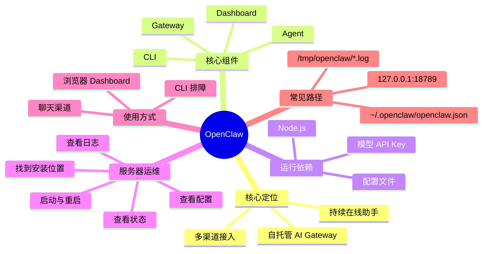

# OpenClaw 知识文档

## 1. 知识点简介

OpenClaw 可以先粗略理解成一个你自己部署、自己掌控的 AI 助手网关。

它不是一个单纯的网页聊天框，也不是某个单一模型的壳，而是一套把这些东西串起来的系统：

- 大模型提供推理能力
- OpenClaw Gateway 负责接消息、管配置、管会话、管路由
- Dashboard / Control UI 提供 Web 管理界面
- Telegram、Slack、Discord、WhatsApp 等渠道负责让你从手机或聊天软件里直接找这个助手

一句话：

> OpenClaw 是一个自托管的 AI Gateway，你可以把它部署在自己的电脑或服务器上，然后通过网页或聊天渠道去使用一个持续在线的 AI 助手。

它典型出现的场景有这些：

- 想把 AI 助手跑在自己的机器或服务器上
- 想用 Telegram、Slack、Discord 等聊天入口来访问 AI
- 想要可配置、可扩展、可自托管，而不是完全依赖第三方 SaaS
- 想把配置、会话、日志、认证、渠道接入都集中管理

## 2. 脑图



## 3. 相关知识点的关系

`OpenClaw` 这个主题，最容易混的不是命令，而是“它到底是一个什么角色”。可以按下面几个关系来理解。

`前置依赖`

- `Node.js` 是 OpenClaw CLI 和 Gateway 的运行时基础。
- 模型 API Key 是 OpenClaw 真正回复消息的前提，没有模型配置，Gateway 就算启动了，也只能算“壳子在跑”。

`包含关系`

- `OpenClaw` 这个总概念里，包含了 `CLI`、`Gateway`、`Dashboard/Control UI`、`配置文件`、`日志`、`渠道接入` 这些部分。
- 其中真正长期驻留在服务器上的核心，是 `Gateway`。

`实现关系`

- `CLI` 是你和 OpenClaw 交互的管理入口。
- `Gateway` 是后台常驻服务，负责收发消息、会话管理、配置加载、工具调用和渠道连接。
- `Dashboard` 是可视化入口，本质上还是连到 `Gateway`。

`并列概念`

- 浏览器 Dashboard 和 Telegram/Slack/Discord 这类聊天渠道，是两类不同入口。
- 它们都能用来“找 OpenClaw”，但一个偏运维与调试，一个偏日常使用。

`常见混淆点`

- 很多人会把 `openclaw` 命令和 `Gateway` 服务混成一件事。实际上，`openclaw` 是命令行入口，`Gateway` 才是常驻服务。
- 很多人会以为“能打开 Dashboard 就等于一切都好了”。其实 Dashboard 只是入口，模型配置、渠道配置、权限配置仍可能有问题。
- 很多人会以为服务器上只要有 `openclaw` 二进制就行。实际上，真正排障时更关键的是配置文件、状态目录、日志文件、环境变量和服务管理方式。

学习路径上，建议按这个顺序理解：

1. OpenClaw 的定位是什么
2. Gateway、CLI、Dashboard 各自干什么
3. 配置文件和状态目录在哪
4. 服务器上怎么找到已有实例
5. 怎么确认它有没有跑起来
6. 怎么通过 Dashboard 或聊天渠道实际使用它

## 4. 详细介绍每个知识点

### 4.1 OpenClaw 的核心定位

它是什么

- OpenClaw 是一个自托管的 AI 助手网关系统。
- 它把模型、渠道、配置、会话、日志和 Web 界面串在一起。

它解决什么问题

- 让 AI 助手不再只存在于某个网页里，而是能常驻在你自己的服务器上
- 让你可以从不同入口访问同一个助手
- 让配置、日志、权限和状态集中管理

核心机制 / 核心用法

- 通过 `openclaw` CLI 做安装、配置、启动、排障
- 通过 `Gateway` 常驻运行
- 通过 `Dashboard` 或聊天渠道访问这个助手

注意事项

- OpenClaw 是“控制平面”，不是模型本身
- 真正回复质量最终仍取决于你接入的模型和配置

### 4.2 Gateway、CLI、Dashboard 分别是什么

它是什么

- `CLI`：命令行管理入口
- `Gateway`：常驻后台服务
- `Dashboard`：浏览器可视化界面

它解决什么问题

- CLI 解决“安装、配置、检查、排障”
- Gateway 解决“持续在线、消息转发、会话管理”
- Dashboard 解决“网页访问、配置查看、会话查看、日志查看”

核心机制 / 核心用法

最常用的命令链一般是：

```bash
openclaw status
openclaw gateway status
openclaw logs --follow
openclaw doctor
openclaw dashboard
```

可以先这样理解：

- `status` 看全局健康
- `gateway status` 看服务和端口
- `logs --follow` 盯实时日志
- `doctor` 做修复和迁移检查
- `dashboard` 打开 Web 界面

注意事项

- 日常“能不能用”主要看 `Gateway`
- 日常“怎么排障”主要靠 `CLI`

### 4.3 OpenClaw 在服务器上的典型文件和端口

它是什么

- 这是你真正接管一台已有 OpenClaw 服务器时最该先看的部分

它解决什么问题

- 知道实例装在哪
- 知道配置在哪
- 知道日志在哪
- 知道默认监听在哪

核心机制 / 核心用法

官方默认情况下，常见位置通常是：

- 配置文件：`~/.openclaw/openclaw.json`
- 状态目录：`~/.openclaw/`
- 日志目录：`/tmp/openclaw/openclaw-YYYY-MM-DD.log`
- 本地 Dashboard：`http://127.0.0.1:18789/`

如果管理员改过路径，还要关注这些环境变量：

- `OPENCLAW_HOME`
- `OPENCLAW_STATE_DIR`
- `OPENCLAW_CONFIG_PATH`

这几个变量会影响你看到的真实配置位置和状态目录。

注意事项

- 不能死记默认路径，实际服务器上可能被环境变量改掉
- 排障时要先确认“当前进程用的到底是哪份配置”

### 4.4 我们服务器上有一个 OpenClaw，如何找到它

它是什么

- 这是接管现有实例时的第一步

它解决什么问题

- 找到二进制命令
- 找到进程
- 找到配置文件
- 找到日志和端口
- 找到它是用什么方式托管的

核心机制 / 核心用法

建议按下面顺序查。

第一步，确认命令是否存在：

```bash
which openclaw
openclaw --version
```

第二步，确认进程或服务是否存在：

```bash
ps aux | grep openclaw | grep -v grep
openclaw gateway status
openclaw status
```

第三步，确认默认配置和状态目录：

```bash
ls -la ~/.openclaw
cat ~/.openclaw/openclaw.json
```

第四步，确认日志位置：

```bash
ls -la /tmp/openclaw
tail -n 100 "$(ls -t /tmp/openclaw/openclaw-*.log | head -1)"
```

第五步，确认是否被自定义路径覆盖：

```bash
env | grep OPENCLAW
echo "$OPENCLAW_HOME"
echo "$OPENCLAW_STATE_DIR"
echo "$OPENCLAW_CONFIG_PATH"
```

第六步，确认它是怎么被托管的：

```bash
systemctl --user status | grep -i openclaw
systemctl status | grep -i openclaw
```

如果是 macOS 主机，可以查：

```bash
launchctl list | grep -i openclaw
```

如果 `openclaw doctor --deep` 可用，它还能帮你扫描额外的服务安装和多实例残留：

```bash
openclaw doctor --deep
```

注意事项

- `which openclaw` 只能告诉你命令位置，不能证明 Gateway 正在跑
- `openclaw gateway status` 比单纯看进程更可靠，因为它还会做连通性探测

### 4.5 如何启动、重启、停止 OpenClaw

它是什么

- 这是运维层面最常用的一组动作

它解决什么问题

- 首次安装后拉起服务
- 服务挂了后恢复
- 改配置后重启

核心机制 / 核心用法

如果是首次安装或重新引导，最常见的是：

```bash
openclaw onboard --install-daemon
```

它会做这些事：

- 引导你配置模型认证
- 生成或更新配置
- 安装守护方式
- 启动 Gateway

如果服务已经存在，优先用官方命令查看和操作：

```bash
openclaw gateway status
openclaw gateway restart
```

如果只是临时前台运行做排障，可以直接跑：

```bash
openclaw gateway --port 18789
```

这更像“手工拉起来看看是否能工作”，适合定位服务管理器有问题还是 Gateway 本身有问题。

如果出现启动失败，优先执行这组命令：

```bash
openclaw doctor
openclaw logs --follow
openclaw health --verbose
```

注意事项

- 改了关键配置后，最好重启 Gateway 再验证
- 如果生产环境是通过 systemd 或 launchd 托管，不要只靠前台命令掩盖真实问题

### 4.6 如何使用服务器上的 OpenClaw

它是什么

- 这部分讲的不是“怎么安装”，而是“已经有实例了，怎么真正用它”

它解决什么问题

- 从浏览器使用
- 从聊天渠道使用
- 从运维角度验证它是否真的可用

核心机制 / 核心用法

方式一，直接在服务器本机打开 Dashboard：

```bash
openclaw dashboard
```

或者在服务器本机浏览器打开：

```text
http://127.0.0.1:18789/
```

方式二，如果你人在本地电脑，服务器是远程机，建议先做 SSH 端口转发：

```bash
ssh -L 18789:127.0.0.1:18789 <user>@<server>
```

然后在你自己的浏览器打开：

```text
http://127.0.0.1:18789/
```

方式三，通过已经配置好的聊天渠道使用，比如：

- Telegram
- Slack
- Discord
- WhatsApp

这时你的操作路径通常是：

1. 先确认渠道配置存在
2. 再确认渠道已连接
3. 给机器人或对应入口发消息
4. 通过日志确认消息是否到达 Gateway

运维验证建议：

```bash
openclaw channels status --probe
openclaw logs --follow
```

注意事项

- 如果 Dashboard 能打开但回复失败，往往是模型认证或渠道配置有问题
- 如果远程访问 Dashboard，不要直接把服务裸露到公网，优先走 SSH 隧道或内网方案

### 4.7 常用排障思路

它是什么

- 这是你维护服务器实例时最省时间的一套命令顺序

它解决什么问题

- 服务不回消息
- Dashboard 打不开
- 日志看不懂
- 配置不生效

核心机制 / 核心用法

官方推荐的第一轮排障顺序可以记成：

```bash
openclaw status
openclaw status --all
openclaw gateway status
openclaw doctor
openclaw logs --follow
```

如果 RPC 不通，但你怀疑服务其实起过，可以直接看文件日志：

```bash
tail -f "$(ls -t /tmp/openclaw/openclaw-*.log | head -1)"
```

如果你怀疑端口或服务管理冲突，可以继续看：

```bash
openclaw health --verbose
openclaw doctor --deep
```

注意事项

- 先看状态，再看日志，再做修复
- 不要一上来就重装，很多问题只是路径、权限、环境变量、认证或端口冲突

## 5. 实际案例讲解

场景背景

- 你接手一台团队服务器
- 同事告诉你“这台机器上已经有一个 OpenClaw”
- 但你不知道它装在哪、配置在哪、现在是不是活着、如何自己用起来

目标

- 找到这台服务器上的 OpenClaw
- 确认它是否正常运行
- 打开它的 Dashboard
- 发出一次测试请求

步骤拆解

第一步，登录服务器后先确认命令和服务：

```bash
which openclaw
openclaw --version
openclaw gateway status
openclaw status
```

如果这里就能看到 `Runtime: running` 或类似健康结果，说明它大概率已经在跑。

第二步，确认配置和状态目录：

```bash
ls -la ~/.openclaw
cat ~/.openclaw/openclaw.json
env | grep OPENCLAW
```

这一步的目标不是立刻改配置，而是先知道：

- 它是不是走默认目录
- 有没有自定义配置路径
- 当前实例到底用哪份配置

第三步，确认日志和端口：

```bash
openclaw logs --follow
```

如果 CLI 无法正常拉日志，再回退到文件日志：

```bash
tail -f "$(ls -t /tmp/openclaw/openclaw-*.log | head -1)"
```

第四步，打开 Dashboard。

如果你就在服务器本机桌面环境上：

```bash
openclaw dashboard
```

如果是远程 Linux 服务器，没有图形界面，那就从你自己的电脑建立隧道：

```bash
ssh -L 18789:127.0.0.1:18789 <user>@<server>
```

然后本地浏览器打开：

```text
http://127.0.0.1:18789/
```

第五步，做一次最小验证。

- 在 Dashboard 发一条测试消息
- 或从已配置渠道给机器人发一句话
- 同时在服务器看 `openclaw logs --follow`

如果你能看到：

- 请求进入 Gateway
- 模型调用成功
- 返回内容被发送出去

说明这台服务器上的 OpenClaw 已经被你接管成功。

案例里对应的知识点

- `Gateway`：真正常驻服务
- `CLI`：状态检查与排障入口
- `配置文件`：定位实例行为
- `日志`：判断问题发生在哪一层
- `Dashboard`：最方便的验证入口
- `SSH 端口转发`：安全地远程使用本机 Dashboard

最终结果

- 你不只是“知道这台机器上装了 OpenClaw”
- 而是知道它的命令、配置、日志、端口、访问方式和排障顺序

## 6. Demo 指导

前置准备

- 你可以登录到服务器 Shell
- 服务器上已经安装了 `openclaw`
- 你有对应账号权限
- 最好已经有可用的模型 API Key

第 1 步：找到服务器上的 OpenClaw

```bash
which openclaw
openclaw --version
openclaw gateway status
openclaw status
ls -la ~/.openclaw
env | grep OPENCLAW
```

你要确认三件事：

- 命令存在
- Gateway 是否在跑
- 配置是否走默认目录或自定义目录

第 2 步：如果没跑，就把它拉起来

先做修复和检查：

```bash
openclaw doctor
```

如果这是第一次配置或守护服务还没装好：

```bash
openclaw onboard --install-daemon
```

如果只是修改配置后需要恢复运行：

```bash
openclaw gateway restart
```

如果你想先前台试跑排障：

```bash
openclaw gateway --port 18789
```

第 3 步：打开并使用它

本机有桌面环境：

```bash
openclaw dashboard
```

远程服务器更推荐这样：

```bash
ssh -L 18789:127.0.0.1:18789 <user>@<server>
```

然后打开：

```text
http://127.0.0.1:18789/
```

如果已经配置了 Telegram / Slack / Discord / WhatsApp，则直接在对应渠道给它发消息。

验证方式

在一个终端盯日志：

```bash
openclaw logs --follow
```

然后去 Dashboard 或聊天渠道发一句：

```text
你好，做一个 20 字以内的自我介绍
```

你完成后应该看到什么

- `openclaw gateway status` 显示服务处于运行状态
- Dashboard 能打开，或聊天渠道能收到回复
- 日志里能看到消息进入、模型调用、响应返回

如果没有做到这些，按下面顺序继续查：

```bash
openclaw status --all
openclaw doctor
openclaw health --verbose
openclaw channels status --probe
```

---

参考资料

- 官方首页：https://docs.openclaw.ai/
- Getting Started：https://docs.openclaw.ai/start/getting-started
- 配置文档：https://docs.openclaw.ai/gateway/configuration
- 环境变量：https://docs.openclaw.ai/help/environment
- FAQ：https://docs.openclaw.ai/help/faq
- Troubleshooting：https://docs.openclaw.ai/gateway/troubleshooting
- Logging：https://docs.openclaw.ai/logging
