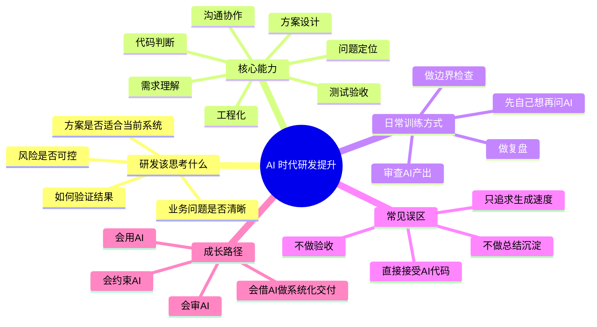

# AI 时代研发思考与能力提升

## 1. 知识点简介

现在很多研发同学已经进入这样一种工作状态：

- 需求由人来理解
- 方案由人和 AI 一起讨论
- 代码大部分由 AI 生成
- 最终上线、验收、背责仍然是研发自己

所以问题不再只是“会不会写代码”，而是：

- 你能不能把问题定义清楚
- 你能不能判断 AI 给出的方案对不对
- 你能不能发现风险、补齐边界、做好验收
- 你能不能在效率提升的同时，保持工程质量

一句话理解：

> AI 擅长高频生成，研发更应该提升高质量判断。

这个主题通常会出现在这些场景里：

- 团队开始大规模使用 AI 编程
- 研发担心“代码都让 AI 写了，自己该提升什么”
- 管理者想重新定义研发能力模型
- 个体研发想制定日常训练计划

## 2. 脑图



## 3. 相关知识点的关系

`前置依赖`

- `需求理解` 是后面所有能力的起点。问题没定义清楚，AI 写得越快，返工可能越多。
- `方案设计` 依赖对业务目标、系统现状、技术约束的理解，不是单纯拼代码。

`实现关系`

- `代码判断` 解决“AI 生成的东西能不能用”。
- `测试验收` 解决“看起来对，是否真的对”。
- `问题定位` 解决“出了问题，能不能快速收敛根因”。
- `工程化能力` 解决“代码能不能长期维护并稳定上线”。

`并列概念`

- `写代码能力` 仍然重要，但不再是唯一核心能力。
- `提问能力`、`审查能力`、`复盘能力` 与编码能力是并列关系，而不是附属能力。

`对比关系`

- 过去更强调“谁写得快”。
- 现在更强调“谁定义得清、判断得准、交付得稳”。

`常见混淆点`

- 很多人以为“AI 能生成代码”就代表“研发只需要提需求”。其实真正难的是约束、取舍、验收和负责。
- 很多人以为“会写 prompt”就等于“会用 AI 编程”。其实 prompt 只是入口，真正的差异在于你有没有判断框架。
- 很多人把“写完”当成“完成”。在工程里，真正的完成还包括测试、上线、监控、回滚和复盘。

建议按这个顺序理解：

1. 先搞清楚 AI 时代研发价值转移到了哪里
2. 再理解最该提升的几类核心能力
3. 再把能力拆成日常可训练动作
4. 最后形成自己的工作清单和复盘节奏

## 4. 详细介绍每个知识点

### 4.1 研发该重点思考什么

它是什么

- 这是 AI 时代研发最先要调整的思维方式。
- 从“我怎么写代码”转向“我怎么交付正确结果”。

它解决什么问题

- 避免把 AI 当成答案机
- 避免只追求生成速度而忽略风险
- 让研发的价值从执行上移到判断和负责

核心机制 / 核心用法

平时可以固定思考这 4 个问题：

1. 这个需求真正解决什么问题
2. 这个方案为什么适合当前系统
3. 这次改动最大的风险在哪里
4. 最终如何验证结果是对的

注意事项

- 不要把“能生成”误以为“能上线”
- 不要用 AI 替代自己的业务理解和系统判断

### 4.2 需求理解能力

它是什么

- 把模糊需求转成明确目标、边界和验收标准的能力。

它解决什么问题

- 避免需求理解偏差
- 降低 AI 输出方向错误的概率
- 减少返工和沟通成本

核心机制 / 核心用法

每接一个需求，至少先写清这 3 件事：

- 目标是什么
- 边界是什么
- 验收标准是什么

可以进一步补这几类信息：

- 谁会用
- 在什么场景下用
- 失败了怎么办
- 旧逻辑怎么兼容

注意事项

- 没有边界的需求，最容易让 AI 生成出“看起来完整、实际不落地”的代码
- 研发不要急着写实现，先学会澄清问题

### 4.3 方案设计能力

它是什么

- 在多个可选实现中做技术取舍的能力。

它解决什么问题

- 避免只拿 AI 的第一版方案直接落地
- 帮助你在复杂度、风险、扩展性之间找到合适平衡

核心机制 / 核心用法

一个简单训练方法是：

- 先自己想 1 个方案
- 再让 AI 给 2 到 3 个方案
- 最后比较它们的改动范围、复杂度、扩展性、上线风险

平时可以重点比较这些维度：

- 是否符合现有系统结构
- 是否容易回滚
- 是否会引入额外维护成本
- 是否有明显性能或一致性风险

注意事项

- 最佳方案不一定是最先进的方案，很多时候是“当下最合适的方案”
- 方案设计能力的核心不是名词多，而是取舍清楚

### 4.4 代码判断能力

它是什么

- 审查 AI 生成代码是否正确、可靠、可维护的能力。

它解决什么问题

- 识别伪正确代码
- 发现隐藏边界和异常分支
- 降低“看起来没问题，上线后出事”的概率

核心机制 / 核心用法

建议固定按这个顺序审查 AI 代码：

1. 正确性
2. 边界条件
3. 异常处理
4. 历史兼容
5. 可维护性
6. 性能与安全

还可以固定追问 AI：

- 这段代码最容易出问题的地方是什么
- 缺了哪些测试
- 有没有更简单的写法
- 如果线上报错，日志能否快速定位

注意事项

- 不要因为代码是 AI 生成的就降低审查标准
- “能跑”不是终点，“别人敢改”也很重要

### 4.5 问题定位能力

它是什么

- 线上或开发环境出问题时，快速缩小范围并找到根因的能力。

它解决什么问题

- 避免一出问题就反复重写
- 避免把调试变成无效猜测
- 提升复杂系统中的排障效率

核心机制 / 核心用法

可以固定用下面这个小流程：

```text
先描述现象
-> 再列 2 到 3 个假设
-> 再想验证方法
-> 再根据证据收敛结论
```

排查时优先看这些信息：

- 输入输出
- 错误日志
- 请求链路
- 最近变更
- 环境差异

注意事项

- 先收集证据，再让 AI 参与分析，效果会更好
- 不要只把报错丢给 AI 问“怎么修”，那通常只会得到泛化答案

### 4.6 测试与验收能力

它是什么

- 把“实现了功能”转化为“确认结果可靠”的能力。

它解决什么问题

- 避免漏测
- 降低回归风险
- 把 AI 代码真正变成可交付结果

核心机制 / 核心用法

每次改动至少检查这 4 类场景：

- 正常流程
- 边界条件
- 异常流程
- 历史回归

每次让 AI 生成代码时，也可以顺带要求它输出：

- 测试点
- 风险点
- 监控点
- 回滚点

注意事项

- AI 能帮你补测试思路，但不能替你对验收结果负责
- 测试不是最后补一下，而应该在设计阶段就开始想

### 4.7 工程化与复盘能力

它是什么

- 让系统稳定运行、让团队持续积累经验的能力。

它解决什么问题

- 避免一次次重复踩坑
- 让 AI 协作从“随机发挥”变成“团队方法论”
- 提升长期可维护性

核心机制 / 核心用法

每次功能完成后，至少补一遍这几个问题：

- 日志够不够定位问题
- 监控能不能发现异常
- 发布失败能不能回滚
- 这次踩坑的根因是什么
- 下次能增加什么固定检查项

复盘时可以固定问：

- 是需求没想清，还是上下文没给清
- 是 AI 产出有问题，还是自己没审出来
- 是代码能力问题，还是验收能力问题

注意事项

- 没有复盘的效率提升，通常很难沉淀成长期能力
- 真正成熟的团队，不只是“会用 AI”，而是“会持续优化人机协作流程”

## 5. 实际案例讲解

场景背景

- 你接到一个需求：给后台列表增加一个新的筛选条件，并保证导出逻辑也同步生效。
- 你决定借助 AI 来加速实现。

目标

- 快速完成开发
- 避免漏改查询、分页、导出、权限和日志
- 确保上线后可回归、可定位

步骤拆解

第一步，先自己写清需求。

- 筛选条件是什么
- 作用在哪些页面和接口
- 导出是否和列表口径一致
- 没传筛选值时默认行为是什么

第二步，再让 AI 出方案和代码。

你不是直接说“帮我实现”，而是给出：

- 当前模块背景
- 影响范围
- 输入输出
- 历史兼容要求
- 希望它同时列出风险点和测试点

第三步，审 AI 产出。

重点检查：

- 列表查询改了没有
- 导出查询改了没有
- 分页总数口径是否一致
- 空值和非法值如何处理
- 日志里是否能看见新的筛选参数

第四步，做验收。

至少覆盖：

- 正常筛选
- 不传筛选
- 传非法值
- 导出与列表数据一致
- 老功能未受影响

第五步，上线后复盘。

如果这次出现问题，就回头看：

- 是需求边界没问清
- 是 AI 上下文不完整
- 是自己审查漏了
- 还是验收覆盖不够

案例里对应的知识点

- `需求理解`：先澄清筛选条件和口径
- `方案设计`：判断改动影响面
- `代码判断`：审查 AI 代码是否漏改
- `测试验收`：确认列表和导出口径一致
- `复盘能力`：总结这次协作中的真实短板

最终结果

- AI 负责提升实现速度
- 研发负责保证结果正确、边界完整、上线可控

## 6. Demo 指导

前置准备

- 准备一个你最近真实在做的小需求或小 bug
- 准备一个固定的 AI 协作入口，比如 IDE 助手、CLI agent 或网页模型
- 给自己准备一个简单记录模板

第 1 步：先自己写问题定义

在动手前先写 4 行：

```text
目标：
边界：
验收标准：
最大风险：
```

如果这 4 行写不出来，先不要急着让 AI 生成代码。

第 2 步：让 AI 同时输出代码和检查项

可以直接这样提问：

```text
请基于以下背景给出实现方案和代码，同时补充风险点、边界条件、测试点、上线注意事项。
```

这样做的目的，不是让 AI 多写字，而是逼自己把关注点从“生成代码”扩展到“完成交付”。

第 3 步：按固定顺序审代码

你可以用下面这个最小清单：

```text
1. 逻辑是否正确
2. 边界是否覆盖
3. 异常是否处理
4. 历史逻辑是否兼容
5. 是否容易维护
6. 是否需要补日志、监控、测试
```

第 4 步：做一次最小复盘

功能结束后，写下这 3 个问题：

```text
1. 这次最容易踩坑的地方是什么
2. 这个坑是需求问题、方案问题、审查问题还是验收问题
3. 下次我要增加哪一条固定检查项
```

第 5 步：连续做两周

不要追求一次就全面提升，而是连续两周反复做：

- 每天 1 次先自己想再问 AI
- 每天 1 次审 AI 代码
- 每周 1 次复盘需求或 bug

验证方式

两周后看这几个变化：

- 你给 AI 的上下文是否更清楚了
- AI 首次产出的可用率是否提高了
- 你是否更容易发现边界和风险
- 你是否更少在同类问题上重复返工

你完成后应该看到什么

- 你不只是“更会用 AI”
- 你会逐渐形成自己的判断框架
- 你会从“依赖 AI 生成代码”转向“驾驭 AI 完成交付”

---

## 一句话总结

AI 时代，研发最该提升的不是单点编码速度，而是问题定义、方案判断、代码审查、测试验收、问题定位和复盘沉淀这些高质量判断能力。
