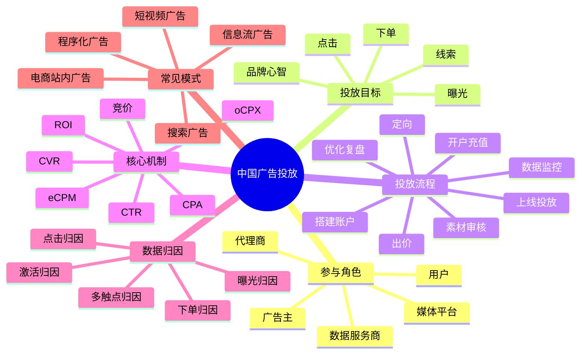
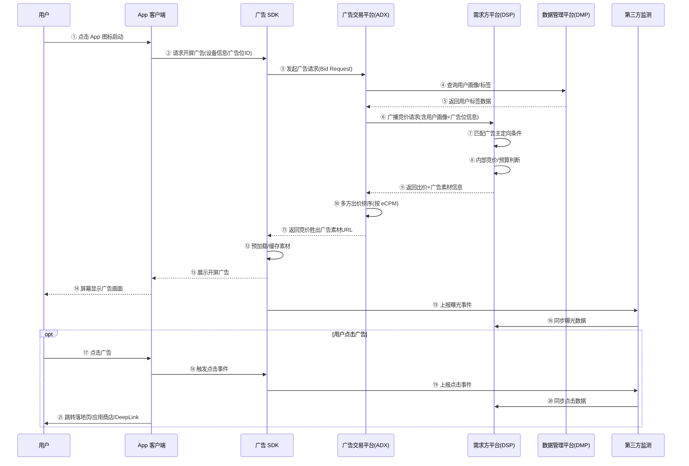

# 中国业内主流广告投放流程与广告业务知识

## 1. 知识点简介

如果把互联网广告投放讲白一点，它本质上是在做一件事：

- 商家想花一笔钱，换来曝光、线索、下单或品牌认知
- 平台想把广告卖给合适的商家，同时尽量不影响用户体验
- 系统要在一瞬间决定“这次展示给谁、出多少钱、展示哪条素材、最终算谁的效果”

中国主流的广告投放场景，通常集中在这些平台：

- 字节系：巨量引擎、抖音信息流、穿山甲
- 腾讯系：腾讯广告、微信生态、广点通
- 阿里系：阿里妈妈、万相台、淘宝天猫站内广告
- 百度系：百度营销、搜索推广、信息流
- 快手、小红书、B站等内容平台广告

从业务视角看，广告投放不是“建个计划然后等转化”这么简单，而是一条完整链路：

- 明确营销目标
- 选择投放渠道
- 开户充值
- 搭建广告账户结构
- 定向与出价
- 上传素材并审核
- 正式投放
- 监控数据
- 归因分析
- 持续优化与复盘

你可以把它理解成：

> 广告投放 = 预算分配 + 人群匹配 + 内容创意 + 竞价机制 + 数据归因 + 持续优化

这个主题常见于以下场景：

- 增长团队做拉新和促活
- 电商团队做商品推广和成交放量
- 教育、本地生活、金融等行业做表单获客和销售线索
- 品牌团队做曝光和品牌心智建设
- 广告平台、代理商、运营团队做日常投放和效果优化

## 2. 脑图



## 3. 相关知识点的关系

`前置依赖`

- 广告投放最前面的前置依赖不是“开计划”，而是先确定业务目标。你是要品牌曝光、商品成交、还是销售线索，会直接决定后面的渠道选择、出价方式、优化目标和考核指标。
- 数据追踪是投放的基础依赖。没有埋点、转化回传、线索回传或电商订单数据，后面的智能出价和优化基本都会失真。

`包含关系`

- 一个完整的投放体系通常包含：渠道选择、账户管理、计划搭建、定向、创意、竞价、归因、分析、优化这几层。
- 账户结构通常有层级关系。常见理解方式是：账户 -> 广告组/计划 -> 广告/创意。不同平台命名不同，但层级思路很像。

`实现关系`

- 定向解决“给谁看”的问题。
- 创意素材解决“用户为什么愿意停留和点击”的问题。
- 出价策略解决“愿意为这次机会付多少钱”的问题。
- 竞价排序解决“最终谁能拿到这次曝光”的问题。
- 归因系统解决“这个结果算谁带来的”的问题。
- 优化动作解决“后续怎么把钱花得更值”的问题。

`并列概念`

- 搜索广告、信息流广告、短视频广告、电商站内广告都属于主流投放形态，它们是并列关系，但背后的竞价和优化逻辑高度相似。
- CTR、CVR、CPA、ROI 都是核心指标，但分别处在不同层面。CTR 偏点击效率，CVR 偏转化效率，CPA 偏获客成本，ROI 偏商业结果。

`对比关系`

- 品牌广告更关注曝光、触达、完播、互动和品牌提升；效果广告更关注注册、激活、线索、下单和 ROI。
- 手动出价更可控，但需要较强运营经验；智能出价更依赖数据量和模型学习，适合稳定放量。

`常见混淆点`

- 很多人把“点击率高”误认为“投放效果好”。其实点击只是中间指标，最终还要看转化率和成本。
- 很多人把“归因转化”当成“真实新增收益”。实际上归因只是规则下的结果认定，不一定等于业务全量真实增量。
- 很多人觉得“预算加大就一定能放量”。但如果人群过窄、素材疲劳或出价不够，预算再高也可能花不出去。

从学习顺序上，建议按这个路径理解：

1. 先理解角色和目标
2. 再理解账户结构和投放流程
3. 再理解定向、素材、出价、竞价
4. 最后学习归因、数据分析和优化方法

## 4. 详细介绍每个知识点

### 4.1 参与角色

它是什么

- 广告生态里最核心的角色包括广告主、代理商、媒体平台、广告交易平台（ADX）、需求方平台（DSP）、数据管理平台（DMP）、用户、第三方监测。

它解决什么问题

- 这些角色一起完成"需求提出、预算投放、流量分发、实时竞价、效果归因、持续优化"这条链路。

核心机制 / 核心用法

- **广告主**：负责给预算和业务目标，是最终花钱的人。
- **代理商**：负责代运营、策略、素材协同和账户管理。
- **媒体平台（Publisher）**：拥有流量的一方，如抖音、微信、作业帮等 App。提供广告位，通过接入 ADX 把流量变现。核心诉求是把曝光卖个好价格。
- **广告交易平台（ADX, Ad Exchange）**：连接媒体方和需求方的"拍卖市场"。媒体方接入 ADX 卖流量，ADX 收到广告请求后向多家 DSP 发起实时竞价，按 eCPM 排序决出胜者，完成交易撮合。国内典型：穿山甲、优量汇。
- **需求方平台（DSP, Demand-Side Platform）**：代表广告主去 ADX 竞价买流量的"代购"。广告主在 DSP 后台设置定向、出价、预算、素材，DSP 收到竞价请求后自动决策是否出价、出多少。核心诉求是以最低成本达成广告主的转化目标。国内典型：巨量引擎、腾讯广告。
- **数据管理平台（DMP, Data Management Platform）**：提供用户画像标签、人群包、设备数据，让 ADX/DSP 在竞价时能精准判断"这个用户值不值得投"。大多数情况下 DMP 是 ADX 自建的（数据来自自家产品矩阵的用户行为，如穿山甲的 DMP 数据来自抖音/头条），也有独立第三方 DMP 如 TalkingData、个推，但数据覆盖面和深度不如平台自建。
- **用户**：广告触达对象，也是最终点击、转化、下单的人。
- **第三方监测**：独立于 ADX 和 DSP 的数据校验"裁判"，同时接收曝光和点击上报，提供双方都信任的数据基准。核心作用：曝光/点击计数校验、反作弊（识别机器刷量）、独立归因、品牌安全（广告是否出现在不当位置）。国内主流：秒针（Miaozhen）、AdMaster；移动端归因常用 Adjust、AppsFlyer。

  它存在的根本原因：ADX（卖方）和 DSP（买方）利益对立——ADX 有动机多报曝光多收钱，DSP 有动机少报转化显得成本控制好。两方数据谁也不信谁，需要一个双方认可的独立第三方来认定"事实是什么"——到底曝了多少、有没有作弊、转化该算谁的。没有它，整个程序化广告交易缺乏信任基础。

**角色之间的依赖关系：**

```
用户打开 App
  │
  ▼
媒体平台(Publisher) ──接入SDK──▶ ADX(拍卖行) ──广播竞价──▶ DSP(代购) ──代表──▶ 广告主(花钱)
  │                                  │                      │
  └── 提供流量变现 ──────────────────┘                      │
                                     │                      │
                                     ▼                      │
                                  DMP(画像) ◀───────────────┘
                                     │       查询用户标签
                                     │
                                     ▼
                                第三方监测(独立校验)
```

- **媒体平台 → ADX**：媒体方接入 ADX 的 SDK，把广告位交给 ADX 托管变现。没钱不接，赚分成。
- **ADX → DSP**：ADX 把竞价请求广播给多家 DSP。ADX 希望竞价越激烈越好，DSP 希望出价越低越好。**两者是交易对手方。**
- **DSP → 广告主**：广告主把钱和投放策略交给 DSP，DSP 替它在多家 ADX 上竞价。DSP 从广告主预算中收取服务费或赚差价。
- **ADX → DMP**：竞价时 ADX 查询设备画像，把用户标签附带在竞价请求中给 DSP，帮助 DSP 做精准决策。
- **第三方监测**：独立于交易双方，同时接收曝光/点击上报，防止 ADX 或 DSP 单方面数据造假。
- **一个公司可能同时扮演多个角色**：比如字节跳动旗下，穿山甲是 ADX，巨量引擎是 DSP，抖音是媒体平台。但逻辑上三者是上中下游的关系，不能混为一谈。

注意事项

- 中国市场里，很多行业依然高度依赖代理商和平台运营同学协同，不是一个系统自动跑完所有环节。
- 理解 ADX 和 DSP 的区别是理解程序化广告的基础：**ADX 替媒体把流量卖贵，DSP 替广告主把成本压低。**

### 4.2 投放目标与核心指标

它是什么

- 投放目标就是这笔广告预算最终想换来的业务结果，指标则是衡量结果的数字表达。

它解决什么问题

- 它决定了投放策略的方向，否则很容易出现“数据很好看，但业务没增长”。

核心机制 / 核心用法

- 品牌目标常看：曝光量、触达人数、播放量、完播率、互动率。
- 效果目标常看：点击量、激活量、注册量、线索量、下单量、付费金额。
- 常见指标解释：
  - `CTR`：点击率，衡量素材吸引力和流量匹配度
  - `CVR`：转化率，衡量承接页或商品转化效率
  - `CPA`：单次转化成本，衡量获客成本
  - `CPC`：单次点击成本
  - `CPM`：千次曝光成本
  - `eCPM`：有效千次曝光成本，竞价排序的核心指标，综合了出价和预估效果（eCPM = 出价 × 预估CTR × 预估CVR × 1000），谁 eCPM 高谁拿到曝光
  - `ROI / ROAS`：投入产出比
  - `LTV`：用户长期价值

注意事项

- 不同行业对“转化”的定义不一样。教育行业可能是留资，游戏行业可能是激活和付费，电商行业通常是成交金额和 ROI。

### 4.3 开户、资质、充值与账户结构

它是什么

- 广告正式投放前，需要在**广告投放平台（DSP 后台，如巨量引擎、腾讯广告）**开户，提交营业执照、行业资质、品牌资料，并完成充值或授信。
- 注意：这里的"开户"不是在单个媒体 App（如作业帮、抖音）开户，而是在 DSP 后台一次性完成。广告主不需要也不可能去每个 App 单独开户——DSP 会自动替广告主在所有接入的流量上竞价。

它解决什么问题

- 平台需要确认投放主体是否合法（KYC）、行业是否可投、预算是否可结算。这是监管合规要求，不是技术问题。

核心机制 / 核心用法

- 大部分平台都有行业准入和审核要求，比如医疗、金融、教育等行业更严格。
- 一个 DSP 账户可以投到该平台覆盖的所有流量（如巨量引擎账户可以投抖音、头条、穿山甲联盟的全部 App），广告主不需要关心具体哪个 App 会展示广告。
- 账户层面通常会区分：
  - 主账户：公司主体、结算关系
  - 计划层：预算、投放目标、出价策略
  - 创意层：图片、视频、文案、落地页
- 团队管理里还会涉及：
  - 账户权限
  - 多主体管理
  - 多产品线拆分
  - 预算包和财务对账

注意事项

- 账户结构最好和业务结构一致，否则后续数据拆解、财务核算、归因分析会很混乱。

### 4.4 定向策略

它是什么

- 定向就是决定广告展示给哪些用户，包括地域、年龄、性别、兴趣、行为、设备、时间段、人群包等。

它解决什么问题

- 解决“预算应该优先花在谁身上”，避免把广告大量浪费给不相关人群。

核心机制 / 核心用法

- 常见定向方式：
  - 基础定向：地区、年龄、性别、终端、网络环境
  - 兴趣行为定向：浏览内容、互动行为、消费倾向
  - 人群包：已购用户、潜客人群、相似人群、流失人群
  - 场景定向：关键词、搜索词、内容上下文
- 主流平台越来越强调“宽定向 + 智能放量”，尤其是在有稳定转化回传的情况下，系统会自动探索更优人群。

注意事项

- 定向不是越细越好。定向过窄会导致量级不足、学习受限、成本波动加大。

### 4.5 创意素材与落地页

它是什么

- 创意包括图片、短视频、标题、正文、按钮文案；落地页是用户点击后进入的承接页面。

它解决什么问题

- 创意负责把用户吸引住，落地页负责把用户说服并完成转化。

核心机制 / 核心用法

- 信息流和短视频广告里，前三秒通常决定停留率。
- 电商广告里，商品图、价格、优惠信息、评价背书非常关键。
- 线索广告里，表单字段数量、咨询入口、页面加载速度会直接影响 CVR。
- 常见创意策略：
  - 多素材并行测试
  - 多卖点拆分测试
  - 不同人群匹配不同内容
  - 定期更换素材避免疲劳

注意事项

- 很多投放问题表面上看是“流量问题”，实际上是素材不行、落地页承接弱，导致系统越投越贵。

### 4.6 出价、竞价与智能投放

它是什么

- 出价是广告主愿意为结果支付的价格，竞价是平台根据多个广告主的出价和预估效果决定谁获得曝光。

它解决什么问题

- 解决流量资源如何分配，以及广告主如何在有限预算内争取更优曝光机会。

核心机制 / 核心用法

- 常见计费方式：
  - `CPM`：按曝光计费
  - `CPC`：按点击计费
  - `CPA`：按转化计费
  - `oCPM / oCPC / oCPA`：按优化目标自动调价
- 平台内部常用 `eCPM` 作为排序参考，可以粗理解成“这条广告每一千次曝光大概能给平台带来多少价值”。
- 简化理解：

```text
排序价值 ~= 出价 x 预估点击率 x 预估转化率 x 质量因子
```

- 当数据积累足够时，系统会根据转化回传自动调整流量分配，逐步把预算给更容易转化的人群和素材组合。

注意事项

- 智能投放依赖数据量和稳定转化事件。如果转化样本太少，模型很难学到有效规律。

### 4.7 审核、投放上线与投后监控

它是什么

- 广告在正式展示前通常要经过资质审核、素材审核、落地页审核；上线后还要监控消耗、曝光、点击、转化、异常告警。

它解决什么问题

- 平台通过审核控制合规风险，运营团队通过监控及时发现花费异常、素材失效、转化掉量等问题。

核心机制 / 核心用法

- 审核关注点通常包括：
  - 行业合规
  - 文案夸大宣传
  - 禁投词
  - 落地页内容一致性
  - 用户体验
- 投后监控常看：
  - 花费是否正常释放
  - CTR 是否突降
  - CVR 是否下滑
  - CPA 是否超出目标
  - 转化回传是否中断

注意事项

- 很多团队只盯最终转化，却忽略链路监控。实际上曝光、点击、到站、表单提交、支付每一段都可能出问题。

### 4.8 归因、复盘与持续优化

它是什么

- 归因是把结果分配给某次广告触达，复盘是总结预算使用情况和效果变化原因，优化则是持续调整策略。

它解决什么问题

- 没有归因，就无法判断投放值不值；没有复盘，就无法知道下一轮该怎么投。

核心机制 / 核心用法

- 常见归因口径：
  - 点击归因
  - 曝光归因
  - 激活归因
  - 下单归因
  - 7天点击 / 1天曝光等归因窗口
- 常见优化动作：
  - 调整预算分配
  - 优化出价目标
  - 扩定向或收定向
  - 替换低效素材
  - 优化落地页或商品详情页
  - 做分时段、分地域、分人群复盘

注意事项

- 归因结果不等于增量效果，复盘时最好结合自然量、老客复购、渠道重叠、投放前后基线变化一起看。

## 5. 开屏广告完整链路详解


### 5.1 场景描述

用户在手机上点击 App 图标 → App 启动 → 首先看到一个全屏广告（通常 3-5 秒，可跳过）→ 用户点击广告 → 跳转到广告主落地页或应用商店。

下面把这个过程涉及的完整链路拆开，从用户启动 App 到广告最终曝光，背后经历了什么。

### 5.2 链路总览



### 5.3 前置概念：广告位与代码位

在进入各环节详细说明之前，需要先理清两个容易混淆的概念：**广告位**和**代码位**。

**什么是代码位**

代码位是**广告交易平台（ADX）后台**里的一个概念（如穿山甲、优量汇后台）。当某个 App（比如快对）想通过广告变现时，它的开发团队需要去 ADX 后台**创建代码位**——告诉平台："我在首页信息流有个位置想放广告，尺寸是多少，底价多少，渲染方式是自渲染还是模板"。

创建完成后，ADX 会给这个位置分配一个唯一的**代码位 ID（Placement ID）**，App 把 ID 硬编码进自己集成的广告 SDK 中。之后每次 SDK 发起广告请求时，都会带上这个 ID，ADX 拿到后就知道：这来自快对 App、安卓端、信息流位置、答案大图页。

**代码位 vs 广告位**

| | 广告位（Ad Placement） | 代码位（Placement ID） |
|---|---|---|
| 是什么 | 业务概念，App 里某块可以展示广告的区域 | 系统里的**唯一数字/字符串 ID** |
| 在哪里用 | 运营/产品沟通时用 | SDK 写死、ADX 后台管理、竞价请求中传递 |
| 谁创建 | 媒体方（App 开发者） | 在 ADX 后台创建广告位时自动生成 |
| 例子 | "快对 App 安卓端首页 Banner" | `placement_id = 1` 或 `自建_穿山甲_Android_信息流_答案页_25` |

**代码位的命名规则**

穿山甲后台代码位命名通常遵循这个格式：

```
{渲染方式}_{ADX名称}_{平台}_{广告场景}_{页面位置}_{序号/底价}
```

逐字段拆解一个实际例子 `自建_穿山甲_Android_信息流_答案页_25`：

| 字段 | 值 | 含义 |
|------|-----|------|
| 渲染方式 | 自建 | 自渲染（App 自己拼 UI），区别于模板渲染 |
| ADX | 穿山甲 | 接入的是穿山甲（字节跳动）这个 ADX |
| 平台 | Android | 安卓端 |
| 广告场景 | 信息流 | 信息流广告（非开屏、非激励视频） |
| 页面位置 | 答案页 | 出现在"拍照搜题答案结果"页面 |
| 序号/底价 | 25 | 可能是底价档位（25 元/CPM），也可能是序号 |

**代码位在竞价链路中的位置**

代码位是整个竞价链路的起点——没有它，整个链路都无法触发：

```
App 启动 → SDK 读取代码位 ID → 连同设备信息打包成 Bid Request
  → ADX 收到，根据代码位 ID 查后台配置（底价、尺寸、允许的广告类型）
  → ADX 向 DSP 广播竞价请求（附带代码位信息）
  → DSP 根据代码位场景（开屏/信息流/激励视频）匹配合适的素材尺寸和类型
  → 竞价完成 → SDK 根据代码位配置渲染广告
```

**一个广告位对应多个代码位（瀑布流模式）：**

实践中，同一个广告位经常拆成多个代码位，按底价从高到低排列，SDK 依次请求。这是为了在保证填充率的前提下尽量卖高价，称为**瀑布流（Waterfall）**。

以实际数据为例（注意：`_25` / `_12` 后缀含义为假设，实际可能是序号或其他标识）：

```
广告位：510-快对-Android-信息流-答案大图页

代码位：自建_穿山甲_Android_信息流_答案页_25   → 假设底价 25 元/CPM
代码位：自建_穿山甲_Android_信息流_答案页_12   → 假设底价 12 元/CPM
```

请求流程（以底价为例，实际情况依配置而定）：

```
SDK 先请求高价代码位（假设底价 25 元/CPM）
  ├── 有广告主出价 ≥ 25 元 → 展示，高价卖出 ✓
  └── 无人出价（填充失败）→ 降级请求低价代码位（假设底价 12 元/CPM）
       ├── 有广告主出价 ≥ 12 元 → 展示，少赚点但至少卖出去了 ✓
       └── 再失败 → 继续降档或本次曝光放弃
```

**为什么不用一个大底价？** 如果只设一个 25 元底价的代码位，出价 12~24 元的广告主永远进不来，一旦没人出到 25 元，这次曝光就浪费了。拆多档相当于"先试高价，卖不出去再降档"，既不错过高价机会，也不浪费低价流量。

**Bidding 模式正在替代瀑布流：** 穿山甲等平台目前推 Bidding 模式，一个代码位不设底价，所有 DSP 同时竞价，由市场决定价格，省去瀑布流的多档串行逻辑。比如 `课程表-安卓-冷启动开屏-bidding` 就是一个代码位搞定，不需要拆成 12、18、25 三档。

### 5.4 各环节详细说明

#### 5.4.1 广告请求阶段（App 启动 → ADX 收到请求）

当用户打开 App 时，应用内集成的**广告 SDK**（如穿山甲、优量汇、百度 SDK 等）会在开屏位置触发广告请求。这个请求通常包含以下信息：

| 请求字段 | 含义 | 示例 |
|---------|------|------|
| `ad_unit_id` | 广告位 ID | 开屏位 #10001 |
| `device_id` | 设备标识（IDFA/OAID/IMEI） | 用于用户识别与频控 |
| `os` / `os_version` | 操作系统及版本 | iOS 17.2 |
| `app_name` / `app_bundle` | 当前 App 包名 | com.example.app |
| `ip` | 设备 IP 地址 | 用于粗略地域判断 |
| `network` | 网络类型 | Wi-Fi / 4G / 5G |
| `screen_size` | 屏幕分辨率 | 1170×2532 |
| `ad_type` | 广告形式 | 开屏 / 插屏 / 激励视频 |
| `bidfloor` | 底价（如有） | 15 元/CPM |

SDK 将这些信息封装为 **Bid Request**（竞价请求），通过 HTTP 发送至广告交易平台（ADX）。

#### 5.4.2 用户画像增强（ADX → DMP）

ADX 拿到设备 ID 后，会到数据管理平台（DMP）查询该设备的用户画像标签：

- 基础属性：性别、年龄段、地域
- 兴趣偏好：游戏、教育、电商、金融等
- 行为标签：近期浏览类目、历史点击/转化行为
- 人群包匹配：是否在广告主的已购人群、排除人群、相似人群中等

这一步通常在几毫秒内完成，标签数据会附加到 Bid Request 中一并发送给 DSP。

#### 5.4.3 实时竞价阶段（ADX → DSP → 返回出价）

ADX 将增强后的 Bid Request 广播给多家 DSP（需求方平台）。每个 DSP 代表背后的广告主进行决策：

**DSP 内部处理逻辑：**

```
1. 定向过滤
   - 地域是否在投放范围内？
   - 用户标签是否命中目标人群？
   - 时间段是否在投放时段内？
   - 频控：该用户今天是否已经看过太多次？

2. 预算检查
   - 计划日预算是否已消耗完毕？
   - 广告主账户余额是否充足？

3. 出价计算
   - 根据广告主设置的出价策略（CPM / oCPM / CPC）
   - 结合预估 CTR（基于历史素材表现）
   - 结合预估 CVR（如果有转化目标）
   - 计算最终 eCPM 出价

4. 素材选择
   - 从该广告主账户下挑选合适的开屏素材
   - 确保素材尺寸适配当前设备

5. 返回竞价响应
   - 包含：出价金额、素材 URL、落地页 URL、监测链接
```

**出价计算公式（简化）：**

```text
eCPM = 出价 × 预估CTR × 预估CVR × 1000
```

比如某广告主在开屏位出价 80 元/CPM，预估 CTR 为 3%，预估 CVR 为 2%，则：

```text
eCPM = 80 × 0.03 × 0.02 × 1000 = 48
```

#### 5.4.4 竞价决策阶段（ADX 排序 + 胜出）

ADX 收到所有 DSP 的出价响应后，按 eCPM 从高到低排序：

| 排序 | 广告主 | 出价方式 | 出价 | eCPM | 结果 |
|------|--------|---------|------|------|------|
| 1 | 某电商 App | CPM | 100 | 65 | **胜出** |
| 2 | 某手游 | oCPM | 80 | 48 | 落选 |
| 3 | 某教育机构 | CPC | 5 元/点击 | 18 | 落选 |

**二价机制**：很多 ADX 采用广义二价（GSP），即胜出者按第二名出价结算，而非自己的出价。这样广告主有动力报真实出价，不必担心"出高了亏太多"。

ADX 将胜出广告的素材 URL、落地页跳转链接、曝光/点击监测链接一并返回给 SDK。

#### 5.4.5 素材加载与展示（SDK → 屏幕渲染）

SDK 收到胜出广告后：

1. **素材下载**：从 CDN 拉取图片或视频素材到本地缓存（通常开屏素材会提前预加载，减少等待时间）
2. **渲染展示**：将素材渲染到 App 开屏页面上，通常为全屏/半屏，带"跳过"按钮
3. **展示判断**：广告素材覆盖屏幕面积达到一定比例（如 50% 以上）、展示时长超过最小阈值（如 1 秒）后，才算有效曝光
4. **跳过逻辑**：用户可在规定时间（如 3-5 秒）后点击跳过，或广告自动关闭进入 App 主界面

#### 5.4.6 监测上报（曝光 & 点击）

广告展示和点击时，会触发多条监测上报，这是后续计费和归因的基础：

**曝光上报（Impression）：**

SDK 识别到广告有效展示后，同时向以下地址发送曝光通知：
- ADX 的曝光追踪服务器（用于计费确认）
- DSP 的曝光监测链接（用于广告主后台数据对账）
- 第三方监测平台（如秒针、AdMaster、TalkingData，用于独立三方校验）

一个典型的曝光监测 URL 长这样：

```text
https://track.adx.com/imp?ad_id=123&creative_id=456&price=45&ts=1700000000
https://monitor.dsp.com/imp?campaign_id=789&device_id=xxx&ts=1700000000
https://3rd-party.com/imp?advertiser_id=abc&placement_id=def
```

**点击上报（Click）：**

用户点击开屏广告后，同样触发多路上报，此外还要完成跳转：

```
点击事件触发
  ├── 上报 ADX 点击监测（计费：如果是 CPC 模式）
  ├── 上报 DSP 点击监测（广告主后台记录）
  ├── 上报第三方点击监测
  └── 执行跳转逻辑
       ├── DeepLink：直接唤起目标 App（如从微博开屏跳转淘宝）
       ├── Universal Link：iOS 唤起目标 App
       ├── H5 落地页：在内置浏览器打开活动页
       └── App Store / 应用商店：跳转到应用下载页
```

#### 5.4.7 跳转后的转化归因

如果用户点击后完成了广告主期望的转化行为（下载、注册、下单），需要归因系统把这个转化"算给"这次开屏广告曝光或点击：

**点击归因（主流）：**

```
用户在 App A 点击开屏广告 → 跳转到 App B 下载页 → 下载并安装 App B → 首次打开 App B
```

此时 App B 内的 SDK 会上报激活事件，归因系统根据设备 ID + 时间窗口（如点击后 7 天内激活）匹配到之前的广告互动，从而认定这次转化来自该开屏广告。

**曝光归因（辅助）：**

即使用户没有点击，只是看了开屏广告，后续如果在一定窗口内（如 1 天）发生转化，也可按曝光归因计入。

### 5.5 耗时拆解

整个过程从用户启动 App 到广告展示，通常在 **300ms - 1s** 内完成：

| 阶段 | 耗时 | 说明 |
|------|------|------|
| SDK 发起请求 | ~5ms | 本地组装参数 |
| 网络传输至 ADX | ~20-50ms | 取决于网络质量 |
| ADX → DMP 查画像 | ~10-20ms | KV 缓存查询 |
| ADX → DSP 广播竞价 | ~30-50ms | 并行发送 |
| DSP 内部决策 | ~10-30ms | 定向+出价+选素材 |
| DSP → ADX 返回 | ~20-50ms | 网络回传 |
| ADX 排序决策 | ~5ms | 简单排序 |
| ADX → SDK 下发 | ~20-50ms | 返回素材 URL |
| SDK 渲染展示 | ~50-200ms | 取决于素材是否已缓存 |

> 实际项目中，很多 SDK 会做**素材预缓存**——在上一次广告请求或 App 空闲时提前拉取素材到本地，这样本次请求只需传回一个"素材 ID"，本地直接渲染，大幅缩短展示延迟。

### 5.6 关键关注点

- **底价（Bidfloor）**：媒体方设置的最低 CPM 价格，低于此价格的出价直接丢弃，保护流量价值
- **频控（Frequency Cap）**：同一个用户一天最多看到几次开屏广告，防止用户反感
- **素材预加载**：开屏广告对加载速度要求极高，通常 App 启动时不会实时下载素材，而是用缓存素材 + 实时竞价决策的组合策略
- **竞价超时**：整个竞价链路的超时时间通常设置在 200-300ms，超时则降级到本地缓存素材或放弃此次广告展示
- **三方监测对齐**：ADX、DSP、第三方三方的曝光和点击数据可能存在差异（网络丢包、统计口径不同），通常以 ADX 数据作为计费依据，以第三方数据作为独立校验
- **冷启动场景**：用户首次安装 App 或清除广告 ID 后，没有设备画像数据，DSP 只能根据 IP 粗略判断地域，出价偏保守

### 5.6 与前面知识点的对应

| 上文知识点 | 在开屏链路中的体现 |
|-----------|-------------------|
| 4.1 参与角色 | 广告主 → DSP；媒体平台 → ADX；用户 → 设备 ID；数据服务商 → DMP+三方监测 |
| 4.4 定向策略 | DSP 根据用户画像标签做定向过滤 |
| 4.6 出价与竞价 | ADX 实时竞价拍卖 + eCPM 排序 |
| 4.7 投放上线 | 广告主提前在 DSP 搭建好计划和素材 |
| 4.8 归因复盘 | 点击后通过归因匹配判断转化来源 |
