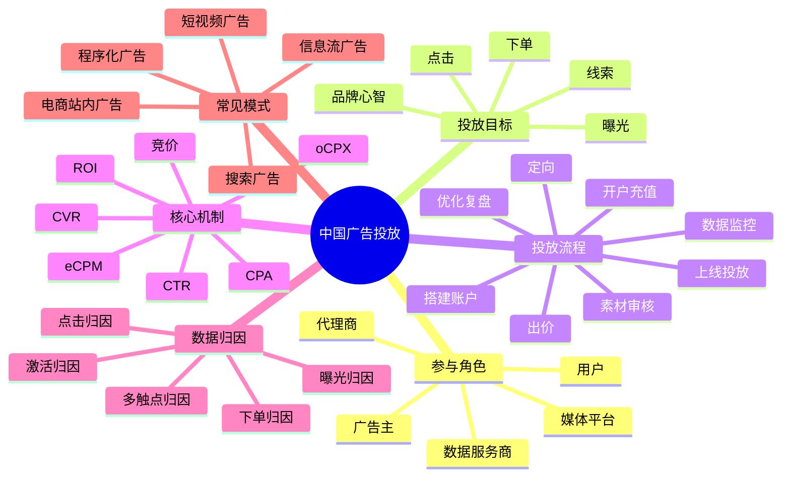

# 中国业内主流广告投放流程与广告业务知识

## 1. 知识点简介

如果把互联网广告投放讲白一点，它本质上是在做一件事：

- 商家想花一笔钱，换来曝光、线索、下单或品牌认知
- 平台想把广告卖给合适的商家，同时尽量不影响用户体验
- 系统要在一瞬间决定“这次展示给谁、出多少钱、展示哪条素材、最终算谁的效果”

中国主流的广告投放场景，通常集中在这些平台：

- 字节系：巨量引擎、抖音信息流、穿山甲
- 腾讯系：腾讯广告、微信生态、广点通
- 阿里系：阿里妈妈、万相台、淘宝天猫站内广告
- 百度系：百度营销、搜索推广、信息流
- 快手、小红书、B站等内容平台广告

从业务视角看，广告投放不是“建个计划然后等转化”这么简单，而是一条完整链路：

- 明确营销目标
- 选择投放渠道
- 开户充值
- 搭建广告账户结构
- 定向与出价
- 上传素材并审核
- 正式投放
- 监控数据
- 归因分析
- 持续优化与复盘

你可以把它理解成：

> 广告投放 = 预算分配 + 人群匹配 + 内容创意 + 竞价机制 + 数据归因 + 持续优化

这个主题常见于以下场景：

- 增长团队做拉新和促活
- 电商团队做商品推广和成交放量
- 教育、本地生活、金融等行业做表单获客和销售线索
- 品牌团队做曝光和品牌心智建设
- 广告平台、代理商、运营团队做日常投放和效果优化

## 2. 脑图



## 3. 相关知识点的关系

`前置依赖`

- 广告投放最前面的前置依赖不是“开计划”，而是先确定业务目标。你是要品牌曝光、商品成交、还是销售线索，会直接决定后面的渠道选择、出价方式、优化目标和考核指标。
- 数据追踪是投放的基础依赖。没有埋点、转化回传、线索回传或电商订单数据，后面的智能出价和优化基本都会失真。

`包含关系`

- 一个完整的投放体系通常包含：渠道选择、账户管理、计划搭建、定向、创意、竞价、归因、分析、优化这几层。
- 账户结构通常有层级关系。常见理解方式是：账户 -> 广告组/计划 -> 广告/创意。不同平台命名不同，但层级思路很像。

`实现关系`

- 定向解决“给谁看”的问题。
- 创意素材解决“用户为什么愿意停留和点击”的问题。
- 出价策略解决“愿意为这次机会付多少钱”的问题。
- 竞价排序解决“最终谁能拿到这次曝光”的问题。
- 归因系统解决“这个结果算谁带来的”的问题。
- 优化动作解决“后续怎么把钱花得更值”的问题。

`并列概念`

- 搜索广告、信息流广告、短视频广告、电商站内广告都属于主流投放形态，它们是并列关系，但背后的竞价和优化逻辑高度相似。
- CTR、CVR、CPA、ROI 都是核心指标，但分别处在不同层面。CTR 偏点击效率，CVR 偏转化效率，CPA 偏获客成本，ROI 偏商业结果。

`对比关系`

- 品牌广告更关注曝光、触达、完播、互动和品牌提升；效果广告更关注注册、激活、线索、下单和 ROI。
- 手动出价更可控，但需要较强运营经验；智能出价更依赖数据量和模型学习，适合稳定放量。

`常见混淆点`

- 很多人把“点击率高”误认为“投放效果好”。其实点击只是中间指标，最终还要看转化率和成本。
- 很多人把“归因转化”当成“真实新增收益”。实际上归因只是规则下的结果认定，不一定等于业务全量真实增量。
- 很多人觉得“预算加大就一定能放量”。但如果人群过窄、素材疲劳或出价不够，预算再高也可能花不出去。

从学习顺序上，建议按这个路径理解：

1. 先理解角色和目标
2. 再理解账户结构和投放流程
3. 再理解定向、素材、出价、竞价
4. 最后学习归因、数据分析和优化方法

## 4. 详细介绍每个知识点

### 4.1 参与角色

它是什么

- 广告生态里最核心的角色包括广告主、代理商、媒体平台、用户、第三方监测或数据服务商。

它解决什么问题

- 这些角色一起完成“需求提出、预算投放、流量分发、效果归因、持续优化”这条链路。

核心机制 / 核心用法

- 广告主负责给预算和业务目标。
- 代理商负责代运营、策略、素材协同和账户管理。
- 媒体平台负责提供流量、竞价系统、审核系统、数据能力。
- 用户是广告触达对象，也是最终点击、转化、下单的人。
- 数据服务商会参与监测、反作弊、归因、数据打通。

注意事项

- 中国市场里，很多行业依然高度依赖代理商和平台运营同学协同，不是一个系统自动跑完所有环节。

### 4.2 投放目标与核心指标

它是什么

- 投放目标就是这笔广告预算最终想换来的业务结果，指标则是衡量结果的数字表达。

它解决什么问题

- 它决定了投放策略的方向，否则很容易出现“数据很好看，但业务没增长”。

核心机制 / 核心用法

- 品牌目标常看：曝光量、触达人数、播放量、完播率、互动率。
- 效果目标常看：点击量、激活量、注册量、线索量、下单量、付费金额。
- 常见指标解释：
  - `CTR`：点击率，衡量素材吸引力和流量匹配度
  - `CVR`：转化率，衡量承接页或商品转化效率
  - `CPA`：单次转化成本，衡量获客成本
  - `CPC`：单次点击成本
  - `CPM`：千次曝光成本
  - `ROI / ROAS`：投入产出比
  - `LTV`：用户长期价值

注意事项

- 不同行业对“转化”的定义不一样。教育行业可能是留资，游戏行业可能是激活和付费，电商行业通常是成交金额和 ROI。

### 4.3 开户、资质、充值与账户结构

它是什么

- 广告正式投放前，需要在媒体平台开户，提交营业执照、行业资质、品牌资料，并完成充值或授信。

它解决什么问题

- 平台需要确认投放主体是否合法、行业是否可投、预算是否可结算。

核心机制 / 核心用法

- 大部分平台都有行业准入和审核要求，比如医疗、金融、教育等行业更严格。
- 账户层面通常会区分：
  - 主账户：公司主体、结算关系
  - 计划层：预算、投放目标、出价策略
  - 创意层：图片、视频、文案、落地页
- 团队管理里还会涉及：
  - 账户权限
  - 多主体管理
  - 多产品线拆分
  - 预算包和财务对账

注意事项

- 账户结构最好和业务结构一致，否则后续数据拆解、财务核算、归因分析会很混乱。

### 4.4 定向策略

它是什么

- 定向就是决定广告展示给哪些用户，包括地域、年龄、性别、兴趣、行为、设备、时间段、人群包等。

它解决什么问题

- 解决“预算应该优先花在谁身上”，避免把广告大量浪费给不相关人群。

核心机制 / 核心用法

- 常见定向方式：
  - 基础定向：地区、年龄、性别、终端、网络环境
  - 兴趣行为定向：浏览内容、互动行为、消费倾向
  - 人群包：已购用户、潜客人群、相似人群、流失人群
  - 场景定向：关键词、搜索词、内容上下文
- 主流平台越来越强调“宽定向 + 智能放量”，尤其是在有稳定转化回传的情况下，系统会自动探索更优人群。

注意事项

- 定向不是越细越好。定向过窄会导致量级不足、学习受限、成本波动加大。

### 4.5 创意素材与落地页

它是什么

- 创意包括图片、短视频、标题、正文、按钮文案；落地页是用户点击后进入的承接页面。

它解决什么问题

- 创意负责把用户吸引住，落地页负责把用户说服并完成转化。

核心机制 / 核心用法

- 信息流和短视频广告里，前三秒通常决定停留率。
- 电商广告里，商品图、价格、优惠信息、评价背书非常关键。
- 线索广告里，表单字段数量、咨询入口、页面加载速度会直接影响 CVR。
- 常见创意策略：
  - 多素材并行测试
  - 多卖点拆分测试
  - 不同人群匹配不同内容
  - 定期更换素材避免疲劳

注意事项

- 很多投放问题表面上看是“流量问题”，实际上是素材不行、落地页承接弱，导致系统越投越贵。

### 4.6 出价、竞价与智能投放

它是什么

- 出价是广告主愿意为结果支付的价格，竞价是平台根据多个广告主的出价和预估效果决定谁获得曝光。

它解决什么问题

- 解决流量资源如何分配，以及广告主如何在有限预算内争取更优曝光机会。

核心机制 / 核心用法

- 常见计费方式：
  - `CPM`：按曝光计费
  - `CPC`：按点击计费
  - `CPA`：按转化计费
  - `oCPM / oCPC / oCPA`：按优化目标自动调价
- 平台内部常用 `eCPM` 作为排序参考，可以粗理解成“这条广告每一千次曝光大概能给平台带来多少价值”。
- 简化理解：

```text
排序价值 ~= 出价 x 预估点击率 x 预估转化率 x 质量因子
```

- 当数据积累足够时，系统会根据转化回传自动调整流量分配，逐步把预算给更容易转化的人群和素材组合。

注意事项

- 智能投放依赖数据量和稳定转化事件。如果转化样本太少，模型很难学到有效规律。

### 4.7 审核、投放上线与投后监控

它是什么

- 广告在正式展示前通常要经过资质审核、素材审核、落地页审核；上线后还要监控消耗、曝光、点击、转化、异常告警。

它解决什么问题

- 平台通过审核控制合规风险，运营团队通过监控及时发现花费异常、素材失效、转化掉量等问题。

核心机制 / 核心用法

- 审核关注点通常包括：
  - 行业合规
  - 文案夸大宣传
  - 禁投词
  - 落地页内容一致性
  - 用户体验
- 投后监控常看：
  - 花费是否正常释放
  - CTR 是否突降
  - CVR 是否下滑
  - CPA 是否超出目标
  - 转化回传是否中断

注意事项

- 很多团队只盯最终转化，却忽略链路监控。实际上曝光、点击、到站、表单提交、支付每一段都可能出问题。

### 4.8 归因、复盘与持续优化

它是什么

- 归因是把结果分配给某次广告触达，复盘是总结预算使用情况和效果变化原因，优化则是持续调整策略。

它解决什么问题

- 没有归因，就无法判断投放值不值；没有复盘，就无法知道下一轮该怎么投。

核心机制 / 核心用法

- 常见归因口径：
  - 点击归因
  - 曝光归因
  - 激活归因
  - 下单归因
  - 7天点击 / 1天曝光等归因窗口
- 常见优化动作：
  - 调整预算分配
  - 优化出价目标
  - 扩定向或收定向
  - 替换低效素材
  - 优化落地页或商品详情页
  - 做分时段、分地域、分人群复盘

注意事项

- 归因结果不等于增量效果，复盘时最好结合自然量、老客复购、渠道重叠、投放前后基线变化一起看。

## 5. 实际案例讲解

场景背景

- 假设一家做职业教育的公司，要推广一门 AI 训练营课程，目标不是品牌曝光，而是尽可能获取有效销售线索。
- 可用渠道包括抖音信息流、腾讯广告和小红书信息流，销售团队要求单条有效线索成本控制在 150 元以内。

目标

- 7 天内稳定拿到线索量
- 找到更能转化的人群和素材
- 控制 CPA 不失控

步骤拆解

1. 明确转化事件
- 团队先定义什么叫“有效线索”，比如提交手机号且销售可接通。
- 技术和运营一起打通表单回传，把有效线索回传给广告平台。

2. 完成账户准备
- 在抖音和腾讯广告完成主体开户、资质提交、课程类目审核、预算充值。
- 按产品线拆出独立账户或计划，避免和其他课程混投。

3. 搭建账户结构
- 计划 A：面向泛职场提升人群
- 计划 B：面向 AI、编程、转行兴趣人群
- 计划 C：面向历史到站未留资人群做再营销

4. 设计素材与落地页
- 素材 1 强调“0 基础学 AI”
- 素材 2 强调“课程就业价值”
- 素材 3 强调“限时试听和老师答疑”
- 落地页尽量缩短表单路径，只保留核心字段，提高 CVR

5. 设置出价和投放
- 初期用较稳妥的目标线索成本做 oCPX 投放，让系统先学习。
- 前两天不频繁大改计划，避免系统学习被打断。

6. 监控与优化
- 如果 CTR 低，优先看素材和首屏文案。
- 如果 CTR 还行但 CVR 低，优先看落地页和表单设计。
- 如果线索量少但成本高，检查定向是否过窄、出价是否偏低、回传是否正常。

7. 复盘结果
- 最终发现“转行焦虑 + 免费试听”主题素材 CTR 最高。
- 再营销人群 CVR 高，但量有限。
- 泛兴趣大盘量大但需要更多素材筛选和更长学习周期。

案例里对应的知识点

- 投放目标：有效线索成本
- 定向策略：兴趣定向 + 再营销 + 相似人群
- 创意策略：多素材 A/B 测试
- 出价策略：智能出价控制 CPA
- 数据回传：把销售侧结果反馈回媒体
- 优化复盘：从 CTR、CVR、CPA 三层一起看问题

最终结果

- 团队不是只靠“加预算”放量，而是通过回传、素材测试、定向分层、再营销协同，把成本逐步压到目标线以内。
- 这就是中国主流效果广告投放最常见的实操逻辑：先跑通数据，再让系统学习，再靠人和系统一起迭代。

## 6. Demo 指导

这个主题不是纯代码主题，但你可以用一个最小练习，把广告投放流程亲手走一遍。

前置准备

- 准备一个虚拟业务场景，比如“卖一款 99 元的在线课程”
- 准备一个表格工具，Excel、飞书表格、Notion 都可以
- 准备 10000 元虚拟预算
- 选择两个渠道做模拟，比如“抖音信息流”和“小红书信息流”

第 1 步

- 在表格中建一张“投放设计表”，列出这些字段：
  - 渠道
  - 投放目标
  - 人群
  - 素材卖点
  - 出价方式
  - 预算
  - 落地页
  - 核心指标

第 2 步

- 假设你要拆 3 个计划：
  - 泛人群拉新
  - 精准兴趣人群拉新
  - 历史访问用户再营销
- 为每个计划分别写：
  - 目标 CPA
  - 日预算
  - 核心卖点
  - 预期 CTR 和 CVR

第 3 步

- 用下面这组简化公式，手动估算每个计划的结果：

```text
点击量 = 曝光量 x CTR
转化量 = 点击量 x CVR
CPA = 花费 / 转化量
ROI = 产出金额 / 花费
```

- 然后尝试改 3 个变量：
  - CTR 提升 20%
  - CVR 提升 20%
  - 出价下降 10%
- 看看哪种调整对最终 CPA 和 ROI 影响最大。

第 4 步

- 再做一次“问题排查演练”：
  - 如果消耗起不来，你会先检查什么
  - 如果 CTR 很低，你会改什么
  - 如果 CVR 很低，你会改什么
  - 如果归因量高但实际成交差，你会怀疑什么

验证方式

- 你应该能独立回答下面这些问题：
  - 广告主为什么要拆计划而不是全塞进一个计划里
  - 为什么不能只看 CTR
  - 为什么回传数据会影响智能投放
  - 为什么素材、定向、出价、落地页必须一起看

你完成后应该看到什么

- 你会形成一张自己的“广告投放决策表”
- 你会知道一个广告计划从立项到投后优化的完整流程
- 你会初步理解中国主流广告平台为什么越来越强调智能出价、数据回传和素材迭代
- 你再去看抖音、腾讯广告、阿里妈妈等后台时，就不会只把它们当成“点按钮的系统”，而能看懂背后的业务逻辑
