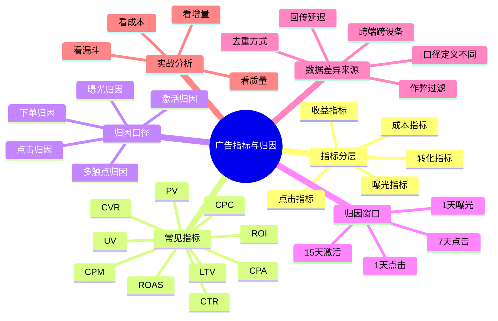

# 广告平台常见指标与归因口径

## 1. 知识点简介

广告投放里最容易把人搞晕的，不是建计划，也不是出价，而是看数据。

你经常会遇到这些情况：

- 平台后台说今天有 100 个转化，业务系统只认 60 个
- 同样是“下单”，媒体报表、BI 报表、财务报表三边数字不一样
- 一个渠道说自己带来了订单，另一个渠道也说这单算它的
- CTR 看起来不错，但 ROI 很差
- 曝光和点击都正常，线索量却突然掉了

这背后的核心原因通常有两类：

- 指标含义没分清
- 归因口径没对齐

所以这篇文档主要解决两个问题：

1. 你要知道广告平台里常见指标到底在衡量什么
2. 你要知道不同归因口径为什么会让报表结果不一样

如果讲得更白话一点：

> 指标回答“发生了什么”，归因回答“这件事算谁的”。

这个主题通常出现在这些场景里：

- 投放运营每天看后台报表
- 数据分析同学做渠道效果评估
- 增长团队评估拉新质量和渠道 ROI
- 产品、销售、财务和投放团队对账
- 广告主和代理商讨论“到底是哪边数据有问题”

## 2. 脑图



## 3. 相关知识点的关系

`前置依赖`

- 先要分清业务目标，才能决定看什么指标。做品牌广告时重点看曝光、触达、播放、互动；做效果广告时重点看激活、留资、下单、付费和 ROI。
- 先要定义“什么算转化”，才能谈归因。比如“注册成功”“提交表单”“支付成功”“有效线索”“首单支付”其实是完全不同的事件。

`包含关系`

- 广告指标通常分成几层：曝光层、点击层、转化层、成本层、收入层、长期价值层。
- 归因口径通常包含：归因对象、归因窗口、归因规则、去重逻辑、回传方式。

`实现关系`

- 曝光、点击、访问、注册、下单这些指标共同构成漏斗。
- `CTR` 反映素材和流量匹配度，`CVR` 反映承接页或商品转化效率，`CPA` 反映成本控制，`ROI` 反映最终商业结果。
- 归因系统会根据曝光或点击记录，把后续发生的注册、激活、下单等结果回挂到某个广告计划、创意或渠道上。

`并列概念`

- `CTR`、`CVR`、`CPA`、`ROI` 都是核心指标，但它们衡量的是不同环节，彼此是并列关系，不是替代关系。
- 点击归因、曝光归因、多触点归因也是并列归因方式，不同平台和不同业务会选择不同方案。

`对比关系`

- 平台归因强调“平台认为自己带来了多少结果”，业务归因强调“企业内部最终认账的结果是多少”。
- 单触点归因更简单，适合日常投放管理；多触点归因更接近真实路径，但实现复杂、解释成本更高。

`常见混淆点`

- 很多人把“转化数”理解成真实新增用户，其实平台转化数往往是归因后的结果，不等于业务自然增量。
- 很多人把“订单数”当作统一口径，但平台订单、支付成功订单、签收订单、财务确认订单往往不是一个概念。
- 很多人只看平台后台，不看回传链路和埋点质量，最后把技术问题误判成投放问题。

从学习顺序上，建议按这个路径理解：

1. 先搞清楚每个指标处于漏斗哪一层
2. 再理解不同转化事件的业务含义
3. 再学习归因窗口和归因规则
4. 最后再看平台数据和业务数据为什么会不一致

## 4. 详细介绍每个知识点

### 4.1 指标分层：从曝光到商业结果

它是什么

- 广告指标不是一堆散乱数字，而是一条漏斗链路上的不同观察点。

它解决什么问题

- 帮你判断问题到底出在流量、素材、落地页、转化链路还是业务成交环节。

核心机制 / 核心用法

- 常见漏斗可以理解成：

```text
曝光 -> 点击 -> 到站/访问 -> 注册/留资 -> 下单 -> 支付 -> 复购
```

- 对应分层通常是：
  - 曝光层：曝光量、触达人数、展示频次
  - 点击层：点击量、点击率、点击成本
  - 转化层：注册量、激活量、线索量、下单量、支付量
  - 成本层：总花费、CPA、CAC
  - 收益层：GMV、收入、ROI、ROAS
  - 长期价值层：LTV、留存率、复购率

注意事项

- 不要跨层误判。比如 CTR 很高只能说明前端吸引力可能不错，不代表后面的注册和成交就一定好。

### 4.2 常见曝光与点击指标

它是什么

- 这类指标描述广告是否被看到、是否被点开，是最前面的流量效率指标。

它解决什么问题

- 帮你判断广告是否有机会进入用户视野，以及素材是否有基础吸引力。

核心机制 / 核心用法

- `Impression / 曝光量`：广告被展示的次数。
- `Reach / 触达人数`：至少看过一次广告的去重人数。
- `Frequency / 频次`：平均每个用户被展示了几次。
- `Click / 点击量`：用户点击广告的次数。
- `CTR = 点击量 / 曝光量`
- `CPC = 花费 / 点击量`
- `CPM = 花费 / 曝光量 x 1000`

- 这些指标通常用于判断：
  - 定向是否过窄
  - 素材是否吸引人
  - 花费能否顺利释放
  - 流量是否过度重复曝光

注意事项

- 曝光量高不代表有效触达高，频次过高可能说明人群已经打透。
- 点击量高也不一定是好事，如果是误点或低质量点击，后面的 CVR 可能会很差。

### 4.3 常见转化指标

它是什么

- 转化指标是广告投放最核心的一层，它描述用户在点击后是否完成你真正想要的动作。

它解决什么问题

- 帮你判断广告带来的不是“热闹”，而是实际业务结果。

核心机制 / 核心用法

- 常见转化事件包括：
  - 注册
  - 激活
  - 留资
  - 加购
  - 下单
  - 支付
  - 首次付费
  - 次日留存
- 关键指标包括：
  - `CVR = 转化量 / 点击量`
  - `CPA = 花费 / 转化量`
  - `CAC = 花费 / 获客数`
  - `Activation Rate = 激活量 / 下载量`
  - `Lead Valid Rate = 有效线索 / 总线索`

- 在不同行业里，真正要盯的“转化”不同：
  - 工具或内容产品：激活、注册、付费
  - 教育、本地生活：留资、有效线索、到店
  - 电商：加购、下单、支付、首购

注意事项

- 一定要区分“平台定义的转化”和“业务真正认账的转化”。例如平台记一条线索，销售团队可能判定这条线索无效。

### 4.4 常见成本与收益指标

它是什么

- 这类指标告诉你广告花的钱是否值得，以及最终带回来的价值够不够覆盖投入。

它解决什么问题

- 帮你判断投放是否可持续，而不是只看表面转化数量。

核心机制 / 核心用法

- `Spend / 花费`：投放消耗的总金额。
- `CPA`：单次转化成本。
- `CPS`：单次销售成本，常见于电商。
- `ROI = 收益 / 花费`
- `ROAS = 广告带来的销售额 / 广告花费`
- `LTV`：用户在一个观察周期内带来的累计价值。

- 常见判断方法：
  - 如果是短链路生意，重点看当期 ROI
  - 如果是订阅或高复购业务，重点看首单 ROI 和 LTV
  - 如果是买量拉新，不能只看首日，要看留存和后续付费

注意事项

- ROI 高不代表一定能放量，因为高 ROI 可能来自小量优质人群，扩量后未必还能保持。

### 4.5 归因是什么

它是什么

- 归因本质上是在回答一个问题：用户最终完成的这次注册、留资或下单，应该算给哪次广告触达。

它解决什么问题

- 如果没有归因，你只能知道有结果，不知道是哪个渠道、哪个计划、哪条素材带来的。

核心机制 / 核心用法

- 平台通常会记录用户的曝光和点击行为，再结合后续转化回传，判断转化应归属于哪次广告接触。
- 归因对象可能落在：
  - 渠道
  - 账户
  - 广告计划
  - 广告组
  - 创意
  - 关键词

- 简化理解：

```text
用户先看广告 / 点广告
-> 后续发生注册或下单
-> 系统根据规则判断“这次结果算谁的”
```

注意事项

- 归因是“规则分配”，不是“绝对真相”。它更像一套业务管理规则，而不是上帝视角。

### 4.6 常见归因方式与归因窗口

它是什么

- 归因方式定义“按什么行为算”，归因窗口定义“在多长时间内算”。

它解决什么问题

- 帮你决定一个转化结果应该归给最近点击、最近曝光，还是多个接触点共同分配。

核心机制 / 核心用法

- 常见归因方式：
  - 点击归因：用户点击广告后发生转化，就把结果归给该点击
  - 曝光归因：用户只看了广告，未点击，但后续转化，结果也可能归给该曝光
  - 激活归因：常见于 App 安装场景，先归下载或激活，再看后续付费
  - 多触点归因：多个渠道共同分配转化价值

- 常见归因窗口：
  - `1天点击`
  - `7天点击`
  - `15天点击`
  - `1天曝光`
  - `7天曝光`

- 举个例子：
  - 用户周一看了抖音广告没点
  - 周二点了小红书广告
  - 周三完成下单

- 那么：
  - 如果是 7 天最后点击归因，订单更可能算给小红书
  - 如果平台支持曝光归因，抖音也可能记一部分结果
  - 如果企业内部做多触点归因，这单可能被拆给多个渠道

注意事项

- 归因窗口越长，平台认到的转化往往越多，但不一定越真实；窗口越短，归因结果更保守，但可能漏掉长决策周期用户。

### 4.7 为什么平台数据和业务数据对不上

它是什么

- 这是广告投放里最常见的报表争议来源。

它解决什么问题

- 帮你快速定位是口径问题、技术问题，还是业务定义问题。

核心机制 / 核心用法

- 常见差异来源包括：
  - `归因规则不同`：平台按点击归因，业务按首触或末触统计
  - `归因窗口不同`：平台看 7 天点击，业务看当天支付
  - `去重逻辑不同`：平台按设备去重，业务按手机号或用户 ID 去重
  - `时间口径不同`：平台按转化发生时间记，业务按支付确认时间记
  - `回传延迟`：线索审核、订单支付、激活上报可能延迟几分钟到几小时
  - `跨端跨设备`：用户在手机看广告，在电脑下单，平台不一定能完整识别
  - `反作弊过滤`：媒体和业务方可能过滤掉不同的异常流量
  - `退款/取消订单`：平台可能先记了订单，财务最终不认

- 实战里遇到对不上，建议按这个顺序排查：
  1. 先对齐事件定义
  2. 再对齐时间范围
  3. 再对齐归因窗口
  4. 再核查去重逻辑
  5. 最后再查埋点、回传、风控过滤

注意事项

- 报表差异不一定意味着谁错了，很多时候只是大家在看不同口径下的“同一件事”。

### 4.8 实战里该怎么用这些指标

它是什么

- 这是把指标和归因从“概念”变成“日常运营动作”的部分。

它解决什么问题

- 帮你知道每天看板应该先看什么，问题定位应该先查哪一层。

核心机制 / 核心用法

- 一般可以按四层来看：
  - 第一层看花费：预算有没有正常消耗
  - 第二层看流量：曝光、点击、CTR、CPC 是否异常
  - 第三层看转化：CVR、CPA、有效率是否异常
  - 第四层看商业：ROI、复购、LTV 是否达标

- 常见定位方式：
  - 曝光低：检查预算、出价、定向、审核状态
  - CTR 低：检查素材、标题、首图、首屏视频
  - CVR 低：检查落地页、表单、商品价格、客服承接
  - ROI 低：检查人群质量、客单价、留存和复购

注意事项

- 不要只在平台后台闭环看数据，最好把平台报表、站内行为报表、业务结果报表放在一起看。

## 5. 实际案例讲解

场景背景

- 假设一家做跨境电商的团队同时在抖音和腾讯广告投放一款高客单价小家电。
- 平台后台显示抖音带来了 200 单、腾讯带来了 120 单，但企业 BI 报表只认 250 单，团队开始争论到底哪个平台“多算了”。

目标

- 找出平台报表和业务报表差异的来源
- 建立一套内部统一可复用的分析方法

步骤拆解

1. 先对齐转化定义
- 平台看的“下单”是提交订单成功。
- 业务 BI 看的“成交”是支付成功且未退款。
- 财务最终看的则是确认收入订单。

2. 再对齐归因口径
- 抖音平台采用 7 天点击 + 1 天曝光归因。
- 腾讯广告采用 7 天最后点击归因。
- 企业内部 BI 暂时采用最后点击归因，但只认支付成功时间。

3. 再核查去重方式
- 平台更多按设备标识或平台用户标识做归因。
- 企业 BI 以会员 ID 和订单号做去重。
- 同一用户在多个平台被触达后，两个平台都可能“认到”同一笔转化。

4. 看漏斗差异
- 抖音 CTR 高，但支付转化率略低。
- 腾讯 CTR 一般，但支付率更稳定。
- 抖音的曝光归因额外多认了一部分“看过广告后自然回来下单”的用户。

5. 得出结论
- 平台后台的数字更适合做平台内部投放优化。
- 企业 BI 的数字更适合做跨渠道预算分配和经营决策。
- 两边都不是绝对错误，只是使用目的不同。

案例里对应的知识点

- 指标分层：曝光、点击、下单、支付、退款
- 归因方式：点击归因和曝光归因
- 归因窗口：7 天点击、1 天曝光
- 去重逻辑：设备 ID 与会员 ID 的差异
- 经营口径：平台优化口径与财务确认口径分离

最终结果

- 团队最后建立了三套固定报表：
  - 平台优化报表：看 CTR、CVR、CPA、平台归因订单
  - 渠道评估报表：看支付订单、支付 ROI、去重后渠道贡献
  - 财务经营报表：看确认收入、退款后净收入

- 这样投放、分析、财务三方都能在自己的口径下工作，同时也知道彼此的数据为什么不同。

## 6. Demo 指导

这个主题不需要写代码，你可以用一个表格练习，把“指标”和“归因口径”真正吃透。

前置准备

- 打开一个表格工具
- 假设你有两个投放渠道：抖音、腾讯广告
- 假设业务目标是“支付订单”
- 准备一组模拟数据：
  - 曝光量
  - 点击量
  - 花费
  - 下单量
  - 支付量
  - 退款量

第 1 步

- 在表格中建两张表：
  - `平台报表`
  - `业务报表`

- `平台报表` 字段建议包括：
  - 渠道
  - 曝光
  - 点击
  - 花费
  - 平台归因下单
  - 平台归因支付

- `业务报表` 字段建议包括：
  - 渠道
  - 支付成功单
  - 退款单
  - 净收入
  - 去重后用户数

第 2 步

- 自己计算这些指标：

```text
CTR = 点击 / 曝光
CPC = 花费 / 点击
CVR = 支付 / 点击
CPA = 花费 / 支付
ROI = 净收入 / 花费
```

- 然后观察：
  - 哪个渠道 CTR 更高
  - 哪个渠道 CVR 更高
  - 哪个渠道 ROI 更高
  - 这三个“更高”是不是同一个渠道

第 3 步

- 再人为制造几种口径差异：
  - 让抖音多 20 个曝光归因支付
  - 让腾讯少 10 个延迟回传支付
  - 让业务报表扣掉 8 个退款单

- 再看三份结果：
  - 平台报表
  - BI 报表
  - 财务报表

- 你会明显看到同一个渠道在不同口径下结果不同。

第 4 步

- 尝试回答这些问题：
  - 如果平台支付高于业务支付，最可能是什么原因
  - 如果 CTR 高但 ROI 低，问题更可能出在哪
  - 如果两个平台都说自己带来了订单，该怎么排查
  - 为什么做预算分配时不能只看平台后台数据

验证方式

- 你应该能独立解释这些概念：
  - `CTR` 和 `CVR` 分别代表什么
  - `CPA` 和 `ROI` 为什么不能混着看
  - 点击归因和曝光归因的区别是什么
  - 为什么同一天的订单在不同报表里会不一样

你完成后应该看到什么

- 你会形成一套自己的“广告数据解读顺序”
- 你会知道遇到报表对不上时，应该先查定义、再查窗口、再查去重、最后查技术链路
- 你会理解广告平台数据更适合优化，企业业务数据更适合经营决策
- 你再看任何广告后台时，就不会只盯一个转化数字，而会主动问“这个数到底是什么口径”
