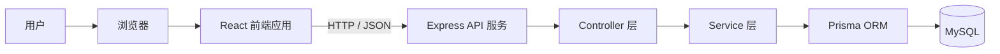
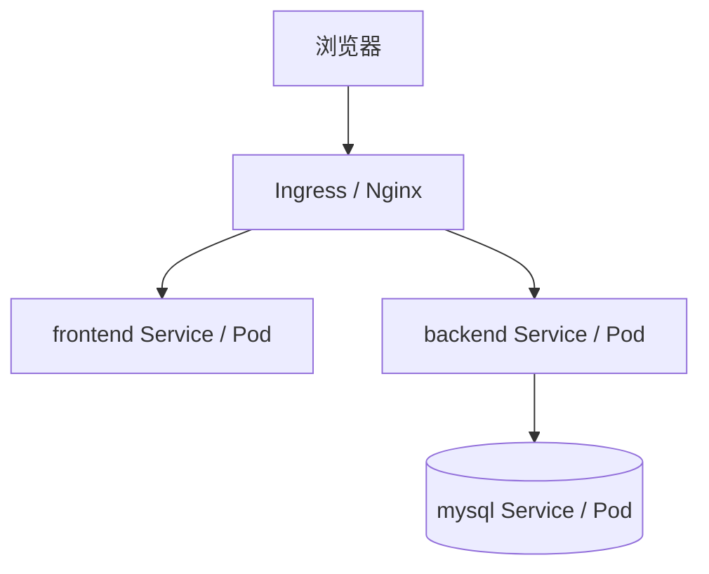
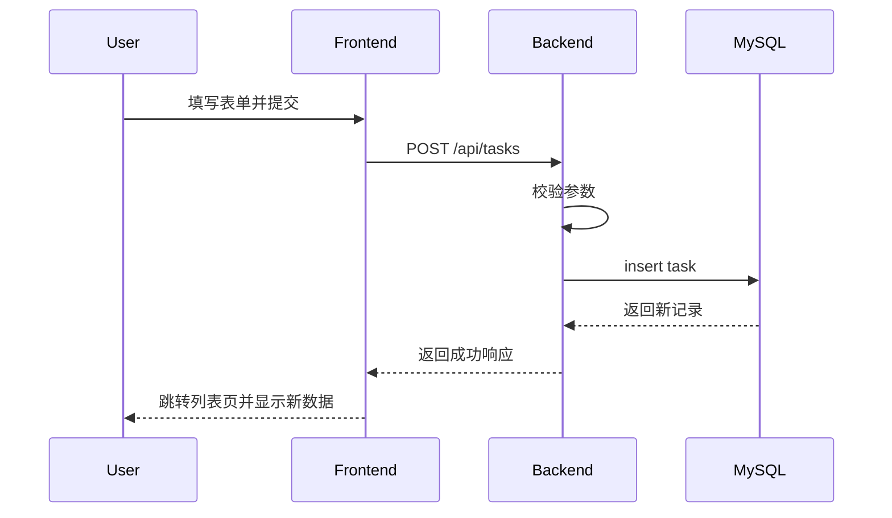
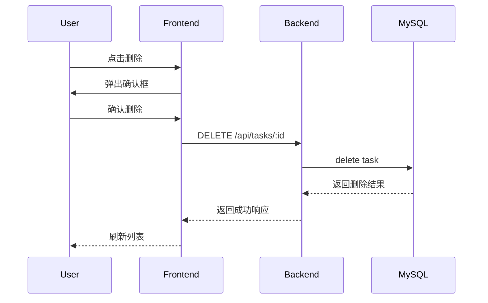

# CRUD Demo 正式设计方案

## 1. 文档目的

本文档用于定义 CRUD Demo 的正式技术方案，目标是让项目在实现前就明确：

- 系统目标和范围
- 技术选型和职责分层
- 前后端实现逻辑
- 数据模型与接口协议
- Docker 容器化方案
- Kubernetes 部署方案
- 开发、联调、部署的推荐顺序

本文档面向“从 0 到 1 跑通完整链路”的学习型项目，重点是结构清晰、便于实现、方便后续用 AI 辅助生成代码。

---

## 2. 项目目标

本项目是一个任务管理 CRUD demo，用于熟悉完整的全栈开发流程。

### 2.1 学习目标

通过本项目掌握以下能力：

- React 前端项目结构与页面开发
- Node.js + Express 后端接口开发
- MySQL 数据建模与 CRUD 操作
- Prisma 作为 ORM 的使用方式
- 前后端联调方式
- Docker 镜像构建与容器编排
- Kubernetes 基础资源编写与部署

### 2.2 业务目标

实现一个最小任务管理系统，支持：

- 查看任务列表
- 查看任务详情
- 新增任务
- 编辑任务
- 删除任务

### 2.3 非目标

第一版不包含以下能力：

- 登录注册
- 用户体系
- 权限控制
- 文件上传
- Redis 缓存
- 消息队列
- 微服务拆分
- 复杂筛选、分页、排序

第一版重点是“单表 CRUD + 完整工程链路”。

---

## 3. 技术选型

## 3.1 前端技术栈

- React
- TypeScript
- Vite
- React Router
- Axios

### 选型原因

- React 是主流前端框架，资料多，适合学习组件化开发
- TypeScript 有利于建立清晰的数据结构认知
- Vite 启动快、配置轻，适合 demo 项目
- React Router 足够支撑基础页面跳转
- Axios 可用于统一封装 API 请求

---

## 3.2 后端技术栈

- Node.js
- Express
- TypeScript
- Prisma

### 选型原因

- Node.js 与前端同语言，降低切换成本
- Express 足够轻量，适合学习 HTTP 接口开发
- TypeScript 能帮助后端定义更清晰的数据类型
- Prisma 相比直接写 SQL 更适合入门和维护

---

## 3.3 数据库与部署技术

- MySQL
- Docker
- Kubernetes
- Nginx / Ingress

### 选型原因

- MySQL 是最常见的关系型数据库之一
- Docker 用于统一运行环境
- Kubernetes 用于熟悉容器编排
- Nginx 或 Ingress 用于统一访问入口

---

## 4. 总体架构

## 4.1 逻辑架构图



### 说明

- 用户通过浏览器访问前端页面
- 前端通过 HTTP 请求访问后端 API
- 后端通过 Controller 接收请求
- Service 承担业务逻辑
- Prisma 负责与 MySQL 交互
- MySQL 负责持久化存储任务数据

---

## 4.2 部署架构图



### 说明

- 外部流量先进入 Ingress 或 Nginx
- 前端静态资源由 frontend 服务提供
- API 请求被转发到 backend 服务
- backend 服务通过 mysql 服务访问数据库

---

## 5. 系统边界与职责划分

## 5.1 前端职责

前端负责：

- 页面展示
- 用户交互
- 表单收集
- 调用后端 API
- 展示接口返回结果
- 基础交互提示，如加载中、提交中、删除确认

前端不负责：

- 持久化存储
- 核心业务规则落地
- 数据安全校验的最终裁决

---

## 5.2 后端职责

后端负责：

- 定义 API
- 处理请求和响应
- 执行业务逻辑
- 参数校验
- 数据持久化
- 错误处理

后端是数据正确性的最终保障。

---

## 5.3 数据库职责

数据库负责：

- 存储任务数据
- 保证数据结构可维护
- 支持任务的增删改查

---

## 6. 前端设计

## 6.1 页面设计

第一版建议采用 2 个主页面：

- 任务列表页 `/tasks`
- 任务表单页 `/tasks/new`、`/tasks/:id/edit`

如需降低复杂度，也可以做成单页模式：

- 列表区域
- 表单弹窗

正式方案推荐使用独立页面，结构更清晰，更适合理解路由和页面职责。

---

## 6.2 前端模块划分

```text
frontend/
└── src/
    ├── components/   # 可复用组件
    ├── pages/        # 页面级组件
    ├── services/     # API 请求封装
    ├── router/       # 路由配置
    ├── types/        # 类型定义
    ├── hooks/        # 可选，自定义 hooks
    ├── App.tsx
    └── main.tsx
```

### 模块职责

#### components/
放通用组件，例如：
- TaskTable
- TaskForm
- ConfirmDialog
- PageHeader

#### pages/
放页面，例如：
- TaskListPage
- TaskFormPage

#### services/
放接口请求代码，例如：
- `getTasks`
- `getTaskById`
- `createTask`
- `updateTask`
- `deleteTask`

#### router/
定义页面路径与路由映射。

#### types/
定义前端任务类型、接口响应类型。

---

## 6.3 前端页面流转

### 列表页流程

1. 用户进入 `/tasks`
2. 页面触发任务列表加载
3. 调用 `GET /api/tasks`
4. 渲染任务列表
5. 提供新增、编辑、删除入口

### 新增页流程

1. 用户进入 `/tasks/new`
2. 页面展示空表单
3. 用户填写任务信息
4. 点击提交
5. 调用 `POST /api/tasks`
6. 成功后跳回列表页

### 编辑页流程

1. 用户进入 `/tasks/:id/edit`
2. 页面读取任务 id
3. 调用 `GET /api/tasks/:id`
4. 回填表单
5. 用户修改后提交
6. 调用 `PUT /api/tasks/:id`
7. 成功后跳回列表页

### 删除流程

1. 用户在列表页点击删除
2. 前端弹出确认框
3. 用户确认后调用 `DELETE /api/tasks/:id`
4. 成功后刷新列表

---

## 6.4 前端状态设计

第一版建议不引入 Redux 等全局状态工具，直接使用：

- `useState`
- `useEffect`
- 页面级局部状态

原因：

- demo 规模小
- 页面状态简单
- 降低复杂度

---

## 7. 后端设计

## 7.1 分层结构

```text
backend/
├── src/
│   ├── routes/
│   ├── controllers/
│   ├── services/
│   ├── middleware/
│   ├── utils/
│   └── app.ts
└── prisma/
    └── schema.prisma
```

### 分层职责

#### routes/
定义 URL 与 controller 映射关系。

#### controllers/
负责：
- 接收请求
- 提取参数
- 调用 service
- 返回响应

#### services/
负责：
- 处理任务相关业务逻辑
- 调用 Prisma 完成数据访问

#### middleware/
负责：
- 跨域处理
- 请求日志
- 错误处理中间件

#### prisma/
负责：
- 数据模型定义
- 数据库迁移
- Prisma Client 生成

---

## 7.2 后端请求链路

以新增任务为例：

```text
POST /api/tasks
  -> routes/tasks.ts
  -> taskController.createTask
  -> taskService.createTask
  -> prisma.task.create
  -> MySQL
  -> 返回 JSON
```

---

## 7.3 后端接口设计

统一前缀：`/api`

### 1）获取任务列表

- Method: `GET`
- Path: `/api/tasks`

响应示例：

```json
{
  "code": 0,
  "message": "success",
  "data": [
    {
      "id": 1,
      "title": "学习 React",
      "description": "完成列表页",
      "status": "todo",
      "createdAt": "2026-05-31T10:00:00.000Z",
      "updatedAt": "2026-05-31T10:00:00.000Z"
    }
  ]
}
```

### 2）获取任务详情

- Method: `GET`
- Path: `/api/tasks/:id`

### 3）新增任务

- Method: `POST`
- Path: `/api/tasks`

请求体：

```json
{
  "title": "学习 React + Node.js",
  "description": "完成一个 CRUD demo",
  "status": "todo"
}
```

### 4）更新任务

- Method: `PUT`
- Path: `/api/tasks/:id`

请求体：

```json
{
  "title": "学习 React + Node.js",
  "description": "补齐 Docker 与 K8s",
  "status": "doing"
}
```

### 5）删除任务

- Method: `DELETE`
- Path: `/api/tasks/:id`

---

## 7.4 响应规范

建议统一响应结构：

```json
{
  "code": 0,
  "message": "success",
  "data": {}
}
```

### 约定

- `code = 0` 表示成功
- 非 0 表示失败
- `message` 表示结果描述
- `data` 表示业务数据

错误示例：

```json
{
  "code": 4001,
  "message": "title is required",
  "data": null
}
```

---

## 7.5 参数校验规则

第一版建议校验：

### 新增/编辑任务
- `title`：必填，长度 1~100
- `description`：可选，长度 <= 1000
- `status`：必须是 `todo`、`doing`、`done` 之一

说明：
- 前端可做基础校验
- 后端必须做最终校验

---

## 8. 数据库设计

## 8.1 表设计

表名：`tasks`

| 字段名 | 类型 | 约束 | 说明 |
|---|---|---|---|
| id | bigint / int | PK, Auto Increment | 主键 |
| title | varchar(100) | not null | 任务标题 |
| description | text | null | 任务描述 |
| status | varchar(20) | not null | 任务状态 |
| created_at | datetime | not null | 创建时间 |
| updated_at | datetime | not null | 更新时间 |

---

## 8.2 Prisma 模型建议

```prisma
model Task {
  id          Int      @id @default(autoincrement())
  title       String   @db.VarChar(100)
  description String?  @db.Text
  status      String   @db.VarChar(20)
  createdAt   DateTime @default(now())
  updatedAt   DateTime @updatedAt

  @@map("tasks")
}
```

---

## 8.3 数据约束策略

- `title` 不允许为空
- `status` 限制在预定义值内
- `created_at` 自动生成
- `updated_at` 在更新时自动刷新

---

## 9. 时序设计

## 9.1 新增任务时序图



---

## 9.2 删除任务时序图



---

## 10. 项目目录结构

```text
curd_demo/
├── frontend/
│   ├── src/
│   │   ├── components/
│   │   ├── pages/
│   │   ├── services/
│   │   ├── router/
│   │   ├── hooks/
│   │   ├── types/
│   │   ├── App.tsx
│   │   └── main.tsx
│   ├── public/
│   ├── package.json
│   ├── tsconfig.json
│   ├── vite.config.ts
│   └── Dockerfile
│
├── backend/
│   ├── src/
│   │   ├── routes/
│   │   ├── controllers/
│   │   ├── services/
│   │   ├── middleware/
│   │   ├── utils/
│   │   └── app.ts
│   ├── prisma/
│   │   └── schema.prisma
│   ├── package.json
│   ├── tsconfig.json
│   ├── .env
│   └── Dockerfile
│
├── deploy/
│   ├── docker-compose.yml
│   └── k8s/
│       ├── namespace.yaml
│       ├── frontend-deployment.yaml
│       ├── frontend-service.yaml
│       ├── backend-deployment.yaml
│       ├── backend-service.yaml
│       ├── mysql-deployment.yaml
│       ├── mysql-service.yaml
│       ├── configmap.yaml
│       ├── secret.yaml
│       └── ingress.yaml
│
├── idea.md
└── design.md
```

---

## 11. Docker 方案设计

## 11.1 容器划分

建议拆分为 3 个主要容器：

- frontend
- backend
- mysql

---

## 11.2 frontend 容器职责

- 构建 React 项目
- 提供静态资源
- 通过 Nginx 或其他静态服务运行前端构建产物

推荐：
- 多阶段构建
- Node 镜像负责编译
- Nginx 镜像负责运行产物

---

## 11.3 backend 容器职责

- 安装 Node.js 依赖
- 编译 TypeScript
- 启动 Express 服务
- 连接 MySQL

---

## 11.4 mysql 容器职责

- 提供 MySQL 数据服务
- 提供初始化数据库能力

说明：
- 学习型 demo 可以直接使用官方 MySQL 镜像
- 生产环境不会这样简单部署状态型数据库

---

## 11.5 本地编排方式

本地建议优先使用 `docker-compose`：

- 拉起 mysql
- 拉起 backend
- 拉起 frontend
- 统一配置网络和环境变量

这一步完成后，再进入 Kubernetes 部署阶段。

---

## 12. Kubernetes 方案设计

## 12.1 目标

Kubernetes 方案主要用于熟悉：

- Deployment
- Service
- ConfigMap
- Secret
- Ingress
- Pod 间访问

---

## 12.2 资源划分

### frontend Deployment + Service
负责前端页面服务。

### backend Deployment + Service
负责后端 API 服务。

### mysql Deployment + Service
负责 MySQL 服务。

### ConfigMap
用于保存非敏感配置，例如：
- API 基础地址
- 服务运行环境标志

### Secret
用于保存敏感信息，例如：
- 数据库密码
- 数据库连接字符串

### Ingress
负责外部统一访问入口。

---

## 12.3 K8s 网络关系

- `frontend` 可被 Ingress 访问
- `backend` 可被 Ingress 访问
- `backend` 通过集群内服务名访问 `mysql`
- `mysql` 一般不直接暴露到集群外部

---

## 12.4 K8s 配置重点

### backend 需要的环境变量
- `PORT`
- `DATABASE_URL`
- `NODE_ENV`

### frontend 需要的配置
- API 基础地址

### mysql 需要的配置
- `MYSQL_ROOT_PASSWORD`
- `MYSQL_DATABASE`
- `MYSQL_USER`
- `MYSQL_PASSWORD`

---

## 13. 开发与交付顺序

建议按以下顺序推进：

### 第一阶段：后端和数据库打通
- 创建 MySQL 实例
- 建立 Prisma 模型
- 执行迁移
- 开发 CRUD API
- 用 Postman/Apifox 测试成功

### 第二阶段：前端开发
- 搭建 React 项目
- 实现列表页
- 实现新增/编辑页
- 对接后端 API
- 完成增删改查闭环

### 第三阶段：Docker 化
- 编写 frontend Dockerfile
- 编写 backend Dockerfile
- 编写 docker-compose.yml
- 在本地容器环境跑通

### 第四阶段：Kubernetes 化
- 编写 Deployment
- 编写 Service
- 编写 ConfigMap/Secret
- 编写 Ingress
- 完成部署验证

---

## 14. 验收标准

项目完成后，至少满足以下标准：

### 功能验收
- 能查看任务列表
- 能新增任务
- 能编辑任务
- 能删除任务
- 页面与接口联动正常

### 工程验收
- 前端可本地运行
- 后端可本地运行
- MySQL 可连接
- Prisma 迁移正常
- Docker 可启动整套服务
- Kubernetes 资源可成功部署

### 调试验收
- 能明确定位前端问题、后端问题、数据库问题、容器问题
- 能通过日志和接口测试验证链路状态

---

## 15. 风险与约束

### 主要风险
- 前后端跨域配置问题
- Prisma 连接串配置错误
- Docker 网络与端口映射错误
- Kubernetes 环境变量或 Service 名称配置错误
- 前端 API 地址在不同环境下切换不清晰

### 约束
- 第一版必须保持简单
- 不引入额外复杂中间件
- 不追求一次性做成复杂工程
- 以“跑通”和“可理解”为优先

---

## 16. 最终方案总结

本项目最终采用以下架构：

- 前端：React + TypeScript + Vite
- 后端：Node.js + Express + TypeScript + Prisma
- 数据库：MySQL
- 部署：Docker + Kubernetes

该方案适合学习完整全栈工程流程，既覆盖主流 CRUD 应用实现方式，也包含基础容器化和编排部署能力，适合作为后续持续扩展的起点。
