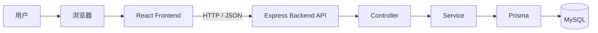
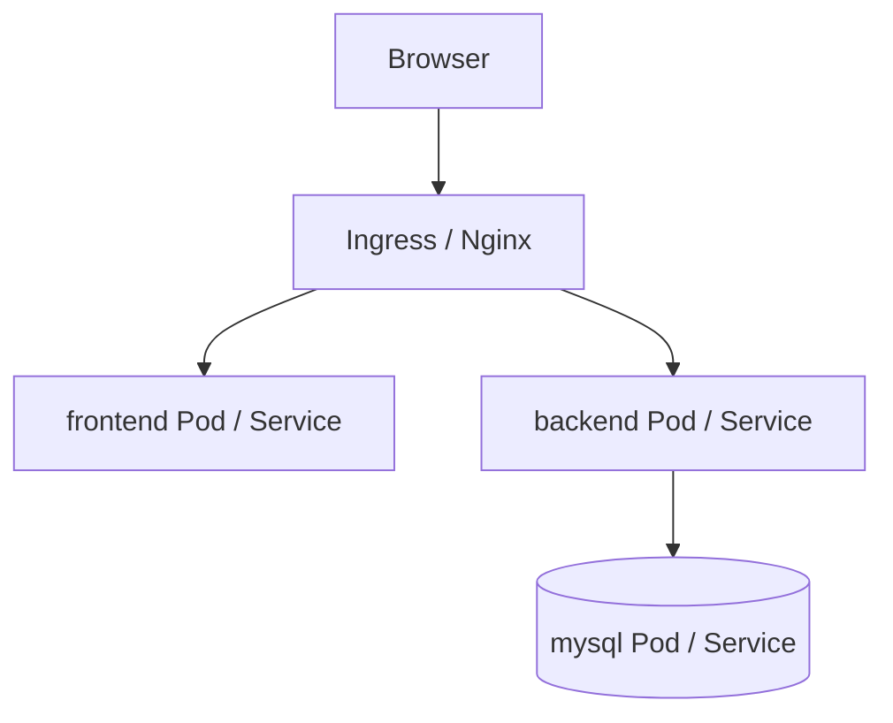

# CRUD Demo 完整实施文档

## 1. 文档目标

这是一份完整的 demo 实施文档。

目标不是只讲架构，也不是只讲生成代码，而是把下面这些内容全部串起来：

- 最终架构是什么
- 每个组件负责什么
- 任务 CRUD 模型怎么设计
- 前后端分别怎么实现
- 每一步具体做什么
- 每一步做完后怎么调试
- 每一步怎么验证没有问题
- 最后怎么用 Docker 和 Kubernetes 部署启动

你后面可以把这份文档当成项目主线，按顺序一步步往下做。

---

## 2. 项目目标

本项目是一个任务管理 CRUD demo，用来熟悉完整全栈开发流程。

### 2.1 业务目标

实现一个最小可用的任务管理系统，支持：

- 查看任务列表
- 查看任务详情
- 新增任务
- 编辑任务
- 删除任务

### 2.2 学习目标

通过这个 demo，掌握下面一整套流程：

- React 前端开发
- Node.js + Express 后端开发
- MySQL 数据库设计
- Prisma 数据访问
- 前后端联调
- Docker 容器化
- Kubernetes 部署

### 2.3 第一版不做什么

第一版明确不做：

- 登录注册
- 用户权限
- 文件上传
- Redis
- 消息队列
- 微服务
- 复杂筛选、分页、排序

第一版只做单表 CRUD，把主链路打通。

---

## 3. 技术栈

### 前端
- React
- TypeScript
- Vite
- React Router
- Axios

### 后端
- Node.js
- Express
- TypeScript
- Prisma

### 数据库
- MySQL

### 部署
- Docker
- Docker Compose
- Kubernetes
- Ingress / Nginx

---

## 4. 总体架构图

## 4.1 逻辑架构图



## 4.2 部署架构图



---

## 5. 各组件职责

## 5.1 前端
负责：
- 页面展示
- 用户输入
- 调用后端接口
- 显示请求结果
- 加载态、错误提示、删除确认

## 5.2 后端
负责：
- 定义 API
- 接收前端请求
- 做参数校验
- 处理业务逻辑
- 访问数据库
- 返回统一 JSON

## 5.3 数据库
负责：
- 持久化存储任务数据
- 支持任务增删改查

## 5.4 Prisma
负责：
- 定义 Task 数据模型
- 生成数据库访问代码
- 管理数据库迁移

## 5.5 Docker
负责：
- 统一运行环境
- 本地容器化运行
- 为 K8s 做准备

## 5.6 Kubernetes
负责：
- 管理容器部署
- 服务发现
- 环境变量管理
- 对外统一暴露入口

---

## 6. 任务 CRUD 模型设计

这里把你的核心业务模型定死，后面前后端、数据库、接口都围绕它来实现。

## 6.1 业务对象：Task

一个 Task 表示一条任务记录。

### 字段设计

| 字段名 | 类型 | 必填 | 说明 |
|---|---|---|---|
| id | number | 是 | 主键，自增 |
| title | string | 是 | 任务标题 |
| description | string | 否 | 任务描述 |
| status | string | 是 | 任务状态 |
| priority | string | 是 | 优先级 |
| dueDate | datetime | 否 | 截止时间 |
| createdAt | datetime | 是 | 创建时间 |
| updatedAt | datetime | 是 | 更新时间 |

---

## 6.2 字段含义

### id
数据库主键，用来唯一标识一条任务。

### title
任务标题，比如：
- 学习 React
- 写完 CRUD Demo

### description
任务详细说明，可以为空。

### status
任务状态，固定只允许以下 3 个值：
- `todo`：待开始
- `doing`：进行中
- `done`：已完成

### priority
任务优先级，固定只允许以下 3 个值：
- `low`
- `medium`
- `high`

### dueDate
截止时间，可空。

### createdAt
任务创建时间，新增时自动生成。

### updatedAt
任务更新时间，更新时自动刷新。

---

## 6.3 为什么增加 priority 和 dueDate

如果字段太少，CRUD demo 会过于简单，页面和表单也练不到太多内容。

加入这两个字段的好处：
- 表单会更真实
- 列表展示更像业务系统
- 可以练习 select 和 datetime 字段处理
- 复杂度仍然可控

---

## 6.4 数据库表设计

表名：`tasks`

| 字段名 | 类型 | 约束 | 说明 |
|---|---|---|---|
| id | int | PK, Auto Increment | 主键 |
| title | varchar(100) | not null | 任务标题 |
| description | text | null | 任务描述 |
| status | varchar(20) | not null | todo / doing / done |
| priority | varchar(20) | not null | low / medium / high |
| due_date | datetime | null | 截止时间 |
| created_at | datetime | not null | 创建时间 |
| updated_at | datetime | not null | 更新时间 |

---

## 6.5 Prisma 模型

```prisma
model Task {
  id          Int       @id @default(autoincrement())
  title       String    @db.VarChar(100)
  description String?   @db.Text
  status      String    @db.VarChar(20)
  priority    String    @db.VarChar(20)
  dueDate     DateTime?
  createdAt   DateTime  @default(now())
  updatedAt   DateTime  @updatedAt

  @@map("tasks")
}
```

---

## 6.6 参数校验规则

### 新增任务
- `title`：必填，1~100 个字符
- `description`：可选，最多 1000 个字符
- `status`：必须是 `todo` / `doing` / `done`
- `priority`：必须是 `low` / `medium` / `high`
- `dueDate`：可选，传值时必须是合法日期

### 更新任务
同新增规则。

---

## 7. API 设计

统一前缀：`/api`

## 7.1 获取任务列表
- Method: `GET`
- Path: `/api/tasks`

响应：

```json
{
  "code": 0,
  "message": "success",
  "data": [
    {
      "id": 1,
      "title": "学习 React",
      "description": "完成列表页",
      "status": "todo",
      "priority": "high",
      "dueDate": "2026-06-05T10:00:00.000Z",
      "createdAt": "2026-05-31T10:00:00.000Z",
      "updatedAt": "2026-05-31T10:00:00.000Z"
    }
  ]
}
```

## 7.2 获取任务详情
- Method: `GET`
- Path: `/api/tasks/:id`

## 7.3 新增任务
- Method: `POST`
- Path: `/api/tasks`

请求体：

```json
{
  "title": "实现 CRUD Demo",
  "description": "先完成后端，再做前端",
  "status": "todo",
  "priority": "high",
  "dueDate": "2026-06-10T12:00:00.000Z"
}
```

## 7.4 更新任务
- Method: `PUT`
- Path: `/api/tasks/:id`

请求体：

```json
{
  "title": "实现 CRUD Demo",
  "description": "后端已完成，继续做前端",
  "status": "doing",
  "priority": "high",
  "dueDate": "2026-06-10T12:00:00.000Z"
}
```

## 7.5 删除任务
- Method: `DELETE`
- Path: `/api/tasks/:id`

---

## 7.6 统一响应格式

成功：

```json
{
  "code": 0,
  "message": "success",
  "data": {}
}
```

失败：

```json
{
  "code": 4001,
  "message": "title is required",
  "data": null
}
```

---

## 8. 前端设计

## 8.1 页面结构

第一版采用两个页面：

- `/tasks`：任务列表页
- `/tasks/new`：新增任务页
- `/tasks/:id/edit`：编辑任务页

---

## 8.2 前端目录建议

```text
frontend/
└── src/
    ├── components/
    │   ├── TaskTable.tsx
    │   ├── TaskForm.tsx
    │   └── ConfirmDialog.tsx
    ├── pages/
    │   ├── TaskListPage.tsx
    │   └── TaskFormPage.tsx
    ├── services/
    │   ├── http.ts
    │   └── taskService.ts
    ├── router/
    │   └── index.tsx
    ├── types/
    │   └── task.ts
    ├── App.tsx
    └── main.tsx
```

---

## 8.3 前端页面逻辑

### 列表页
功能：
- 请求任务列表
- 展示标题、状态、优先级、截止时间、创建时间
- 提供编辑按钮
- 提供删除按钮
- 提供新增按钮

### 表单页
功能：
- 新增模式显示空表单
- 编辑模式先加载详情再回填
- 提交时调用新增或更新接口

---

## 8.4 前端表单字段

表单包含：
- title：输入框
- description：多行文本框
- status：下拉框
- priority：下拉框
- dueDate：日期时间输入框

---

## 9. 后端设计

## 9.1 后端目录建议

```text
backend/
├── src/
│   ├── routes/
│   │   └── taskRoutes.ts
│   ├── controllers/
│   │   └── taskController.ts
│   ├── services/
│   │   └── taskService.ts
│   ├── middleware/
│   │   └── errorMiddleware.ts
│   ├── utils/
│   │   └── response.ts
│   └── app.ts
└── prisma/
    └── schema.prisma
```

---

## 9.2 后端职责拆分

### routes
定义 URL 到 controller 的映射。

### controllers
负责：
- 读取请求参数
- 调用 service
- 返回响应

### services
负责：
- 校验任务字段
- 调用 Prisma 操作数据库

### utils/response
负责统一返回成功和失败响应。

### middleware/error
负责统一错误处理。

---

## 10. 实现总顺序

整个 demo 必须按下面顺序执行：

```text
1. 项目骨架
2. 后端 + MySQL + Prisma
3. 后端接口测试
4. 前端页面
5. 前后端联调
6. Docker
7. Kubernetes
```

这个顺序不能乱。

---

## 11. 第 1 阶段：项目骨架

## 11.1 目标

把 frontend、backend、deploy 三部分骨架建起来。

---

## 11.2 具体要做什么

### 前端
- 初始化 React + TypeScript + Vite
- 安装 React Router
- 安装 Axios
- 建好目录结构

### 后端
- 初始化 Node.js + Express + TypeScript
- 安装 Prisma
- 建好目录结构
- 配置 `.env`

### deploy
- 创建 `docker-compose.yml`
- 创建 `k8s/` 目录

---

## 11.3 这一阶段怎么调试

检查点：
- frontend 依赖能安装成功
- backend 依赖能安装成功
- Prisma 能初始化成功

### 调试方法
- 看安装命令是否报错
- 看 `package.json` 是否存在
- 看 `prisma/schema.prisma` 是否生成

---

## 11.4 这一阶段怎么验证

只要满足下面几点就算通过：
- `frontend` 工程完整
- `backend` 工程完整
- `deploy` 目录存在
- 没有初始化报错

---

## 12. 第 2 阶段：先打通 MySQL + Prisma + 后端

## 12.1 目标

先不碰前端，先把后端 API 跑通。

---

## 12.2 具体要做什么

### 数据库
- 启动 MySQL
- 创建数据库，例如 `crud_demo`
- 配好账号密码

### Prisma
- 配置 datasource 为 MySQL
- 写 `Task` 模型
- 执行 migration
- 生成 Prisma Client

### 后端
- 实现 `/api/health`
- 实现 task 的 CRUD routes/controller/service
- 实现错误处理中间件

---

## 12.3 这一阶段怎么调试

### 检查 1：后端服务能否启动
看：
- 控制台有没有启动成功日志
- 端口是否被监听

### 检查 2：健康检查接口是否成功
访问：
- `/api/health`

应该返回成功 JSON。

### 检查 3：Prisma 能否连接数据库
看：
- migration 是否成功
- Prisma 是否报连接错误

### 检查 4：CRUD 是否能跑
用 Postman/Apifox：
- POST 创建任务
- GET 查列表
- GET 查详情
- PUT 更新任务
- DELETE 删除任务

---

## 12.4 这一阶段怎么验证

必须全部通过：
- `/api/health` 正常
- 数据库连接正常
- migration 正常
- 新增任务成功
- 查询列表成功
- 查询详情成功
- 修改任务成功
- 删除任务成功

只要有一项不通，就不要做前端。

---

## 12.5 这一阶段常见问题与排查

### 问题 1：数据库连接失败
排查：
- MySQL 是否启动
- 账号密码是否正确
- `DATABASE_URL` 是否正确
- host 是否写错

### 问题 2：Prisma migration 失败
排查：
- schema 是否正确
- 数据库是否存在
- 用户权限是否足够

### 问题 3：接口 500
排查：
- 看后端日志
- 看请求体字段是否缺失
- 看 service 校验是否报错
- 看 Prisma 是否报错

---

## 13. 第 3 阶段：前端页面开发

## 13.1 目标

把页面做出来，但这一步重点还是接已经稳定的 API。

---

## 13.2 具体要做什么

### 第一步：路由
- 配 `/tasks`
- 配 `/tasks/new`
- 配 `/tasks/:id/edit`

### 第二步：类型定义
定义 `Task` 类型。

### 第三步：接口层
封装：
- `getTasks`
- `getTaskById`
- `createTask`
- `updateTask`
- `deleteTask`

### 第四步：列表页
实现：
- 页面加载拉列表
- 表格展示
- 编辑跳转
- 删除确认

### 第五步：表单页
实现：
- 新增模式
- 编辑模式
- 表单校验
- 提交后跳转

---

## 13.3 这一阶段怎么调试

### 检查 1：前端服务是否启动
看：
- Vite 是否正常启动
- 页面是否能打开

### 检查 2：列表接口是否真正调用
看：
- 浏览器 Network 面板
- 是否请求 `GET /api/tasks`
- 响应是否成功

### 检查 3：新增是否生效
看：
- 表单提交后网络请求是否发出
- 接口是否返回成功
- 列表页是否出现新任务

### 检查 4：编辑是否生效
看：
- 编辑页是否能拿到旧数据
- 更新后列表是否变化

### 检查 5：删除是否生效
看：
- 删除请求是否成功
- 列表是否刷新

---

## 13.4 这一阶段怎么验证

必须完成下面动作：
- 打开列表页能看到真实数据
- 新增一条任务成功
- 编辑一条任务成功
- 删除一条任务成功
- 刷新页面后数据仍正确

---

## 13.5 这一阶段常见问题与排查

### 问题 1：前端请求不到后端
排查：
- 后端是否启动
- baseURL 是否正确
- 是否跨域

### 问题 2：页面空白
排查：
- 浏览器 Console 错误
- 路由组件是否导出错误
- 类型报错是否导致页面崩溃

### 问题 3：列表不刷新
排查：
- 提交成功后是否重新拉列表
- 是否跳转回列表页
- 后端是否真正写库

---

## 14. 第 4 阶段：前后端联调验收

## 14.1 目标

确认不是“前端能打开”或者“后端能返回”，而是完整链路通了。

---

## 14.2 你要演练的一条完整业务链路

1. 打开任务列表页
2. 点击新增任务
3. 填写以下内容：
   - title: 学习 Docker
   - description: 完成容器化
   - status: todo
   - priority: high
   - dueDate: 任意未来时间
4. 提交
5. 返回列表页并看到新任务
6. 编辑这条任务，把状态改成 doing
7. 保存
8. 列表页看到状态更新
9. 删除这条任务
10. 列表页确认任务消失
11. 刷新浏览器后再次确认任务不存在

---

## 14.3 联调通过标准

只要这 11 步全部通过，就说明本地开发链路已经打通。

---

## 15. 第 5 阶段：Docker 化

## 15.1 目标

把本地工程升级成容器运行。

---

## 15.2 具体要做什么

### frontend
- 编写 Dockerfile
- 构建前端静态资源
- 用 Nginx 提供访问

### backend
- 编写 Dockerfile
- 安装依赖
- 编译 TypeScript
- 启动 Express 服务

### mysql
- 使用官方镜像

### compose
- 编写 `docker-compose.yml`
- 把 frontend / backend / mysql 组起来

---

## 15.3 这一阶段怎么调试

### 检查 1：mysql 容器
看：
- 容器是否 Running
- 数据库能否连接

### 检查 2：backend 容器
看：
- 容器日志
- `/api/health` 是否可访问
- CRUD 是否正常

### 检查 3：frontend 容器
看：
- 页面是否打开
- Network 是否能请求 backend

### 检查 4：整套服务
看：
- compose 启动后是否三者都正常
- 浏览器是否可完成完整 CRUD

---

## 15.4 这一阶段怎么验证

满足下面条件才算通过：
- `docker compose up` 成功
- 三个容器都正常
- 前端页面可访问
- 后端健康检查正常
- CRUD 能完整跑通

---

## 15.5 Docker 阶段常见问题与排查

### 问题 1：backend 连不上 mysql
排查：
- compose 内 host 不应写 localhost
- 应该写 mysql 服务名
- mysql 是否 ready

### 问题 2：frontend 请求地址错了
排查：
- 前端容器环境的 API 地址是否正确
- 是否区分本地开发和容器环境

### 问题 3：容器起了但网页打不开
排查：
- 端口映射是否正确
- Nginx 配置是否正确
- 构建产物是否存在

---

## 16. 第 6 阶段：Kubernetes 部署

## 16.1 目标

把 compose 方式升级成 Kubernetes 部署。

---

## 16.2 具体要做什么

### mysql
- mysql Deployment
- mysql Service

### backend
- backend Deployment
- backend Service
- 注入数据库连接配置

### frontend
- frontend Deployment
- frontend Service

### 其他
- ConfigMap
- Secret
- Ingress

---

## 16.3 这一阶段怎么调试

### 检查 1：Pod 状态
看：
- 是否 Running
- 是否 CrashLoopBackOff
- 是否 Pending

### 检查 2：日志
看：
- backend 是否报数据库连接错
- frontend 是否正常启动
- mysql 是否正常初始化

### 检查 3：Service 通信
看：
- backend 能否访问 mysql service
- ingress 能否转发请求

### 检查 4：环境变量
看：
- Secret 是否注入成功
- ConfigMap 是否注入成功
- `DATABASE_URL` 是否正确

---

## 16.4 这一阶段怎么验证

必须完成：
- mysql Pod 正常
- backend Pod 正常
- frontend Pod 正常
- Ingress 可访问
- 浏览器可完成完整 CRUD

---

## 16.5 K8s 阶段常见问题与排查

### 问题 1：Pod 起不来
排查：
- 镜像名是否对
- 启动命令是否对
- 环境变量是否缺失

### 问题 2：backend 无法连 mysql
排查：
- service 名称是否正确
- 用户名密码是否正确
- mysql 是否 ready

### 问题 3：Ingress 访问失败
排查：
- ingress controller 是否安装
- path 规则是否正确
- service 端口是否正确

---

## 17. 最终项目目录建议

```text
curd_demo/
├── frontend/
│   ├── src/
│   │   ├── components/
│   │   ├── pages/
│   │   ├── services/
│   │   ├── router/
│   │   ├── types/
│   │   ├── App.tsx
│   │   └── main.tsx
│   └── Dockerfile
│
├── backend/
│   ├── src/
│   │   ├── routes/
│   │   ├── controllers/
│   │   ├── services/
│   │   ├── middleware/
│   │   ├── utils/
│   │   └── app.ts
│   ├── prisma/
│   │   └── schema.prisma
│   └── Dockerfile
│
├── deploy/
│   ├── docker-compose.yml
│   └── k8s/
│       ├── frontend-deployment.yaml
│       ├── frontend-service.yaml
│       ├── backend-deployment.yaml
│       ├── backend-service.yaml
│       ├── mysql-deployment.yaml
│       ├── mysql-service.yaml
│       ├── configmap.yaml
│       ├── secret.yaml
│       └── ingress.yaml
│
├── idea.md
├── design.md
├── ai_runbook.md
└── full_demo_guide.md
```

---

## 18. 最终验收清单

## 18.1 本地开发验收
- 后端可启动
- MySQL 可连接
- Prisma migration 正常
- Postman/Apifox 能完成 CRUD
- 前端可启动
- 页面能完成完整 CRUD

## 18.2 Docker 验收
- frontend 镜像构建成功
- backend 镜像构建成功
- docker-compose 启动成功
- 浏览器完成 CRUD

## 18.3 Kubernetes 验收
- mysql Deployment 正常
- backend Deployment 正常
- frontend Deployment 正常
- Ingress 可访问
- 浏览器完成 CRUD

---

## 19. 你执行这个 demo 时唯一要遵守的原则

你的执行顺序只能是：

```text
项目骨架
-> 后端 + 数据库
-> 接口测试
-> 前端页面
-> 前后端联调
-> Docker
-> Kubernetes
```

只要你按这个顺序做，问题就能一层一层排查清楚。

---

## 20. 一句话总结

这份文档已经把这个 CRUD demo 的架构、数据模型、实现顺序、调试方式、验证方式和部署路径都完整定下来了。

你后面可以直接把它当成主文档，照着一步步生成代码、调试、联调、容器化和部署。