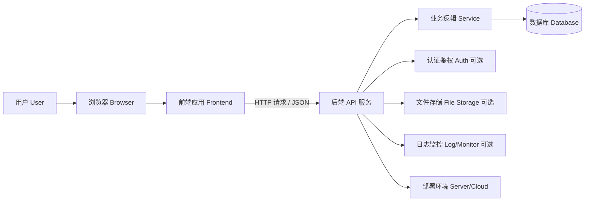

# CRUD Demo 全栈开发架构入门文档

## 1. 你要搭建的其实是什么

你说的这个 demo，本质上就是一个最基础的业务系统：

- 前端页面：给用户看和操作
- 后端服务：处理业务逻辑
- 数据库：保存数据
- 接口通信：让前后端连起来
- 部署运行环境：让这个系统能真正跑起来

比如一个“任务管理” demo：

- 页面能展示任务列表
- 能新增任务
- 能编辑任务
- 能删除任务

这就是最典型的 CRUD（Create / Read / Update / Delete）。

---

## 2. 整体架构图

你可以先把整个系统理解成下面这张图：



你也可以把它简化成最核心的三层：

```text
用户
  ↓
前端（页面）
  ↓
后端（接口 + 业务逻辑）
  ↓
数据库（数据存储）
```

---

## 3. 每个组件是干什么的

## 3.1 浏览器 / 用户端

**作用：**
- 用户打开页面、点击按钮、输入内容、查看结果

**你需要知道：**
- 浏览器是你应用的运行环境之一
- 前端代码最终是在浏览器里执行的
- 用户的所有操作，最后都会触发前端逻辑

---

## 3.2 前端应用（Frontend）

**作用：**
- 展示页面
- 收集用户输入
- 调用后端接口
- 把后端返回的数据渲染出来

**你可以把它理解成：**
“系统的门面”和“交互层”

**常见要学的内容：**
- HTML：页面结构
- CSS：页面样式
- JavaScript / TypeScript：页面行为和逻辑
- 前端框架：React / Vue / Angular（入门推荐 React 或 Vue）

**在 CRUD demo 里它负责：**
- 列表页显示所有数据
- 表单页新增或编辑数据
- 点击删除按钮发送删除请求
- 请求成功后刷新页面或更新列表

---

## 3.3 后端 API 服务（Backend API）

**作用：**
- 接收前端请求
- 处理逻辑
- 访问数据库
- 把结果返回给前端

**你可以把它理解成：**
“中间处理中心”

**常见技术：**
- Node.js（Express / NestJS）
- Java（Spring Boot）
- Python（Flask / FastAPI / Django）
- Go（Gin / Fiber）

**在 CRUD demo 里它负责：**
- 提供接口：
  - `GET /items`：查列表
  - `GET /items/:id`：查详情
  - `POST /items`：新增
  - `PUT /items/:id`：修改
  - `DELETE /items/:id`：删除

---

## 3.4 业务逻辑层（Service）

**作用：**
- 写“规则”和“处理逻辑”
- 不直接关心页面长什么样
- 不直接关心数据库细节怎么写 SQL
- 主要关心“这件事是否允许、怎么处理”

**你可以把它理解成：**
“真正干活的业务层”

**举例：**
比如新增一条任务时，它会做这些事：
- 校验标题不能为空
- 生成创建时间
- 设默认状态
- 保存到数据库

**为什么要有这一层：**
因为前端只负责展示，数据库只负责存储，真正的业务规则应该放在后端的 service 里。

---

## 3.5 数据库（Database）

**作用：**
- 持久化保存数据
- 支持查询、更新、删除

**你可以把它理解成：**
“系统的记忆”

**常见数据库：**
- MySQL
- PostgreSQL
- SQLite（很适合 demo）
- MongoDB（文档型数据库）

**CRUD demo 里它存什么：**
例如 `tasks` 表：

- `id`
- `title`
- `description`
- `status`
- `created_at`
- `updated_at`

**你要掌握的核心概念：**
- 表 / 行 / 列
- 主键
- 增删改查 SQL
- 条件查询
- 分页（后面常用）

---

## 3.6 前后端通信（HTTP API）

**作用：**
- 让前端和后端“说话”

**你可以把它理解成：**
“系统内部的沟通协议”

**常见方式：**
- HTTP 请求
- 数据格式一般用 JSON

**例子：**
前端发请求：

```http
POST /tasks
Content-Type: application/json
```

请求体：

```json
{
  "title": "学习全栈开发",
  "status": "todo"
}
```

后端返回：

```json
{
  "id": 1,
  "title": "学习全栈开发",
  "status": "todo"
}
```

**你要知道的几个概念：**
- 请求方法：GET / POST / PUT / DELETE
- 请求头
- 请求体
- 响应状态码（200、201、400、404、500）
- JSON 数据格式

---

## 3.7 路由（Frontend Route / Backend Route）

这个词前后端都会出现。

### 前端路由
**作用：**
- 控制页面切换
- 比如 `/tasks` 显示列表页，`/tasks/new` 显示新增页

### 后端路由
**作用：**
- 控制不同接口请求交给谁处理
- 比如 `GET /tasks` 走查询逻辑，`POST /tasks` 走新增逻辑

---

## 3.8 认证与鉴权（Auth，可选）

对于最简单的 CRUD demo，可以先不做，但你应该知道它的作用。

**作用：**
- 认证：你是谁（登录）
- 鉴权：你能做什么（权限）

**例子：**
- 用户登录后拿到 token
- 请求接口时带上 token
- 后端校验 token，确认身份

**常见场景：**
- 只有登录用户才能新增数据
- 只有管理员才能删除数据

**常见技术：**
- Session
- JWT

---

## 3.9 文件存储（可选）

如果你的 demo 以后需要上传图片、附件，就会用到它。

**作用：**
- 保存图片、文件，而不是存进普通数据库字段里

**常见方式：**
- 本地磁盘
- 对象存储（如 OSS、S3）

---

## 3.10 日志与监控（可选，但很重要）

**作用：**
- 记录系统运行情况
- 出问题时排查原因

**你可以把它理解成：**
“系统的黑匣子和体检报告”

**包括：**
- 日志：记录请求、报错、关键操作
- 监控：看服务是否正常、慢不慢、有没有报错

**对 demo 来说：**
先知道有这个东西就行，前期只要会看控制台日志已经够用了。

---

## 3.11 部署环境（Server / Cloud）

**作用：**
- 让你的应用不只是在本地跑，而是别人也能访问

**常见环境：**
- 本地开发环境
- 测试环境
- 线上环境

**你可以把它理解成：**
“程序最终安家的地方”

**会涉及：**
- 服务器
- 域名
- Nginx
- Docker
- 云平台（Vercel、Netlify、Railway、阿里云、腾讯云等）

对于入门 demo，可以先做到：
- 前端部署到 Vercel / Netlify
- 后端部署到 Railway / Render
- 数据库用 SQLite 或云数据库

---

## 4. 一次完整的 CRUD 请求是怎么流转的

以“新增一条任务”为例：

### 第 1 步：用户操作前端
用户在页面输入任务标题，点击“新增”。

### 第 2 步：前端发请求给后端
前端把表单数据通过 HTTP POST 发给后端。

### 第 3 步：后端接收请求
后端接口收到请求，读取数据。

### 第 4 步：业务逻辑处理
后端判断参数是否正确，比如标题不能为空。

### 第 5 步：写入数据库
后端把数据存进数据库。

### 第 6 步：后端返回结果
后端把新增后的数据返回给前端。

### 第 7 步：前端更新页面
前端显示“新增成功”，并把列表刷新出来。

---

## 5. 如果你要学这一套，建议掌握的知识模块

你不用一开始全学透，但至少知道这些模块分别是什么：

## 第一层：前端基础
- HTML
- CSS
- JavaScript
- 浏览器基本原理
- 前端框架（React 或 Vue）
- 页面状态管理基础

**目标：**
能做出表单、列表、按钮、弹窗，并能调用接口

---

## 第二层：后端基础
- 一门后端语言/框架
- HTTP 协议
- RESTful API
- 参数校验
- 错误处理
- 项目分层（controller / service / repository）

**目标：**
能写出 CRUD 接口

---

## 第三层：数据库基础
- 关系型数据库
- SQL 基本语法
- 表设计
- 主键、索引基础
- ORM 基础

**目标：**
能设计一张表并完成增删改查

---

## 第四层：工程化基础
- Git / GitHub
- 包管理器（npm / pnpm / yarn）
- 环境变量
- 构建与运行
- 接口调试工具（Postman / Apifox）

**目标：**
能把项目跑起来、管理版本、调试接口

---

## 第五层：部署基础
- Linux / 服务器基础概念
- Docker 基础
- 前后端部署方式
- 域名 / 反向代理基础

**目标：**
能把 demo 从“本地能跑”变成“线上可访问”

---

## 6. 对你这个阶段，最小必要架构是什么

如果你现在只是为了熟悉整体流程，不建议一开始搞太复杂。

我建议你先做这个最小版本：

```text
前端：React
后端：Node.js + Express
数据库：SQLite
接口测试：Postman / Apifox
部署：先本地跑通，再考虑 Docker 或云部署
```

这个组合的优点是：

- 上手快
- 资料多
- 依赖少
- 能完整覆盖前端、后端、数据库、接口、部署的核心流程

---

## 7. 你可以先把一个 demo 拆成这些模块

比如“任务管理系统”：

### 前端
- 登录页（可选）
- 任务列表页
- 新增任务弹窗/页面
- 编辑任务弹窗/页面

### 后端
- 获取任务列表接口
- 获取单个任务接口
- 新增任务接口
- 修改任务接口
- 删除任务接口

### 数据库
- `tasks` 表

### 工程部分
- 本地启动前端
- 本地启动后端
- 前后端联调
- 数据库初始化

---

## 8. 你现在最应该建立的认知

先不要把“全栈开发”想得太重。

你当前要建立的是这几个最核心的理解：

1. **前端负责展示和交互**
2. **后端负责逻辑和数据处理**
3. **数据库负责持久化存储**
4. **接口负责前后端通信**
5. **部署负责让系统真正可用**

只要你把这 5 个点串起来，整个开发流程就通了。

---

## 9. 推荐的项目结构目录图

如果你打算做一个前后端分离的 CRUD demo，可以先按下面这种结构来理解：

```text
curd_demo/
├── frontend/                  # 前端项目
│   ├── public/               # 静态资源
│   ├── src/
│   │   ├── components/       # 通用组件
│   │   ├── pages/            # 页面
│   │   ├── services/         # 调用后端接口的代码
│   │   ├── hooks/            # 自定义 hooks（可选）
│   │   ├── utils/            # 工具函数
│   │   ├── App.jsx           # 前端应用入口组件
│   │   └── main.jsx          # 前端启动入口
│   ├── package.json
│   └── vite.config.js        # 前端构建配置
│
├── backend/                   # 后端项目
│   ├── src/
│   │   ├── controllers/      # 接口控制层，接收请求并返回响应
│   │   ├── services/         # 业务逻辑层
│   │   ├── models/           # 数据模型定义
│   │   ├── routes/           # 路由定义
│   │   ├── db/               # 数据库连接、初始化脚本
│   │   ├── middleware/       # 中间件，如日志、鉴权
│   │   ├── utils/            # 工具函数
│   │   └── app.js            # 后端应用入口
│   ├── package.json
│   └── .env                  # 环境变量配置
│
├── docs/                      # 文档目录（可选）
├── .gitignore
└── README.md
```

---

## 10. 这个目录里每一层是干什么的

### frontend/
前端代码都放在这里，负责页面展示、用户交互、调用后端接口。

### frontend/src/components/
放可以复用的小组件，比如按钮、表格、输入框、弹窗。

### frontend/src/pages/
放页面级内容，比如任务列表页、新增页面、编辑页面。

### frontend/src/services/
放和后端接口通信的代码，比如 `getTasks()`、`createTask()`、`deleteTask()`。

### backend/
后端代码都放在这里，负责接口、业务逻辑、数据库操作。

### backend/src/routes/
定义有哪些接口路径，比如 `/tasks`、`/tasks/:id`。

### backend/src/controllers/
负责接收请求参数、调用 service、返回结果。

### backend/src/services/
负责写核心业务逻辑，比如新增任务前先校验字段，再调用数据库保存。

### backend/src/models/
定义数据结构。如果用了 ORM，这里通常放表结构或模型定义。

### backend/src/db/
放数据库连接配置、建表脚本、初始化数据脚本。

### backend/src/middleware/
放中间件逻辑，比如日志打印、跨域处理、token 校验。

---

## 11. 对新手来说，最重要的是先理解分层

你现在不用追求目录设计多漂亮，先理解这几层分工就够了：

- `pages`：页面长什么样
- `services`：前端怎么请求后端
- `routes`：后端有哪些接口
- `controllers`：接口怎么接请求、回响应
- `services`：后端业务逻辑怎么处理
- `db/models`：数据最终怎么存

你以后看到大多数 CRUD 项目，基本都逃不开这几个层次。

---

## 12. 一句话版总结

如果是一个简单 CRUD demo，你最核心需要掌握的是：

- 前端页面怎么写
- 前端怎么调后端接口
- 后端怎么写 CRUD 接口
- 后端怎么连数据库
- 整个项目怎么运行和部署
