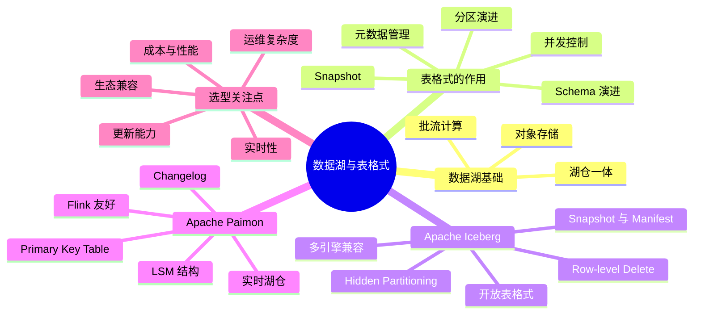

# 数据湖与表格式：Paimon 和 Iceberg

## 1. 知识点简介

数据湖可以先把它理解成“把各种原始数据放进统一存储里，再按需计算”的体系。它通常建在对象存储或分布式文件系统之上，比如 S3、OSS、HDFS。和传统数仓相比，数据湖更便宜、更灵活，能同时容纳结构化、半结构化、非结构化数据。

但只有“把文件放进去”还不够。真正让数据湖可用的关键，是在文件之上再加一层“表格式”或“湖仓表层”。这层能力负责解决几个核心问题：

- 数据怎么组织成一张可查询的表
- 数据更新、删除、回滚怎么做
- 多个计算引擎怎么共享同一份数据
- 流式写入和批式分析怎么共存

`Apache Iceberg` 和 `Apache Paimon` 都属于这类“数据湖表格式/湖仓表存储层”技术，但侧重点不同：

- `Iceberg` 更强调开放标准、跨引擎兼容、大规模分析场景下的稳定表管理
- `Paimon` 更强调实时写入、主键更新、流批一体和 Flink 生态下的低延迟数据处理

如果把数据湖比作“仓库”，那对象存储只是地面和货架，`Iceberg`/`Paimon` 才是仓库的货物管理系统、出入库记录系统和版本管理系统。

## 2. 脑图



## 3. 相关知识点的关系

### 前置依赖

`Paimon` 和 `Iceberg` 都不是“存储介质”本身，而是建立在对象存储或分布式文件系统之上的表层能力。学习它们之前，最好先理解以下基础：

- 数据湖：原始数据存放的位置和组织方式
- 计算引擎：如 Flink、Spark、Trino，负责写入、读取、分析
- 元数据：描述一张表有哪些文件、分区、Schema、版本

### 并列概念

`Paimon` 和 `Iceberg` 是并列的两种湖仓表技术，目标都是让“文件集合”变成“可管理、可演进、可计算的表”。

它们都解决：

- 表级元数据管理
- 快照与版本控制
- Schema 演进
- 流批读写

但它们并不是完全同一路线：

- `Iceberg` 偏“开放表标准 + 分析引擎兼容”
- `Paimon` 偏“实时更新 + 流式处理 + 主键表能力”

### 实现关系

从工程分层上看，关系大致是：

1. 底层存储层：`S3`、`OSS`、`HDFS`
2. 表格式层：`Iceberg`、`Paimon`
3. 计算引擎层：`Spark`、`Flink`、`Trino`
4. 上层业务：数仓建模、BI 查询、实时看板、数据服务

也就是说，`Iceberg`/`Paimon` 是连接“底层文件”和“上层 SQL/计算任务”的关键中间层。

### 对比关系

两者的核心对比可以先从学习路径理解：

- 如果你更关注跨引擎读写共享、离线分析、开放标准，先学 `Iceberg`
- 如果你更关注 CDC 入湖、实时 upsert、主键表、Flink 流批一体，先学 `Paimon`

### 常见混淆点

- 混淆点 1：`数据湖` 和 `表格式` 不是一回事。数据湖是存储理念，`Paimon`/`Iceberg` 是实现“湖上表管理”的技术。
- 混淆点 2：`Iceberg` 不是计算引擎，`Paimon` 也不是计算引擎。它们依赖 Flink、Spark、Trino 等引擎来执行任务。
- 混淆点 3：`Paimon` 不是简单的 `Iceberg` 替代品，它在实时更新和 changelog 场景下有更强特色。
- 混淆点 4：`Iceberg` 更强的地方通常不是“写入速度绝对最快”，而是标准化、生态兼容、表演进能力和查询稳定性。

## 4. 详细介绍每个知识点

### 4.1 数据湖

#### 它是什么

数据湖是一种以低成本、统一存储为核心的数据平台形态。它允许你把原始数据先保留下来，再用不同计算引擎进行加工。

#### 它解决什么问题

- 传统数仓建模成本高，数据接入慢
- 不同类型数据难以统一接入
- 原始数据一旦丢失，后续难以重算
- 批处理和流处理往往是两套系统

#### 核心机制 / 核心用法

数据湖的常见工作流是：

1. 把日志、业务库、消息队列数据落到对象存储
2. 用 Flink/Spark 做清洗、聚合、关联
3. 用表格式管理这些文件
4. 让 BI、报表、Ad-hoc SQL 去消费

#### 注意事项

如果只有“文件堆积”而没有表层管理，数据湖很容易变成“数据沼泽”。所以真正的关键不只是存，而是可治理、可回溯、可查询。

### 4.2 表格式 / 湖仓表层

#### 它是什么

表格式是数据湖上的“事务和元数据管理层”。它让散落的文件表现得像数据库里的表。

#### 它解决什么问题

- 文件太多，查询时不知道该扫哪些文件
- Schema 变化后，旧数据和新数据不兼容
- 删除、更新不能只靠重写整表
- 多个任务并发写入时容易互相覆盖
- 无法轻松做到时间旅行和版本回退

#### 核心机制 / 核心用法

表格式通常会维护：

- 表元数据文件：描述当前表状态
- Snapshot：记录某一时刻表由哪些数据文件组成
- Manifest：记录文件列表和统计信息
- Schema / Partition spec：定义列结构和分区策略
- Commit 协议：保证提交原子性和并发安全

#### 注意事项

`Iceberg` 和 `Paimon` 都有自己的元数据组织方式，但目标一致：不要直接让计算引擎“裸扫文件”，而是通过表层元数据精准定位数据。

### 4.3 Apache Iceberg

#### 它是什么

`Apache Iceberg` 是一种开放的数据湖表格式规范和实现，最初由 Netflix 推动，后来成为 Apache 顶级项目。它的核心目标是让超大规模分析表在对象存储上也能稳定演进，并被多个引擎共享访问。

#### 它解决什么问题

传统 Hive 风格表在大规模场景下有不少痛点：

- 分区信息依赖目录，管理粗糙
- 改分区策略代价大
- 小文件和元数据膨胀严重
- 并发写入一致性差
- 删除和更新支持弱

`Iceberg` 就是在解决这些问题。

#### 核心机制 / 核心用法

`Iceberg` 的关键能力主要有：

1. `Snapshot` 机制
   每次提交都会生成新的快照。查询默认读取当前快照，也可以读取历史快照，实现时间旅行和回滚。

2. `Manifest` 与元数据树
   它不是靠目录猜测分区，而是显式维护文件级元数据、列统计、分区信息。查询时可以通过元数据裁剪大量无关文件。

3. `Hidden Partitioning`
   使用者按业务字段写 SQL，不必显式依赖分区列目录。分区规则由表层管理，降低使用和迁移成本。

4. `Schema Evolution`
   支持列增加、删除、重命名、类型扩展等演进能力，并尽量避免传统“按位置解析列”带来的兼容问题。

5. `Partition Evolution`
   表运行一段时间后，分区策略可以调整，不需要把历史数据整表重写到新目录结构。

6. `Row-level Operation`
   在较新规范和实现中，支持行级删除、更新相关能力，常见方式包括 position delete、equality delete。

7. `Optimistic Concurrency`
   多任务写表时，通过原子替换元数据指针和冲突检查来保证提交一致性。

#### 典型场景

- 大规模离线明细表
- 多引擎共享数据集市
- 需要时间旅行的分析型表
- 对开放生态兼容要求高的平台建设

#### 生态兼容

`Iceberg` 的一大优势是生态广。常见引擎支持包括：

- `Spark`
- `Flink`
- `Trino`
- `Presto`
- 部分云数仓或云湖仓产品

这意味着同一张表，可能由一个引擎写入，再由另一个引擎查询。

#### 注意事项

- `Iceberg` 很强，但如果业务核心是高频主键更新、CDC 持续 upsert，它不一定总是最省心
- 生产上通常需要关注 compaction、小文件治理、元数据清理
- 不同计算引擎对某些高级特性的支持程度可能不完全一致

### 4.4 Apache Paimon

#### 它是什么

`Apache Paimon` 是面向实时湖仓场景的数据湖存储项目，可以理解为“更偏实时更新能力的数据湖表层”。它和 Flink 结合非常紧密，特别适合把 CDC、消息流、业务增量数据直接落成可查询的湖上表。

#### 它解决什么问题

很多实时场景里，数据不是一次性 append，而是不断发生：

- 插入
- 更新
- 删除
- 去重
- 聚合状态刷新

如果只靠传统离线表格式，处理这类高频变更会比较吃力。`Paimon` 的目标就是让这些变更型数据能稳定地落到数据湖里，并继续被流式和批式任务消费。

#### 核心机制 / 核心用法

`Paimon` 的关键能力主要有：

1. `LSM` 风格存储
   它更像面向持续写入优化的结构，先接收增量数据，再通过后台合并整理文件。这种模式对频繁更新、主键去重类场景很有帮助。

2. `Primary Key Table`
   `Paimon` 可以定义主键表。相同主键的新记录到来时，可以形成 upsert 语义，而不是简单追加多条重复记录。

3. `Append-only Table`
   对于纯追加日志、行为流数据，也可以使用 append-only 模式，避免不必要的主键维护开销。

4. `Changelog` 能力
   它不仅能存最终状态，还能在一定条件下提供变更日志视角。这对下游实时同步、状态维护、流式消费非常有价值。

5. `Streaming + Batch`
   同一份湖上表，可以被流作业持续写入，也可以被批作业或交互式查询读取，这正是流批一体的重要基础。

6. `Compaction` 和文件整理
   为了避免小文件过多、查询放大，`Paimon` 会通过 compaction 等机制整理底层文件。

#### 典型场景

- MySQL CDC 入湖
- 订单、用户、商品等主键维表实时更新
- 实时宽表构建
- 低延迟数据集市
- 需要 changelog 语义的下游实时消费

#### 生态特点

`Paimon` 和 `Flink` 结合最紧，这也是它最大的工程优势之一。除 Flink 外，它也逐步支持更多查询和计算引擎，但整体生态广度通常仍会弱于 `Iceberg`。

#### 注意事项

- 如果团队核心引擎是 `Flink`，并且需要强实时更新，`Paimon` 往往很合适
- 如果团队更强调通用开放标准和更广的查询生态，通常要认真比较 `Iceberg`
- 主键表虽然好用，但会引入额外的维护和 compaction 成本

### 4.5 Paimon 和 Iceberg 的重点对比

#### 它们分别更擅长什么

`Iceberg` 更擅长：

- 大规模分析表管理
- 多引擎共享
- 规范化元数据和表演进
- 跨平台、开放生态

`Paimon` 更擅长：

- 实时写入
- 主键 upsert
- CDC 入湖
- changelog 场景
- Flink 驱动的流批一体

#### 选择时最该看的维度

1. 实时性要求高不高
   如果秒级到分钟级持续更新是主需求，`Paimon` 通常更顺手。

2. 是否大量依赖主键更新
   如果核心表是用户表、订单状态表、设备状态表，`Paimon` 的主键能力更贴近需求。

3. 是否需要多引擎统一消费
   如果 Spark、Trino、Flink 都要深度读写，`Iceberg` 往往更稳。

4. 团队主栈是什么
   Flink 重、实时链路强，倾向 `Paimon`；离线分析重、开放生态要求高，倾向 `Iceberg`。

5. 业务表是什么形态
   事件流、明细追加、超大分析表，`Iceberg` 常常更自然；变更流、维表、状态表，`Paimon` 更有优势。

#### 一个简单记忆法

- `Iceberg`：更像“标准化的大型湖上分析表管理方案”
- `Paimon`：更像“面向实时更新和流式场景的湖上表方案”

## 5. 实际案例讲解

### 场景背景

一个电商平台有两类核心数据：

- 订单行为流：不断产生下单、支付、退款事件
- 用户资料表：用户等级、手机号、会员状态会频繁变更

平台希望建设统一数据湖，既支持：

- 实时报表
- 离线分析
- BI 查询
- 历史回溯

### 目标

- 订单事件能低成本长期保存并支持分析
- 用户资料能实时更新，不保留大量重复旧状态
- 同一套数据能被不同计算引擎访问

### 步骤拆解

1. 订单行为流进入湖上明细表

订单事件天然适合 append 模式。这里可以优先考虑 `Iceberg` 或 `Paimon append-only` 表，但如果平台更关注多引擎离线分析，`Iceberg` 会更常见。

2. 用户资料 CDC 进入主键表

MySQL 用户表通过 CDC 持续产生 insert/update/delete 变更。这里如果使用 `Paimon primary key table`，就可以把同一个用户的多次变更合并成当前状态，或者向下游暴露 changelog。

3. Flink 做实时宽表关联

Flink 读取订单事件流，再关联 `Paimon` 中维护的最新用户维度，实时产出经营看板数据。

4. Trino/Spark 做离线分析

分析师使用 Trino/Spark 查询 `Iceberg` 中的订单明细表，按天、按品类、按渠道做统计分析。

5. 历史问题排查

如果想知道“昨天 10 点时某张分析表的状态”，可以利用 `Iceberg snapshot` 做时间旅行，回到历史版本排查问题。

### 案例里对应的知识点

- 订单明细表对应：数据湖、append 表、分析型表
- 用户维表对应：主键表、upsert、CDC 入湖
- Flink 关联对应：流批一体、实时计算
- 历史回溯对应：snapshot、版本管理
- 多引擎消费对应：开放表格式和生态兼容

### 最终结果

平台最终不是只拥有“很多 parquet/orc 文件”，而是拥有：

- 一套可持续演进的数据湖表层
- 一套适合分析的开放表
- 一套适合实时状态维护的主键表
- 一条流批统一的数据处理链路

这就是为什么很多团队会同时研究 `Iceberg` 与 `Paimon`，而不是简单地二选一后再忽略另一个。

## 6. Demo 指导

下面给你一个“最小学习型 Demo”，目标不是一次搭满完整生产环境，而是帮助你真正理解两者差异。

### 前置准备

你需要准备：

- 一台本地机器或测试环境
- `Docker`
- `Flink` 基础认知
- `Spark` 或 `Trino` 基础认知
- 一个对象存储或本地文件系统目录作为 warehouse

### 第 1 步：先做一个 Iceberg 表，理解分析型表能力

选择 `Spark SQL` 或 `Flink SQL` 创建一个订单明细表，例如：

```sql
CREATE TABLE dwd_orders (
  order_id BIGINT,
  user_id BIGINT,
  amount DECIMAL(10,2),
  status STRING,
  dt STRING
)
USING iceberg
PARTITIONED BY (dt);
```

然后插入几批数据，重点观察：

- 表目录下会生成数据文件和元数据文件
- 每次提交都会形成新的 snapshot
- 你可以尝试做一次历史版本查询或回滚

### 第 2 步：再做一个 Paimon 主键表，理解实时更新

使用 `Flink SQL` 创建用户维表：

```sql
CREATE TABLE dim_user (
  user_id BIGINT,
  user_level STRING,
  phone STRING,
  is_member BOOLEAN,
  PRIMARY KEY (user_id) NOT ENFORCED
) WITH (
  'connector' = 'paimon'
);
```

连续插入同一个 `user_id` 的多条更新记录，观察：

- 最终表中同一个主键只保留最新状态
- 下游如果按 changelog 方式消费，会看到更新过程
- 后台会有 compaction/合并相关行为

### 第 3 步：用同一业务模型对比两者体验

设计两个问题并亲自跑一下：

1. “同一个主键不断更新”时，哪种表使用更自然？
2. “多引擎查询同一张分析表”时，哪种表更顺手？

你会很快形成直觉：

- 高频更新场景下，`Paimon` 往往更贴近业务
- 大规模共享分析场景下，`Iceberg` 往往更自然

### 第 4 步：补一个 CDC 入湖小实验

如果你有 `MySQL + Flink CDC` 环境，可以把用户表变更同步进 `Paimon`。重点验证：

- update 是否能正确反映到主键表
- delete 是否能在湖上表体现
- 下游实时宽表是否能读到最新维度

### 验证方式

你做完后，至少要验证这 4 件事：

1. `Iceberg` 表能看到多个 snapshot
2. `Iceberg` 查询能依赖元数据裁剪，而不是简单扫所有目录
3. `Paimon` 主键表对同一主键的多次更新能收敛成最新状态
4. `Paimon` 更适合承接 CDC 和 changelog 型数据

### 你完成后应该看到什么

如果 Demo 做通，你应该能得到下面这个结论：

- 数据湖不是“存文件”这么简单，真正关键是表层能力
- `Iceberg` 是偏标准化、开放生态、分析型的湖上表方案
- `Paimon` 是偏实时更新、主键表、流批一体的湖上表方案
- 两者不是简单互斥关系，而是分别适合不同的数据形态和平台目标

当你能把“订单明细表为什么更适合一种方案”“用户状态表为什么更适合另一种方案”讲清楚时，就说明你已经真正理解了这份知识文档的核心。
