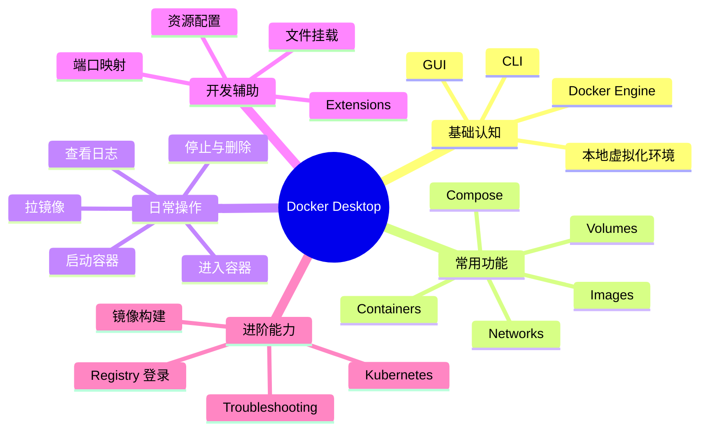

# Docker Desktop 使用说明

## 1. 知识点简介

`Docker Desktop` 可以先理解成：**把 Docker 运行环境、图形界面和一些常用开发能力打包在一起的桌面工具**。

如果你只看命令行，平时常接触的是：

- `docker build`
- `docker run`
- `docker ps`
- `docker compose up`

这些命令背后真正干活的是 Docker Engine。  
而 `Docker Desktop` 则是在 Mac 和 Windows 上，帮你把这些能力更方便地装起来、跑起来、看起来。

它通常解决这些问题：

- 本机没有原生 Linux Docker 环境，怎么跑容器
- 不想只靠命令行，想看镜像、容器、日志和资源占用
- 想用更简单的方式管理本地开发环境
- 想快速开启 Kubernetes、Volumes、Extensions 等能力

所以你可以先把它理解成：

- Docker 的桌面开发平台
- 本地容器开发入口
- Docker CLI 的“图形化控制台 + 运行底座”

常见使用场景：

- 本地启动开发环境
- 运行数据库、中间件、测试服务
- 构建和调试镜像
- 使用 `docker compose` 管理多服务
- 在本机体验 Kubernetes

## 2. 脑图



## 3. 相关知识点的关系

### 前置依赖

学习 Docker Desktop 前，最好先了解这些概念：

- `镜像（Image）`
- `容器（Container）`
- `Dockerfile`
- `端口映射`
- `Volume`
- `docker compose`

因为 Docker Desktop 只是把这些能力更方便地提供出来，它本身不是替代这些概念，而是承载这些概念的工具。

### 包含关系

- `Docker Desktop` 包含本地运行 Docker 所需的桌面环境
- 它提供 `GUI` 和 `CLI` 协作方式
- 你在界面里看到的 `Images`、`Containers`、`Volumes`、`Networks`，本质上对应的就是 Docker 里的核心资源

### 实现关系

- 你要运行一个镜像，会变成一个 `Container`
- 你要开放访问，会配 `端口映射`
- 你要保留数据，会用 `Volume`
- 你要同时管理多个服务，通常会用 `docker compose`
- 你要可视化查看状态、日志、占用情况，就会回到 Docker Desktop 界面

### 并列概念

这些功能在 Docker Desktop 里是并列的入口，但用途不同：

- `Images`：镜像管理
- `Containers`：容器管理
- `Volumes`：数据卷管理
- `Builds`：构建相关能力
- `Extensions`：扩展插件
- `Kubernetes`：本地 K8s 能力

### 常见混淆点

- `Docker Desktop` 和 `Docker CLI`：不是二选一，通常是配合使用
- `Image` 和 `Container`：镜像是模板，容器是运行实例
- `Volume` 和 `Bind Mount`：都能挂载数据，但用途和行为不同
- `Compose` 和单个 `docker run`：前者适合多服务，后者适合单次快速启动

### 学习路径建议

比较顺的顺序是：

1. 先理解镜像、容器、端口映射
2. 再学会用 Docker Desktop 查看和管理资源
3. 然后学 `docker compose`
4. 最后再看 Kubernetes、Extensions、资源限制这些进阶能力

## 4. 详细介绍每个知识点

### 4.1 Docker Desktop 是什么

**它是什么**

Docker Desktop 是 Docker 官方提供的桌面应用，主要面向 Mac 和 Windows 用户。

**它解决什么问题**

这些系统不像 Linux 那样天然适合直接运行 Docker Engine，所以 Docker Desktop 帮你搭好了本地容器运行环境。

**核心机制 / 核心用法**

- 提供桌面界面
- 提供 Docker Engine 运行环境
- 附带 Docker CLI
- 集成 Compose、镜像管理、日志查看等能力

**注意事项**

- 它不是“只是一个界面”，底层还有实际运行环境
- 启动慢、资源占用高时，很多问题不只是 UI，而是底层虚拟化和容器运行环境在消耗资源

### 4.2 Images

**它是什么**

Images 页面用来查看本地已有镜像。

**它解决什么问题**

你需要知道本地有哪些镜像、版本是什么、是否需要清理。

**核心机制 / 核心用法**

- 可以看到镜像名称、tag、大小
- 可以删除镜像
- 可以从镜像直接启动容器

**注意事项**

- 删除镜像前要注意是否还有容器依赖它
- 镜像多了会占磁盘空间

### 4.3 Containers

**它是什么**

Containers 页面展示正在运行或已经停止的容器。

**它解决什么问题**

你不需要每次都回终端查 `docker ps`，也能看到容器状态。

**核心机制 / 核心用法**

- 查看容器是否运行
- 查看日志
- 打开终端进入容器
- 停止、重启、删除容器
- 查看端口映射和环境变量

**注意事项**

- 容器删掉不等于镜像删掉
- 如果没挂载 Volume，删容器后数据可能就没了

### 4.4 Volumes

**它是什么**

Volumes 是 Docker 用来保存容器数据的机制。

**它解决什么问题**

容器是临时的，但数据库数据、缓存数据、持久化文件不能跟着容器一起消失。

**核心机制 / 核心用法**

- 可以在 Docker Desktop 里查看已有 Volume
- 可以清理不再使用的数据卷
- 可以理解哪些服务把数据写到了哪里

**注意事项**

- 清理 Volume 前要确认是不是还在使用
- 很多“删了容器数据还在”的情况，就是因为用了 Volume

### 4.5 Docker Compose

**它是什么**

Compose 是管理多容器应用的方式。

**它解决什么问题**

如果你有一个项目同时依赖：

- Web 服务
- MySQL
- Redis

那一个个 `docker run` 会很乱。Compose 让你用一个 `compose.yaml` 统一管理。

**核心机制 / 核心用法**

- 用文件定义多个服务
- 一条命令启动整套环境
- 配置端口、环境变量、挂载卷、网络

常见命令：

```bash
docker compose up -d
docker compose down
docker compose ps
```

**注意事项**

- 多服务开发几乎都会用到它
- 看不懂 `compose.yaml`，后面本地联调会比较痛苦

### 4.6 资源配置

**它是什么**

Docker Desktop 可以配置 CPU、内存、磁盘等资源。

**它解决什么问题**

如果你容器跑不动、数据库很卡、Kubernetes 启动失败，很多时候是分配资源太少。

**核心机制 / 核心用法**

- 在设置里调整 CPU / Memory / Disk
- 根据项目规模分配资源

**注意事项**

- 分太少：容器容易卡
- 分太多：宿主机会变慢
- 本地开发一般以“够用”为准，不要盲目开太大

### 4.7 Kubernetes

**它是什么**

Docker Desktop 可以提供本地 Kubernetes 环境。

**它解决什么问题**

你不需要单独装一套复杂集群，也能在本机练习 K8s。

**核心机制 / 核心用法**

- 在设置里启用 Kubernetes
- 启用后可以直接用 `kubectl`
- 很适合做入门练习和小规模验证

**注意事项**

- 会明显增加资源消耗
- 不适合模拟复杂生产集群

### 4.8 Troubleshooting

**它是什么**

这是 Docker Desktop 的诊断和排障能力。

**它解决什么问题**

当你遇到以下问题时会用到：

- Docker Desktop 起不来
- 容器莫名其妙退出
- 网络访问异常
- 拉镜像失败

**核心机制 / 核心用法**

- 看状态页
- 看容器日志
- 看资源占用
- 必要时重启 Docker Desktop

**注意事项**

- 很多问题先不要怀疑业务代码，先确认容器、端口、资源和挂载

## 5. 实际案例讲解

### 场景背景

你刚拿到一个后端项目，项目依赖：

- Node.js 服务
- MySQL
- Redis

团队告诉你：本地用 Docker Desktop 跑。

### 目标

用 Docker Desktop 在本地把整套开发环境跑起来，并验证服务可访问。

### 步骤拆解

1. 打开 Docker Desktop，确认它已经正常启动
   - 如果底座没启动，后面的所有命令都不会工作

2. 在项目目录执行 `docker compose up -d`
   - Compose 会按配置把多个服务一起拉起来

3. 在 Docker Desktop 的 Containers 页面查看
   - 是否出现多个服务容器
   - 哪些服务运行中
   - 哪些服务启动失败

4. 如果某个服务失败，点进容器看日志
   - 例如数据库密码错误
   - 例如端口冲突
   - 例如依赖服务未启动

5. 用端口访问服务
   - 比如访问 `http://localhost:3000`
   - 或连接 `localhost:3306`

6. 如果要保留数据库数据，检查 Volume
   - 确认数据卷已经创建

### 案例里对应的知识点

- `Docker Desktop`：作为本地运行入口
- `Containers`：查看运行状态
- `Logs`：定位问题
- `Compose`：一键启动多个服务
- `Volume`：保证数据持久化
- `端口映射`：让本机能访问容器服务

### 最终结果

你不是“手动装了一堆环境”，而是通过 Docker Desktop + Compose，把整个项目的本地依赖环境稳定跑起来了。

这也是它在团队开发里很重要的原因：

- 降低环境差异
- 减少手工安装
- 更容易统一开发流程

## 6. Demo 指导

这里给你一个最小 demo：用 Docker Desktop 跑一个 Nginx 页面服务。

### 前置准备

先确认：

- 你已经安装并启动 Docker Desktop
- 终端里这些命令可用

```bash
docker --version
docker compose version
docker ps
```

如果 `docker ps` 能正常输出，就说明 Docker Desktop 底层已经工作了。

### 第 1 步：创建练习目录

```bash
mkdir docker-desktop-demo
cd docker-desktop-demo
```

### 第 2 步：创建 `index.html`

```html
<!DOCTYPE html>
<html>
  <head>
    <meta charset="UTF-8" />
    <title>Docker Desktop Demo</title>
  </head>
  <body>
    <h1>Hello Docker Desktop</h1>
  </body>
</html>
```

### 第 3 步：创建 `compose.yaml`

```yaml
services:
  web:
    image: nginx:1.27
    ports:
      - "8080:80"
    volumes:
      - ./index.html:/usr/share/nginx/html/index.html:ro
```

### 第 4 步：启动服务

```bash
docker compose up -d
```

### 第 5 步：在 Docker Desktop 中观察

打开 Docker Desktop，进入 `Containers` 页面，确认：

- 有一个名为 `web` 的容器
- 状态是 Running
- 能看到端口映射 `8080:80`

### 第 6 步：在浏览器验证

打开：

[http://localhost:8080](http://localhost:8080)

你应该能看到：

```text
Hello Docker Desktop
```

### 第 7 步：查看日志

```bash
docker logs <container-id-or-name>
```

或者直接在 Docker Desktop 容器详情页查看日志。

### 第 8 步：停止并清理

```bash
docker compose down
```

### 验证方式

你可以用这些命令确认整个流程已经走通：

```bash
docker compose ps
docker ps
docker images
```

### 你完成后应该看到什么

做完这次 demo，你应该建立这些认知：

- Docker Desktop 不只是界面，它背后还提供运行环境
- 你可以同时用 GUI 和 CLI 管理容器
- `compose.yaml` 很适合描述本地开发环境
- 容器运行状态、日志、端口、挂载都能在 Docker Desktop 里直观看到
- 本地开发时，Docker Desktop 是一个很高频的入口工具
