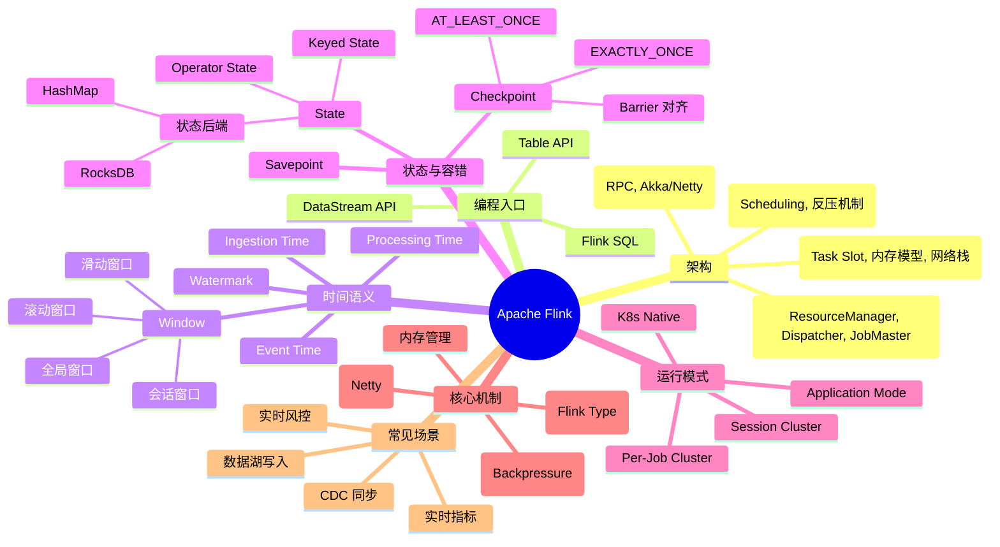

# Apache Flink 基础知识

## 1. 知识点简介

`Apache Flink` 是一个分布式流处理和批处理计算引擎。它最核心的特点是：**以流处理为核心，同时支持批处理**。

你可以先把 Flink 理解成一个专门处理"持续不断的数据"的计算系统，比如：

- 用户点击日志实时统计
- 订单支付状态实时更新
- 实时风控规则计算
- 实时大屏指标聚合
- MySQL binlog 通过 CDC 实时同步到数据湖

和传统离线任务不同，Flink 更擅长处理不断到来的事件流。它可以一边接收数据，一边计算结果，并且通过状态和 Checkpoint 保证任务失败后可以恢复。

在数据工程体系里，Flink 常常位于计算层：

```text
数据源 Kafka / MySQL CDC / 日志
        ↓
      Flink
        ↓
结果表 / Kafka / 数据湖 / OLAP / 实时看板
```

## 2. 脑图



## 3. 相关知识点的关系

### 前置依赖

学习 Flink 之前，最好先理解这些基础概念：

- Java / JVM：Flink 本身运行在 JVM 上
- Docker：本仓库的本地练习环境使用 Docker Compose 启动
- SQL 基础：Flink SQL 会大量使用 SQL 语法
- 消息队列基础：真实场景里经常从 Kafka 读取数据
- 数据处理基础：map、filter、group by、window 等概念

### 并列概念

Flink 经常和 Spark、Storm、Kafka Streams 一起被比较：

- `Flink`：更强调低延迟、有状态流处理、流批一体
- `Spark`：更常见于大规模离线批处理，也支持 Structured Streaming
- `Kafka Streams`：更轻量，适合 Kafka 生态内的流处理
- `Storm`：较早期的流处理框架，现在新项目使用较少

### 实现关系

从工程分层看，Flink 常常处在中间计算层：

1. 数据源层：Kafka、MySQL、日志、文件、对象存储
2. 计算引擎层：Flink
3. 存储或服务层：Kafka、MySQL、Redis、ClickHouse、Paimon、Iceberg
4. 应用层：实时看板、风控系统、推荐系统、数据分析

也就是说，Flink 不是数据库，也不是消息队列。它主要负责把数据从一个或多个地方读出来，经过计算后写到另一个地方。

### 对比关系

一个简单理解：

- 如果你处理的是每天跑一次的离线报表，Spark 或传统数仓任务可能更常见
- 如果你处理的是秒级、分钟级更新的实时指标，Flink 会更适合
- 如果你想用 SQL 写实时任务，Flink SQL 是很常见的选择
- 如果你想把 MySQL 变化实时写入数据湖，Flink CDC + Paimon / Iceberg 是常见组合

### 常见混淆点

- 混淆点 1：Flink 不是 Kafka。Kafka 负责存消息，Flink 负责计算消息。
- 混淆点 2：Flink 不是数据库。它可以维护状态，但不是用来当业务数据库的。
- 混淆点 3：Flink 的批处理不是另一套引擎，而是把有界数据也当成一种特殊的流来处理。
- 混淆点 4：Checkpoint 和 Savepoint 都能保存状态，但用途不同。Checkpoint 偏自动容错，Savepoint 偏人为运维和版本升级。

## 4. 详细介绍每个知识点

### 4.1 Flink 是什么

#### 它是什么

Flink 是一个分布式计算引擎，主要用于处理数据流。它可以把一个计算任务拆成多个并行子任务，分发到集群里的 TaskManager 上执行。

#### 它解决什么问题

Flink 主要解决这些问题：

- 数据持续不断到来，传统批处理延迟太高
- 实时计算需要维护中间状态
- 任务失败后不能从头重算，需要从最近状态恢复
- 数据可能乱序到达，需要按事件时间正确计算
- 希望用一套系统同时处理实时和离线数据

#### 核心机制 / 核心用法

Flink 程序通常会经历：

1. 读取数据源
2. 做转换计算
3. 按 key 分组
4. 做窗口、聚合、关联等操作
5. 写入下游系统

#### 注意事项

刚开始学习时，不要急着一次性上 Kafka、CDC、Paimon。先把 Flink 集群、Web UI、示例任务、基本概念跑通，再逐步扩展。

### 4.2 Flink 架构深度解析

#### 4.2.1 Flink 的启动与提交流

当你执行 `flink run xxx.jar` 时，背后发生的事情：

```
用户提交命令 (flink run)
    ↓
Client (CLI / Web UI / REST API)
    ↓  打包 JAR + 生成 JobGraph
JobManager (Dispatcher)
    ↓  接收 JobGraph
JobMaster
    ↓  生成 ExecutionGraph (物理执行图)
    ↓  向 ResourceManager 申请资源
ResourceManager
    ↓  分配 TaskManager + Task Slot
TaskManager
    ↓  接收 SubTask + 执行算子链
SubTask 开始运行 (Source → Transform → Sink)
```

关键步骤解释：

1. **Client 阶段**：`flink run` 不是把 JAR 直接扔给集群执行。Client 会先加载 JAR，调用 `main()` 方法生成一个**逻辑执行图**（由 Source、Transformation、Sink 组成的 StreamGraph）。然后转换成 **JobGraph**（优化后的图，包含算子链优化信息）。最后把 JobGraph 提交给 JobManager。

2. **JobGraph**：这是 Client 提交给 Flink 集群的最小单位。它已经做了初步优化——把可以串联的算子合并成一个 Operator Chain（算子链），减少网络传输。

3. **ExecutionGraph**：JobManager 收到 JobGraph 后，会根据并行度将它展开为 **物理执行图** ExecutionGraph。每个算子的每个并行子任务变成一个 SubTask。这个图才是真正被调度执行的东西。

4. **算子链优化（Operator Chaining）**：如果两个相邻算子的并行度相同、且数据交换方式是 Forward（不是 keyBy 那种 shuffle），Flink 会把它们合并成同一个线程里执行，避免序列化/反序列化开销。你在 Web UI 上经常看到 "Source → FlatMap → Map" 被合并成一个大节点，这就是算子链。

#### 4.2.2 JobManager 内部组件

JobManager 不是单个进程，它内部包含三个核心组件：

```
JobManager
├── ResourceManager    # 集群资源的总管，负责分配 Task Slot
├── Dispatcher         # 接收外部提交来的 Job，为每个 Job 启动一个 JobMaster
└── JobMaster          # 每个 Job 有一个，负责调度这个 Job 的所有 Task
```

- **ResourceManager**：管理 TaskManager 注册上来的 Slot。当 JobMaster 需要资源时，向 ResourceManager 申请。如果资源不够，ResourceManager 可以动态拉起新的 TaskManager（在 YARN/K8s 模式下）。
- **Dispatcher**：相当于 JobManager 的入口服务。它接收 Client 提交的 Job，为每个 Job 创建一个 JobMaster。同时提供一个 REST API（就是 Web UI 调用的那个）。
- **JobMaster**：每个 Job 独立拥有一个。负责把 JobGraph 展开为 ExecutionGraph、向 ResourceManager 申请资源、调度 Task 到 TaskManager、协调 Checkpoint。

#### 4.2.3 TaskManager 内部结构

```
TaskManager (JVM 进程)
├── Slot 1
│   └── Task A (可能是一个算子链，含多个算子)
├── Slot 2
│   └── Task B
└── ...
├── 内存管理 (Flink 自己管理，不是完全靠 JVM 堆)
│   ├── 托管内存 (Managed Memory) —— 给 RocksDB、排序、Hash Join 用
│   └── JVM 堆 —— 给算子逻辑用
└── 网络栈 (Netty)
    └── 负责 SubTask 之间的数据传递
```

一个 TaskManager 是一个 JVM 进程。它对外暴露若干个 Task Slot。每个 Slot 里可以运行一个 Task（可能是一个算子链）。

**Slot 共享（Slot Sharing）**：Flink 默认开启 Slot Sharing。不同 SubTask 可以共享同一个 Slot，只要它们属于同一个 Job 的不同阶段。这样可以用更少的 Slot 运行完整的 Job。这也是为什么 Docker 环境里配置 `numberOfTaskSlots: 2` 也能运行包含 4-5 个算子的 WordCount。

#### 4.2.4 为什么是流批一体？

Flink 认为**批处理只是流处理的一个特例**——当数据流有明确开始和结束时，就是批处理。

- **流模式**：数据无界，持续不断地来
- **批模式**：数据有界，读完就结束

在 API 层面，同一个 DataStream 程序，既可以在流模式下运行（处理无限数据），也可以在批模式下运行（把有界数据当成一种特殊的流）。在 Table/SQL 层面，流批一体更加统一——同一套 SQL，可以跑在流上也可以跑在批上。

### 4.3 Task Slot 与并行度

#### 它是什么

`Task Slot` 是 TaskManager 提供给作业使用的资源槽位。并行度可以理解为一个算子被拆成多少份同时执行。

#### 并行度的层级

Flink 中并行度有四个层级，优先级从高到低：

1. **算子级别**：`dataStream.map(...).setParallelism(4)` —— 只对这一个算子生效
2. **ExecutionEnvironment 级别**：`env.setParallelism(4)` —— 对这个 Job 里所有算子生效
3. **Client 级别**：`flink run -p 4` —— 通过 CLI 提交时指定
4. **集群级别**：`parallelism.default` 在 `flink-conf.yaml` 中配置

#### 并行度与 Slot 的关系

```
TaskManager 1 (2 个 Slot)          TaskManager 2 (2 个 Slot)
├── Slot 1: Source-SubTask 0       ├── Slot 1: Source-SubTask 2
└── Slot 2: FlatMap-SubTask 0      └── Slot 2: FlatMap-SubTask 2
```

当并行度为 4、每个 TaskManager 有 2 个 Slot 时，需要 2 个 TaskManager 来承载 4 个并行子任务。

#### 注意事项

学习阶段不用把 Slot 调太高。单机 Docker 环境更多是为了理解概念，不适合压测性能。

### 4.4 DataStream API、Table API 和 Flink SQL

#### 它是什么

Flink 有几种常见编程入口：

- `DataStream API`：偏代码，适合精细控制流处理逻辑
- `Table API`：用表的方式表达计算逻辑
- `Flink SQL`：用 SQL 写实时或离线任务

#### 三层 API 的关系

```
┌─────────────────────────────────┐
│       Flink SQL (最高层)         │  ← 用 SQL 写，适合数仓开发
├─────────────────────────────────┤
│      Table API (中间层)          │  ← 用 Java/Scala 链式调用表操作
├─────────────────────────────────┤
│   DataStream API (最底层)        │  ← 最精细控制，适合复杂流处理
└─────────────────────────────────┘
         ↓ 都会被转换
┌─────────────────────────────────┐
│       StreamGraph → JobGraph     │  ← 统一执行图
└─────────────────────────────────┘
```

- **DataStream API**：最底层，提供最大的灵活性。你可以自己定义 Source、自定义状态、控制 Watermark 等。
- **Table API**：中间层。用 Table 的概念包装了 DataStream，操作更像传统的关系型数据库。
- **Flink SQL**：最高层。直接用 SQL 写逻辑，底层自动翻译成 DataStream 或 Table 操作。

#### 常见学习顺序

1. 先跑官方 WordCount 示例，理解作业提交
2. 再学 DataStream API，理解算子和状态
3. 再学 Flink SQL，理解表、Catalog、Connector
4. 最后结合 Kafka、CDC、Paimon 做完整链路

#### 注意事项

SQL 看起来简单，但底层仍然会被转换成 Flink 作业执行。想真正排查问题，仍然需要理解 JobManager、TaskManager、Checkpoint、State 等底层概念。

### 4.5 算子（Operator）与转换（Transformation）

这是写 Flink Java 任务时最核心的概念。

#### Source（数据源）

Source 是数据流的入口。常见的 Source 有：

```java
// 从集合创建（测试用）
env.fromCollection(list);
// 从元素创建（测试用）
env.fromElements("a", "b", "c");
// 从文件创建
env.readTextFile("/path/to/file");
// 从 Kafka 读取（需要 Kafka Connector）
env.addSource(new FlinkKafkaConsumer<>(...));
// 自定义 Source
env.addSource(new MySourceFunction());
// 使用新的 Source API (Flink 1.12+)
env.fromSource(new KafkaSource<>(...), WatermarkStrategy.noWatermarks(), "kafka-source");
```

#### Transformation（转换算子）

| 算子 | 作用 | 输入→输出 | 是否需要 Key |
|------|------|----------|-------------|
| `map` | 一对一转换 | 1条 → 1条 | 不需要 |
| `flatMap` | 一对多/多对多 | N条 → M条 | 不需要 |
| `filter` | 过滤 | N条 → ≤N条 | 不需要 |
| `keyBy` | 按 key 分组 | 重分区 | 需要 |
| `reduce` | 聚合 | 多条 → 1条（per key） | 需要（在 keyBy 后） |
| `window` | 开窗 | 按窗口分组 | 需要（在 keyBy 后） |
| `process` | 底层处理 | 完全自定义 | 可选 |
| `union` | 合并多个流 | 多条流 → 1条 | 不需要 |
| `connect` | 连接两个流 | 2条 → 1条（可不同结构） | 不需要 |
| `broadcast` | 广播流 | 每条数据发到所有并行实例 | 不需要 |

#### Sink（数据出口）

```java
// 打印到日志
dataStream.print();
// 写入 Kafka
dataStream.addSink(new FlinkKafkaProducer<>(...));
// 写入文件
dataStream.writeAsText("/path/to/output");
// 自定义 Sink
dataStream.addSink(new MySinkFunction());
```

#### 算子链优化（Operator Chaining）

Flink 默认会把满足条件的相邻算子合并为一个 Task：

- 两个算子并行度相同
- 数据传递方式是 Forward（不是 keyBy 导致的 Rebalance/Hash 分区）
- 没有被 `disableChaining()` 或 `startNewChain()` 打断

例如在 WordCountJob.java 里：

```java
lines.flatMap(new SplitToWords())   // SubTask 0
     .map(new WordToOne())          // ← 可能被链到同一个 SubTask 里
     .keyBy(new WordKey())          // ← 一定断开（需要 shuffle）
     .reduce(new SumCounts());      // ← 可能被链到同一个 SubTask 里
```

### 4.6 时间语义、Watermark 和 Window

#### 三种时间

| 时间类型 | 定义 | 特点 | 适用场景 |
|----------|------|------|---------|
| **Processing Time** | 数据被 Flink 处理的时刻 | 最简单、延迟最低、但不保证结果一致性（重跑结果不同） | 监控、仪表盘 |
| **Event Time** | 事件实际发生的时刻 | 需要从数据中提取时间字段、结果可重现 | 计费、订单统计 |
| **Ingestion Time** | 数据进入 Flink Source 的时刻 | 介于两者之间，Flink 内部处理类似 Event Time | 较少使用 |

**为什么 Event Time 很重要？**

假设一个订单在 10:00:01 创建，但因为网络延迟 10:00:05 才到达 Flink。如果按 Processing Time 统计"10:00:00-10:00:10"的订单，这个订单可能落在错误的窗口里。用 Event Time 就能按 10:00:01 这个真实发生时间归类。

#### Watermark 原理

Watermark 是 Flink 用来衡量 Event Time 进度的机制。你可以把它理解成一种"时间进度条"。

```
数据流按到达时间顺序:
  事件A(time=10:00:01) 到达时间 10:00:03
  事件B(time=10:00:05) 到达时间 10:00:06
  事件C(time=10:00:03) 到达时间 10:00:07  ← 乱序

Watermark(10:00:05) 表示: 我认为 time <= 10:00:05 的数据已经全部到齐
```

**Watermark 的生成方式：**

```java
// 方式 1: 周期性生成（最常用）
WatermarkStrategy.<MyEvent>forBoundedOutOfOrderness(Duration.ofSeconds(5))
    .withTimestampAssigner((event, timestamp) -> event.getTimestamp());
// 含义：允许数据乱序/迟到最多 5 秒，每收到一条数据都更新 Watermark

// 方式 2: 无 Watermark（数据已有序或不需要 Event Time）
WatermarkStrategy.noWatermarks();

// 方式 3: 严格升序
WatermarkStrategy.forMonotonousTimestamps();
```

**Watermark 在并行流中的传递：**

当有多个并行 Source 时，每个 Source SubTask 独立生成自己的 Watermark。Flink 取所有输入 Watermark 的**最小值**作为当前算子的 Watermark。这意味着：最慢的那个 Source 决定了整个流的 Event Time 进度。

#### Window 类型

| 窗口类型 | 特点 | 举例 |
|----------|------|------|
| **Tumbling Window（滚动窗口）** | 固定大小、不重叠、不跳跃 | 每 5 分钟统计一次，窗口 [10:00-10:05), [10:05-10:10) |
| **Sliding Window（滑动窗口）** | 固定大小、有重叠、按步长滑动 | 每 1 分钟统计过去 5 分钟数据，窗口 [10:00-10:05), [10:01-10:06) |
| **Session Window（会话窗口）** | 按活动间隔分组，动态大小 | 用户 30 分钟无操作则窗口关闭 |
| **Global Window（全局窗口）** | 所有数据进同一个窗口，需自定义触发器 | 需要配合自定义 Trigger 使用 |

**窗口计算的完整生命周期：**

```
1. 元素到达 → 被分配到对应的窗口
2. 窗口内的元素被缓存（实际是 State）
3. Watermark 推进到窗口结束时间 → 触发计算
4. 执行窗口函数（ReduceFunction / AggregateFunction / ProcessWindowFunction）
5. 输出结果
6. 窗口状态被清除（除非配置了 allowedLateness）
```

**迟到数据处理：**

```java
.window(TumblingEventTimeWindows.of(Time.minutes(5)))
   .allowedLateness(Time.minutes(1))   // 窗口触发后 1 分钟内来的数据还会触发更新
   .sideOutputLateData(lateOutputTag)  // 超过允许延迟的数据放到侧输出流
```

### 4.7 State（状态管理）

#### 什么是 State

State 是 Flink 任务运行过程中保存的中间状态。比如统计每个用户的累计点击次数，就需要保存每个用户当前的计数。

**为什么需要 State？**

流处理中很多操作都是"有状态"的：
- 聚合（sum、count、avg）—— 需要记住之前的值
- 去重 —— 需要记住已经见过哪些数据
- 模式匹配（CEP）—— 需要记住之前匹配到什么阶段
- 窗口计算 —— 需要缓存窗口内的所有数据

#### State 分类

**Keyed State**（必须在 `keyBy()` 之后使用）：

| 类型 | 说明 | 场景 |
|------|------|------|
| `ValueState<T>` | 保存一个值 | 记录上次处理的温度 |
| `ListState<T>` | 保存一个列表 | 缓存最近 N 条事件 |
| `MapState<K, V>` | 保存一个 Map | 记录每个商品的上次价格 |
| `ReducingState<T>` | 自动用 ReduceFunction 聚合 | 累加计数 |
| `AggregatingState<IN, OUT>` | 自动用 AggregateFunction 聚合 | 复杂聚合 |

**Operator State**（不需要 keyBy，整个算子一份）：

- 常用于 Source/Sink 中保存偏移量（如 Kafka Consumer 的 offset）
- 整个算子并行实例各自维护一份，不按 key 分

#### State 使用方式

**方式一：RichFunction 中获取 State（最常用）**

```java
public class MyMapper extends RichMapFunction<Input, Output> {
    private transient ValueState<Long> countState;

    @Override
    public void open(Configuration config) {
        StateDescriptor<ValueState<Long>, Long> descriptor =
            new ValueStateDescriptor<>("count", Long.class, 0L);
        countState = getRuntimeContext().getState(descriptor);
    }

    @Override
    public Output map(Input value) {
        Long current = countState.value();
        countState.update(current + 1);
        return new Output(value, current + 1);
    }
}
```

**方式二：Stateful Processor（更底层）**

```java
public class MyProcessFunction extends KeyedProcessFunction<String, Event, Result> {
    private transient ValueState<Long> state;

    @Override
    public void open(Configuration config) {
        state = getRuntimeContext().getState(new ValueStateDescriptor<>("my-state", Long.class));
    }

    @Override
    public void processElement(Event value, Context ctx, Collector<Result> out) {
        Long current = state.value();
        state.update(current + 1);
        // 还可以注册定时器
        ctx.timerService().registerEventTimeTimer(value.getTimestamp() + 60000);
    }

    @Override
    public void onTimer(long timestamp, OnTimerContext ctx, Collector<Result> out) {
        // 定时器触发时的逻辑
    }
}
```

#### 状态后端（State Backend）

状态后端决定了 State 存在哪里、怎么组织：

| 后端 | 存储位置 | 特点 | 适用场景 |
|------|----------|------|---------|
| **HashMapStateBackend** | JVM 堆内存 | 读写快、但受限于内存大小 | 中小状态 (<几GB)、低延迟 |
| **RocksDBStateBackend** | 本地磁盘 (RocksDB) + 内存缓存 | 容量大、但读写稍慢 | 大状态 (几十GB-TB)、需要 TTL |

配置示例：

```java
// HashMap（默认）
env.setStateBackend(new HashMapStateBackend());
// RocksDB
env.setStateBackend(new EmbeddedRocksDBStateBackend());
```

**State TTL（过期时间）**：

```java
StateTtlConfig ttlConfig = StateTtlConfig
    .newBuilder(Time.hours(1))
    .setUpdateType(StateTtlConfig.UpdateType.OnCreateAndWrite)
    .setStateVisibility(StateTtlConfig.StateVisibility.NeverReturnExpired)
    .build();
descriptor.enableTimeToLive(ttlConfig);
```

### 4.8 Checkpoint 与容错

#### 它是什么

`Checkpoint` 是 Flink 自动周期性保存状态的机制，用于失败恢复。

#### Checkpoint 原理（Barrier 对齐机制）

Flink 的 Checkpoint 不是简单地把所有 State 存一份。它使用 **Chandy-Lamport 分布式快照算法** 的变体来保证全局一致性：

```
Source ──数据──→ FlatMap ──数据──→ Reduce ──数据──→ Sink
  │               │                 │               │
  │ ← Barrier N ← │ ← Barrier N ←  │ ← Barrier N ← │
  │               │                 │               │
  当所有输入都收到 Barrier N 时，这个 SubTask 就快照自己的 State
  然后把 Barrier N 发给下游
```

具体流程：

1. **JobMaster 触发 Checkpoint**：按配置的间隔（如 10 秒），JobMaster 向所有 Source SubTask 注入一个 Checkpoint Barrier。
2. **Barrier 沿数据流传递**：Barrier 像普通数据一样在算子之间流动。它不会跳过数据，而是在数据流中插入。
3. **算子对齐 Barrier**：如果一个算子有多个输入（如 Union），它需要等待**所有输入**都收到 Barrier N，才做快照（EXACTLY_ONCE 模式下）。这叫 Barrier Alignment。
4. **State 快照写入外部存储**：每个 SubTask 把自己的 State 写入配置的持久化存储（如 HDFS、S3、NFS）。
5. **确认给 JobMaster**：所有 SubTask 完成后，向 JobMaster 确认。JobMaster 记录这次 Checkpoint 的元数据（哪些 State 文件、对应哪个 SubTask）。
6. **继续正常处理**：Barrier 继续向下游传递，直到所有 Sink。

#### 精确一次（EXACTLY_ONCE） vs 至少一次（AT_LEAST_ONCE）

| 语义 | Barrier 处理 | 性能 | 数据保证 |
|------|-------------|------|---------|
| **EXACTLY_ONCE** | 等待所有输入对齐 | 稍慢（对齐期间数据缓冲） | 每条数据处理且仅处理一次 |
| **AT_LEAST_ONCE** | 不对齐，直接快照 | 更快 | 每条数据至少处理一次（可能重复） |

#### Checkpoint 配置

```java
// 启用 Checkpoint，间隔 10 秒
env.enableCheckpointing(10000);
// 语义
env.getCheckpointConfig().setCheckpointingMode(CheckpointingMode.EXACTLY_ONCE);
// 两次 Checkpoint 最小间隔（防止上一个还没完成就开始下一个）
env.getCheckpointConfig().setMinPauseBetweenCheckpoints(5000);
// Checkpoint 超时时间
env.getCheckpointConfig().setCheckpointTimeout(60000);
// 最大并发 Checkpoint 数
env.getCheckpointConfig().setMaxConcurrentCheckpoints(1);
// 任务取消时是否保留 Checkpoint
env.getCheckpointConfig().setExternalizedCheckpointCleanup(
    ExternalizedCheckpointCleanup.RETAIN_ON_CANCELLATION);
// 存储路径
env.getCheckpointConfig().setCheckpointStorage("hdfs:///checkpoints");
```

#### Checkpoint 与 Savepoint 的对比

| | Checkpoint | Savepoint |
|--|-----------|-----------|
| **触发方式** | 自动周期性 | 手动触发 |
| **用途** | 失败自动恢复 | 升级、迁移、维护 |
| **格式** | Flink 内部格式 | 兼容 Flink 版本的标准格式 |
| **生命周期** | 旧的会被清理 | 除非手动删除否则一直存在 |
| **增量** | 可以配置增量 | 可以是增量或全量 |

触发 Savepoint 命令：

```bash
flink savepoint <jobId> [targetDirectory]
```

从 Savepoint 恢复：

```bash
flink run -s <savepointPath> <jar>
```

### 4.9 反压（Backpressure）

#### 什么是反压

当 Sink 或下游算子处理速度慢于 Source 或上游算子时，数据会在缓冲区中积压。Flink 通过反压机制让上游知道"慢一点"。

#### 反压的传播

```
Sink (慢) → 缓冲区满 → Reduce (被阻塞) → 缓冲区满 → Source (被阻塞)
```

反压不是错误，而是流处理系统自我保护的机制。但如果长期反压，说明系统处理能力不足，需要优化。

#### 如何排查反压

1. 打开 Flink Web UI → 进入运行中的 Job → 点击 Back Pressure
2. 观察各算子的状态：`OK`（正常）、`LOW`（轻微）、`HIGH`（严重）
3. 定位到 HIGH 的算子，分析原因：
   - Sink 写得太慢？（下游数据库瓶颈）
   - 某个 key 数据量太大？（数据倾斜）
   - 算子逻辑太重？（复杂计算、外部调用）

#### 常见优化

- 增加并行度
- 优化 Sink（批量写、异步写）
- 处理数据倾斜（加盐打散、两阶段聚合）
- 调整缓冲区大小

### 4.10 运行模式

#### Session Cluster

```
一个长期运行的 Flink 集群
├── JobManager
└── TaskManager(s)
        ↓
多个 Job 共享同一个集群资源
```

- 集群先启动，然后多个 Job 提交上去共享资源
- 适合：开发测试、小规模部署
- 缺点：一个 Job 异常可能影响其他 Job

#### Per-Job Cluster（YARN 模式）

```
每个 Job 独享一个集群
Job 提交 → 拉起专属 JM + TM → 运行 → 结束 → 释放资源
```

- 每个 Job 有独立的 JobManager 和 TaskManager
- 适合：生产环境、资源隔离要求高
- 需要 YARN 或 Mesos 支持

#### Application Mode

```
在集群内部运行用户的 main() 方法
flink run-application ./my-app.jar
```

- 用户的 `main()` 方法在 JobManager 上执行
- 适合：Flink 原生部署到 Kubernetes
- 更好的资源隔离，JM 和 TM 可以独立扩缩容

#### K8s Native 部署

```
kubectl apply -f flink-deployment.yaml
```

- Flink 直接在 K8s 上管理 Pod
- Session、Application、Per-Job 都支持
- 适合：已有 K8s 基础设施的团队

### 4.11 网络传输与序列化

#### 数据在算子之间怎么传递？

```
SubTask A (上游)                SubTask B (下游)
    │                              │
    │  序列化 → Netty Buffer → 反序列化 │
    │                              │
```

- 同一 TaskManager 内、同一 Slot 内（算子链）：直接在内存中传递对象引用，无序列化开销
- 跨 Task 或跨 TaskManager：通过网络传输，需要序列化

#### Flink 的类型系统

Flink 有自己的类型推断和序列化系统：

```
POJO 类型  → 最优，字段级序列化，支持高效排序和比较
基本类型   → 最优 (int, long, String, etc.)
Tuple 类型 → 优 (Tuple2, Tuple3...)
Generic    → 最差，退化为 Java 序列化
```

为什么你的项目里 `WordCount` 用了 POJO（有 getter/setter/无参构造函数）而不是 record？因为 Flink 能识别 POJO 的字段，做更高效的序列化和比较。如果用 record 或者没有无参构造函数的类，Flink 可能退化为 Generic 类型，用 Java 序列化，性能会下降。

## 5. 实际案例讲解

### 5.1 实时 WordCount

WordCount 是最经典的入门案例。

假设输入数据是：

```text
hello flink
hello stream
```

计算逻辑是：

```text
hello flink
hello stream
    ↓
拆分成单词
    ↓
hello, flink, hello, stream
    ↓
按单词分组统计
    ↓
hello = 2
flink = 1
stream = 1
```

它虽然简单，但能帮助你理解：

- source：从哪里读数据
- transformation：怎么转换数据
- keyBy：怎么按 key 分组
- sink：结果输出到哪里
- job：一个 Flink 作业如何提交和执行

本地环境会用官方自带的 `examples/streaming/WordCount.jar` 来验证作业提交链路。

### 5.2 实时指标聚合

真实业务里更常见的是实时指标，比如每分钟订单金额：

```text
订单事件流
→ 按商品分组
→ 按 1 分钟窗口聚合
→ 输出每个商品每分钟 GMV
```

这个案例会涉及：

- Kafka 或 CDC 作为数据源
- Event Time 和 Watermark
- Window 聚合
- 状态保存
- 结果写入 OLAP 或数据湖

当前本地环境先不包含这些组件，但后续可以在 `compose.yaml` 里继续增加 Kafka、MySQL、Paimon 等服务。

### 5.3 生产级任务示例（概念）

一个典型的生产级 Flink 任务架构：

```text
Kafka (订单 topic)
    ↓ FlinkKafkaSource
[Source: 订单事件]
    ↓ map(JSON 解析 + 字段提取)
    ↓ assignTimestampsAndWatermarks(Event Time)
    ↓ keyBy(order.userId)
    ↓ window(TumblingEventTimeWindows.of(1 minute))
    ↓ aggregate(求和订单金额)
    ↓ [Window Aggregate]
    ↓ sink
Kafka (实时指标 topic) / ClickHouse / Paimon
```

## 6. Demo 指导

本目录已经提供了一个最小可用的 Flink Docker Compose 环境。

先进入目录：

```bash
cd flink
```

启动环境：

```bash
docker compose up -d
```

访问 Flink Web UI：

```text
http://localhost:8081
```

提交官方示例作业：

```bash
docker compose exec jobmanager flink run examples/streaming/WordCount.jar
```

完整跟练步骤见：

```text
practice-guide.md
```

建议你先完整跑一遍 `practice-guide.md`，确认环境能启动、Web UI 能打开、示例任务能提交，再继续学习 Flink API、Flink SQL、Checkpoint、Kafka Connector 和 Flink CDC。
