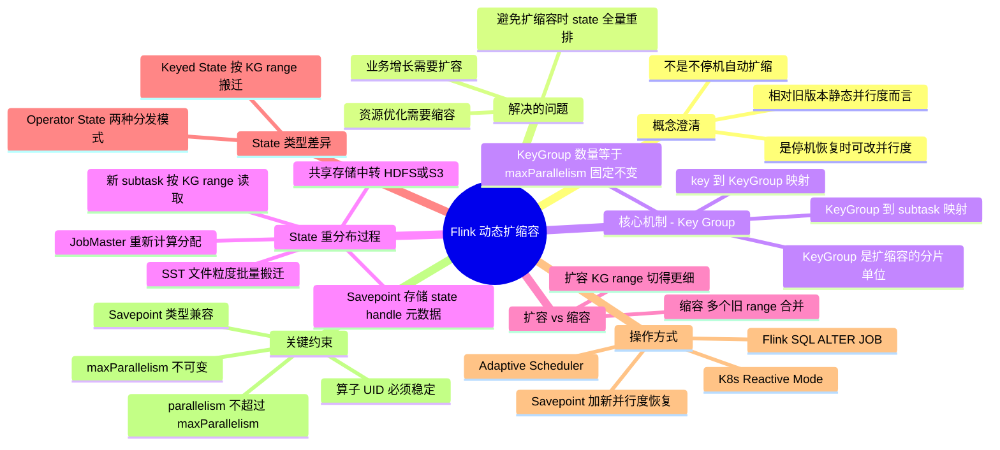

# Flink 动态扩缩容

## 1. 知识点简介

Flink 动态扩缩容（Rescaling）指的是**在作业运行期间或通过 Savepoint 恢复时，改变算子（Operator）的并行度**。

你可以把这个过程想象成"给一条流水线增加或减少工位"——原来 2 个工人处理数据，现在要扩成 4 个，那么每个工人手里正在处理的数据（State）怎么重新分配？这就是动态扩缩容要解决的核心问题。

**重要澄清**：Flink 的"动态"指的是可以在停机恢复时自由改变并行度，而不是像 Kubernetes HPA 那样不停机无缝扩缩。需要先创建 Savepoint、停止作业、再用新的并行度从 Savepoint 恢复。

整个机制的核心依赖是 **Key Group**——一个连接 key 和 subtask 的间接层，它让 state 可以按分片粒度重新分配，而不是逐条 key 的全量 shuffle。

## 2. 脑图



## 3. 相关知识点的关系

### 前置依赖

学习动态扩缩容之前，需要先理解这些概念：

- **Keyed State**：按 key 分区的状态，是扩缩容的主要操作对象。理解 key 的分区逻辑才能理解 state 重分布。
- **Operator State**：算子级别的状态，扩缩容方式和 Keyed State 不同（非按 Key Group）。
- **Savepoint / Checkpoint**：state 的持久化快照，是扩缩容的前提。没有 Savepoint，恢复时就没有 state 可读。
- **并行度（parallelism）**：每个算子有多少个并行实例（subtask），这是扩缩容要改的目标值。
- **maxParallelism**：最大并行度，决定了 Key Group 总数，是扩缩容的上限边界。

### 并列概念

- **Key Group** 和 **Subtask**：Key Group 是固定的逻辑分片，Subtask 是实际的运行实例。扩缩容改的是"哪个 Subtask 负责哪些 Key Group"，Key Group 自身不变。
- **扩容** 和 **缩容**：互为逆过程。扩容是 KG range 被切得更细，缩容是多个旧 KG range 合并到一起。
- **Savepoint 恢复改并行度** vs **Reactive Mode**：前者是手动/半自动，后者是 K8s 环境下自动响应资源变化。
- **Keyed State 重分布** vs **Operator State 重分布**：前者走 Key Group，后者走 EVENLY 或 UNION 模式。

### 包含关系

```
Flink 状态管理
  ├── Keyed State
  │     └── 按 Key Group 组织 ← 动态扩缩容的核心依赖
  ├── Operator State
  │     └── 按 EVENLY / UNION 模式重新分发
  ├── Savepoint
  │     └── 存储 state 的分布式快照，是扩缩容的前提
  └── Checkpoint
        └── 也可用于恢复，但推荐用 Savepoint 扩缩容
```

### 常见混淆点

| 容易混淆 | 实际区别 |
|---------|---------|
| 动态扩缩容 = 不停机扩缩 | 不是，Flink 需要停作业→改并行度→恢复 |
| Key Group 数量 = parallelism | 不是，Key Group 数量 = maxParallelism（固定） |
| 扩缩容时 state 走网络直传 | 通常不是，走共享存储（HDFS/S3）中转 |
| 扩缩容会丢失 state | 不会，只要 Savepoint 完整且算子 UID 不变 |

## 4. 详细介绍每个知识点

### 4.1 为什么要 Key Group——没有它会怎样

假设没有 Key Group，key 直接用 `hashCode() % parallelism` 映射到 subtask。

当 `parallelism=2` 扩容到 `parallelism=4`：

```
parallelism=2 时:
  Subtask-0: key.hashCode() % 2 == 0 的所有 key
  Subtask-1: key.hashCode() % 2 == 1 的所有 key

parallelism=4 时:
  Subtask-0: key.hashCode() % 4 == 0
  Subtask-1: key.hashCode() % 4 == 1
  Subtask-2: key.hashCode() % 4 == 2
  Subtask-3: key.hashCode() % 4 == 3
```

具体看一个 key `"hello"`：

- `"hello".hashCode() = 99162322`
- `parallelism=2` 时：`99162322 % 2 = 0` → Subtask-0
- `parallelism=4` 时：`99162322 % 4 = 2` → Subtask-2

**几乎所有 key 的归属都变了，且变化方向毫无规律。** 这意味着每条 keyed state 都要被读出来、反序列化、找到新归属、序列化、网络传输到新节点——一个 N×M 的全量 shuffle。state 量大时根本不可行。

### 4.2 Key Group 的工作机制

Key Group 引入了两个间接层，将 key 和 subtask 解耦：

```
key → (MurmurHash) → KeyGroupID → (整除分配) → SubtaskIndex
```

**第一步：key → KeyGroup**

```java
// KeyGroupRangeAssignment.java
public static int assignToKeyGroup(Object key, int maxParallelism) {
    return MathUtils.murmurHash(key.hashCode()) % maxParallelism;
}
```

**第二步：KeyGroup → Subtask**

```java
public static int computeOperatorIndexForKeyGroup(
        int maxParallelism, int parallelism, int keyGroupId) {
    return keyGroupId * parallelism / maxParallelism;
}
```

举例（`maxParallelism=128`）：

| 场景 | Subtask-0 | Subtask-1 | Subtask-2 | Subtask-3 |
|------|-----------|-----------|-----------|-----------|
| parallelism=2 | KG 0~63 | KG 64~127 | — | — |
| parallelism=4 | KG 0~31 | KG 32~63 | KG 64~95 | KG 96~127 |

**核心不变式**：Key Group 总数始终 = maxParallelism（例如 128），不管并行度怎么变，每个 key 属于哪个 KG 是固定的。

### 4.3 扩容时 Key Group 如何变化

从 `parallelism=2` 扩容到 `parallelism=4`：

```
扩容前 (parallelism=2):
  Subtask-0: KeyGroup [0, 63]
  Subtask-1: KeyGroup [64, 127]

扩容后 (parallelism=4):
  Subtask-0: KeyGroup [0, 31]    ← 从原 Subtask-0 接手
  Subtask-1: KeyGroup [32, 63]   ← 从原 Subtask-0 接手
  Subtask-2: KeyGroup [64, 95]   ← 从原 Subtask-1 接手
  Subtask-3: KeyGroup [96, 127]  ← 从原 Subtask-1 接手
```

扩容时每个旧 subtask 的 KG range 被**一分为二**，分别交给两个新 subtask。

### 4.4 缩容时 Key Group 如何变化

从 `parallelism=4` 缩容到 `parallelism=2`：

```
缩容前 (parallelism=4):
  Subtask-0: KG [0, 31]
  Subtask-1: KG [32, 63]
  Subtask-2: KG [64, 95]
  Subtask-3: KG [96, 127]

缩容后 (parallelism=2):
  Subtask-0: KG [0, 63]    ← 合并旧 Subtask-0 和 Subtask-1
  Subtask-1: KG [64, 127]  ← 合并旧 Subtask-2 和 Subtask-3
```

缩容时新 subtask 需要从**多个**旧 subtask 的 state 中分别拉取对应的 Key Group 数据。

### 4.5 State 重新分布的完整物理过程

#### Savepoint 里存了什么

以 RocksDB 为例，Savepoint 中的 state 结构：

```
Savepoint 目录/
  └── 算子UID/
      ├── subtask-0/
      │   └── state_handle:
      │       - KeyGroupRange [0, 63]
      │       - RocksDB SST 文件列表（每个文件含多个 KG 的数据）
      │       - KG 到 SST 文件的索引元数据
      │
      └── subtask-1/
          └── state_handle:
              - KeyGroupRange [64, 127]
              - RocksDB SST 文件列表
```

#### 恢复流程

```
┌─────────────────────────────────────────────────────────┐
│ Step 1: JobMaster 读取 Savepoint 元数据                   │
│ Step 2: 根据新 parallelism 计算每个新 subtask 的 KG range  │
│ Step 3: 做 StateHandle 重新分配                           │
│ Step 4: 将分配给每个新 subtask 的 state handle 下发到 TM   │
│ Step 5: 各 TM 从共享存储读取自己需要的 SST 文件             │
│ Step 6: 将 state 加载到本地 StateBackend                   │
│ Step 7: 作业恢复运行                                       │
└─────────────────────────────────────────────────────────┘
```

#### StateHandle 分配示例

```
JobMaster 做分配:

新 Subtask-0 (KG [0, 31]):
  → 需要 旧 Subtask-0(KG [0, 63]) 中 [0, 31] 这部分
  → 不需要 旧 Subtask-1(KG [64, 127])

新 Subtask-2 (KG [64, 95]):
  → 不需要 旧 Subtask-0(KG [0, 63])
  → 需要 旧 Subtask-1(KG [64, 127]) 中 [64, 95] 这部分
```

#### 数据实际传输路径

**路径一：共享存储中转（生产环境默认）**

```
旧 TM-A                         新 TM-B
  │ 写 Savepoint 到 HDFS          │
  └────→ HDFS/S3/OSS ←───────────┘
                               从 HDFS 读 SST 文件
```

不存在"A 节点直传数据到 B 节点"，全是走共享存储中介。Savepoint 恢复速度主要取决于存储 IO 带宽。

**路径二：RocksDB 增量模式的文件粒度搬迁**

```
旧 Subtask-0 在 HDFS 上:
  ├── 000001.sst  (包含 KG 0~15)
  ├── 000002.sst  (包含 KG 16~31)
  ├── 000003.sst  (包含 KG 32~47)
  └── 000004.sst  (包含 KG 48~63)

新 Subtask-0 需要 KG [0, 31]:
  → 下载 000001.sst + 000002.sst
新 Subtask-1 需要 KG [32, 63]:
  → 下载 000003.sst + 000004.sst
```

SST 文件可以**直接作为新 subtask 的 RocksDB 底层数据文件**，不需要逐条 key 反序列化再序列化。这是 Key Group 机制相比"全量逐 key shuffle"最大的性能优势。

### 4.6 Operator State 的扩缩容

Operator State（非 Keyed State，如 Kafka Source 的 offset）没有 Key Group 机制，使用两种重新分发模式：

| 模式 | 行为 | 典型场景 |
|------|------|---------|
| `EVENLY_REDISTRIBUTE` | round-robin 均分 state 到新 subtask | 大部分 Source 算子 |
| `UNION` | 每个新 subtask 获得**全部**旧 state 的合集 | Broadcast state |

### 4.7 操作方式

| 方式 | 操作 | 适用场景 |
|------|------|---------|
| Savepoint 恢复 | `flink stop → flink run -s <path> -p <newP>` | 生产环境手动扩缩容 |
| Flink SQL | `ALTER JOB '<id>' SET 'parallelism.default' = 4` | SQL 作业 |
| K8s Reactive Mode | `kubectl scale deployment --replicas=8` | K8s 部署的流作业 |
| Adaptive Scheduler | 自动根据 Slot 资源决定并行度 | 提交时自动推断 |

### 4.8 关键约束

| 约束 | 说明 |
|------|------|
| `maxParallelism` 不可变 | 一旦设定，Key Group 总数固定。`parallelism` 只能在 `1 ≤ p ≤ maxParallelism` 内变化 |
| 算子 UID 必须稳定 | 通过 `.uid("name")` 显式设置，否则重命名会导致 state 无法恢复 |
| Savepoint 兼容性 | 版本升级时确保类型序列化兼容 |
| 合理设置 maxParallelism | 建议设为未来可能最大并行度的 1.5~2 倍，默认 128 对多数场景够用。设太大会增加元数据开销 |

## 5. 实际案例讲解

### 场景背景

某电商实时大屏项目，大促前需要扩容处理更多流量：

- 当前作业：WordCount 类聚合作业
- 当前并行度：`parallelism=2`
- maxParallelism：128（默认）
- 状态后端：RocksDB
- 已有运行数周，accumulated state 约 50GB

### 目标

在大促前将算子并行度从 2 扩容到 8，且不丢失任何累计 state。

### 步骤拆解

**Step 1：创建 Savepoint**

```bash
flink stop <jobId> -p hdfs:///flink/savepoints/
```

作业停止，所有 operator 做 checkpoint，SST 文件上传到 HDFS。此时 Savepoint 结构如下：

```
hdfs:///flink/savepoints/savepoint-xxx/
  └── 聚合算子UID/
      ├── subtask-0/  (KG range [0, 63])
      │   ├── 000001.sst (KG 0~15)
      │   ├── 000002.sst (KG 16~31)
      │   ├── 000003.sst (KG 32~47)
      │   └── 000004.sst (KG 48~63)
      └── subtask-1/  (KG range [64, 127])
          ├── 000005.sst (KG 64~79)
          ├── 000006.sst (KG 80~95)
          ├── 000007.sst (KG 96~111)
          └── 000008.sst (KG 112~127)
```

**Step 2：以新并行度恢复**

```bash
flink run -s hdfs:///flink/savepoints/savepoint-xxx \
  -p 8 \
  -d your-job.jar
```

**Step 3：JobMaster 做 State 分配**

```
新 parallelism=8:

Subtask-0: KG [0, 15]   ← 旧 Subtask-0 的 000001.sst
Subtask-1: KG [16, 31]  ← 旧 Subtask-0 的 000002.sst
Subtask-2: KG [32, 47]  ← 旧 Subtask-0 的 000003.sst
Subtask-3: KG [48, 63]  ← 旧 Subtask-0 的 000004.sst
Subtask-4: KG [64, 79]  ← 旧 Subtask-1 的 000005.sst
Subtask-5: KG [80, 95]  ← 旧 Subtask-1 的 000006.sst
Subtask-6: KG [96, 111] ← 旧 Subtask-1 的 000007.sst
Subtask-7: KG [112, 127]← 旧 Subtask-1 的 000008.sst
```

每个新 subtask 只需要下载 1 个 SST 文件，完全不需要逐 key 处理。

**Step 4：新 TM 恢复**

8 个新 TaskManager（或 8 个 slot）各自从 HDFS 下载对应的 SST 文件，加载到 RocksDB 实例。作业恢复运行。

### 案例中对应的知识点

| 实际步骤 | 对应知识点 |
|---------|-----------|
| 停作业创建 Savepoint | Savepoint 是扩缩容的前提 |
| KG range 从 [0,63] 切为 [0,15],[16,31],[32,47],[48,63] | 扩容 = KG range 被切得更细 |
| 每个新 subtask 只下载 1 个 SST | 文件粒度搬迁，无需逐 key shuffle |
| 从 HDFS 读而不是节点间直传 | 共享存储中转 |
| parallelism=8 没有超过 maxParallelism=128 | parallelism ≤ maxParallelism 约束 |

### 最终结果

作业从 2 并发扩容到 8 并发，所有历史累计 state 完整保留，恢复时间主要取决于从 HDFS 下载 SST 文件的 IO 耗时而非 state 总量大小。

## 6. Demo 指导

### 前置准备

- 本地 Docker 环境（用于运行 Flink 集群）
- Flink 安装包（或通过 Docker 镜像）
- HDFS 或本地文件系统用于 Savepoint

### 第 1 步：启动本地 Flink 集群

```bash
# 使用 docker-compose 启动
cd /path/to/flink-playground
docker-compose up -d

# 确认集群运行
curl http://localhost:8081/overview
```

### 第 2 步：提交一个简单的有状态作业

创建一个简单的 WordCount 作业，使用 DataStream API：

```java
DataStream<String> text = env.socketTextStream("localhost", 9999);

text.flatMap(new Tokenizer())
    .keyBy(value -> value.word)
    .process(new CountWithTimeoutFunction())
    .uid("word-count-process")  // 必须设置 UID
    .setParallelism(2)
    .print();
```

提交作业：

```bash
flink run -c com.example.WordCount wordcount.jar
```

### 第 3 步：观察运行中的 State 分布

在 Flink Web UI（http://localhost:8081）中查看：
- 算子 word-count-process 的并行度为 2
- 查看 Subtasks 页面，确认两个 subtask 都有数据在处理

### 第 4 步：创建 Savepoint 并扩缩容

```bash
# 获取 JobId
JOB_ID=$(flink list | grep RUNNING | awk '{print $4}')

# 停止并创建 Savepoint
flink stop $JOB_ID -p file:///tmp/flink-savepoints/

# 用 4 并发恢复
flink run -s file:///tmp/flink-savepoints/savepoint-xxxxx \
  -p 4 \
  -d wordcount.jar
```

### 第 5 步：验证 State 完整性

```bash
# 查看恢复后的作业状态
flink list

# 进入 Flink Web UI 查看：
# 1. word-count-process 的并行度变为 4
# 2. 如果之前有输入过数据，之前的计数 state 应该仍然存在
```

### 验证方式

1. **恢复前后数据连续**：扩缩容前输入 `"hello"` 5 次，扩缩容后再输入 `"hello"` 2 次，最终输出应该是 7
2. **检查日志**：恢复日志中应该能看到类似 `Restoring state from Savepoint` 的信息
3. **Key Group 验证**：在代码中打印 KeyGroup 信息确认分配正确：

```java
@Override
public void open(Configuration parameters) {
    int index = getRuntimeContext().getIndexOfThisSubtask();
    KeyGroupRange range = getRuntimeContext().getKeyGroupRange();
    System.out.println("Subtask-" + index + " handles " + range);
}
```

### 完成后应该看到

- Web UI 中并行度从 2 变为 4，且算子处于 RUNNING 状态
- 历史处理过的 key 的累加计数得以保留（不会从零开始）
- 每个新 subtask 的日志中输出了对应的 KeyGroup range
