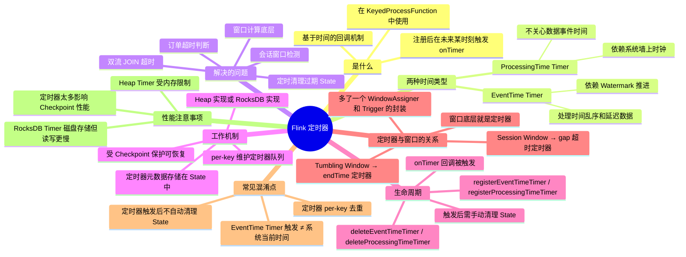

# Flink 定时器（Timer）

## 1. 知识点简介

Flink 的**定时器（Timer）**是在 `KeyedProcessFunction` 中用于**在未来某个时间点触发回调操作**的机制。你可以把它想象成一个可以设定在未来某个时刻响的**闹钟**——你在处理数据时注册一个定时器，Flink 保证当时间推进到对应时刻时，自动调用你的 `onTimer()` 回调函数。

定时器是 Flink 实现很多高级功能的底层基础——Flink 内置的窗口（Window）、会话窗口（Session Window）、双流 JOIN 的超时处理，底层全都是用定时器实现的。掌握定时器，你就能自定义实现任意"基于时间的判断逻辑"，比如订单超时告警、闲置检测、定时状态清理等。

核心调用路径：

```
数据到达 → processElement() → 注册定时器(timestamp)
                                      ↓
                          Flink 维护每个 key 的定时器队列（存储在 State 中）
                                      ↓
                          当时间条件满足（EventTime: Watermark 推进 / ProcessingTime: 系统时间到达）
                                      ↓
                          onTimer(timestamp, ctx) 被触发执行
```

## 2. 脑图



## 3. 相关知识点的关系

### 前置依赖

- **KeyedProcessFunction**：定时器只能在这类函数中使用，因为它需要 `keyBy` 后的 key 上下文。普通 `ProcessFunction` 不能注册定时器。
- **Keyed State**：定时器本身是 per-key 的，其元数据存储在 State 中，需要先理解 Keyed State 的概念。
- **Watermark**：EventTime 定时器依赖 Watermark 推进来触发，不理解 Watermark 就无法预测定时器何时真正触发。
- **Checkpoint**：定时器的状态通过 Checkpoint 持久化，作业恢复后定时器也会恢复。

### 并列概念

- **EventTime Timer** 和 **ProcessingTime Timer**：两种时间语义，触发条件不同。前者看 Watermark，后者看系统时钟。
- **register 和 delete**：注册和删除是定时器的两个基本操作，多个定时器并存时需注意手动管理。
- **定时器** 和 **窗口**：窗口是定时器的上层封装——窗口把数据缓存 + 触发时机包装好了，定时器让你能自定制定时逻辑。

### 包含关系

```
Flink 时间处理
  ├── Watermark（决定 EventTime 何时推进）
  ├── 窗口
  │     ├── Tumbling Window → endTime 定时器
  │     ├── Sliding Window → 每个 pane 的 endTime 定时器
  │     ├── Session Window → gap 超时定时器
  │     └── Global Window → 自定义 Trigger 下的定时器
  ├── 定时器 ← 窗口的底层实现
  │     ├── EventTime Timer
  │     └── ProcessingTime Timer
  └── KeyedProcessFunction
        ├── processElement() → 注册/删除定时器
        ├── onTimer() → 定时器触发回调
        └── State 存储定时器元数据
```

### 常见混淆点

| 容易混淆 | 实际区别 |
|---------|---------|
| 定时器到了注册时间就一定触发 | EventTime 定时器看 Watermark，不是墙上时钟，Watermark 不到就不会触发 |
| 定时器触发后会自动清理 State | 不会，需要在 `onTimer` 中手动 `clear()` 相关 State |
| ProcessingTime Timer 会考虑乱序 | 不会，ProcessingTime 只看系统时间，不考虑事件时间乱序 |
| 可以注册一个全局定时器（不 keyBy） | 不可以，定时器必须在 KeyedProcessFunction 中使用，是 per-key 的 |
| 同一时刻同一个 key 可以注册多个定时器同时触发 | Flink 内部按 key+timestamp 去重，同一 key 同一时间戳只有一个定时器 |

## 4. 详细介绍每个知识点

### 4.1 为什么需要定时器——没有它会怎样

很多流计算场景不是"来一条数据就输出一条"，而是**需要等待和超时判断**。假设没有定时器：

**场景：订单超时检测**。下单后 30 分钟内没支付就告警。

- 没有定时器：你只能在 `processElement` 里立即判断"有没有支付"，但支付事件还没到，你无法判断它未来会不会到
- 用定时器：下单时注册一个"30 分钟后"的闹钟，闹钟响了如果还没收到支付 → 告警；收到支付了 → 取消闹钟

**场景：双流 JOIN**。A 流需要等待 B 流的数据来匹配。

- 没有定时器：不知道要等多久，等不到只能丢弃
- 用定时器：A 流来了注册定时器等待 N 分钟，超时了还没等到 B 流 → 输出 NULL 或其他默认值

**场景：过期状态清理**。Keyed State 越来越多导致 OOM。

- 没有定时器：不知道哪些 state 已经不再需要，不敢随便删
- 用定时器：当某个 key 的最后活跃时间超过 N 天，注册定时器到期删除该 key 的所有 state

### 4.2 定时器的两种时间类型

```java
// EventTime 定时器：当 Watermark 推进到 timestamp 时触发
ctx.timerService().registerEventTimeTimer(timestamp);

// ProcessingTime 定时器：当系统时间到达 timestamp 时触发
ctx.timerService().registerProcessingTimeTimer(timestamp);
```

| | EventTime Timer | ProcessingTime Timer |
|------|------|------|
| 触发条件 | Watermark >= 注册时间戳 | 系统时钟 >= 注册时间戳 |
| 受乱序影响 | 是（Watermark 滞后） | 否 |
| 确定性 | 取决于 Watermark 策略 | 确定性（系统时间单调递增） |
| 适用场景 | 按数据的时间计算超时 | 按真实时间计算超时 |
| 恢复行为 | 从 Checkpoint 恢复后 Watermark 重新计算 | 从 Checkpoint 恢复后可能立即触发 |

### 4.3 EventTime 定时器触发时机详解

这是最容易产生误解的地方。看一个例子：

```
Watermark 生成策略：BoundedOutOfOrderness(10秒)，即允许 10 秒乱序

事件流：
  (A, event_time=12:00:00) 到达，watermark=11:59:50
  (A, event_time=12:00:05) 到达，watermark=11:59:55
  (A, event_time=12:00:15) 到达，watermark=12:00:05  ← 终于推进到超过 12:00:00
```

如果你在 `12:00:00` 注册一个 EventTime 定时器：

- 第一条数据到达：Watermark 是 `11:59:50`，不够，定时器不触发
- 第二条数据到达：Watermark 是 `11:59:55`，不够，定时器不触发
- 第三条数据到达：Watermark 是 `12:00:05`，**>= 12:00:00**，此时 `onTimer(12:00:00, ctx)` 被触发

**重点**：如果在有界乱序场景下，Watermark = `maxEventTime - 乱序时间`，你注册 `12:00:00` 的定时器，实际上要等到有事件时间 **>= 12:00:10** 的数据到达后，Watermark 才会推进到 `12:00:00` 以上。

### 4.4 订单超时告警完整案例

```java
DataStream<OrderEvent> orders = env.addSource(...);

orders
    .assignTimestampsAndWatermarks(
        WatermarkStrategy.<OrderEvent>forBoundedOutOfOrderness(Duration.ofSeconds(10))
            .withTimestampAssigner((event, ts) -> event.getEventTime())
    )
    .keyBy(event -> event.getOrderId())
    .process(new KeyedProcessFunction<String, OrderEvent, String>() {
        
        // 保存订单详情，收到支付后需要取出
        private ValueState<OrderEvent> pendingOrder;
        // 保存注册的定时器时间戳，用于取消定时器
        private ValueState<Long> timeoutTimer;

        @Override
        public void open(Configuration parameters) {
            ValueStateDescriptor<OrderEvent> orderDesc = 
                new ValueStateDescriptor<>("pending-order", OrderEvent.class);
            pendingOrder = getRuntimeContext().getState(orderDesc);
            
            ValueStateDescriptor<Long> timerDesc = 
                new ValueStateDescriptor<>("timeout-timer", Long.class);
            timeoutTimer = getRuntimeContext().getState(timerDesc);
        }

        @Override
        public void processElement(OrderEvent event, Context ctx, Collector<String> out) throws Exception {
            
            if ("CREATE".equals(event.getType())) {
                // 下单事件：保存订单状态，注册 30 分钟超时定时器
                pendingOrder.update(event);
                long timeoutMillis = event.getEventTime() + 30 * 60 * 1000; // 30分钟
                ctx.timerService().registerEventTimeTimer(timeoutMillis);
                timeoutTimer.update(timeoutMillis);
                
            } else if ("PAY".equals(event.getType())) {
                // 支付事件：订单在规定时间内支付了，取消超时定时器
                Long timerTimestamp = timeoutTimer.value();
                if (timerTimestamp != null) {
                    ctx.timerService().deleteEventTimeTimer(timerTimestamp);
                }
                out.collect("订单 " + event.getOrderId() + " 支付成功（在规定时间内），金额: " + event.getAmount());
                
                // 清理 state
                pendingOrder.clear();
                timeoutTimer.clear();
            }
        }

        @Override
        public void onTimer(long timestamp, OnTimerContext ctx, Collector<String> out) throws Exception {
            // 定时器触发了 → 30 分钟内没收到支付事件
            OrderEvent order = pendingOrder.value();
            if (order != null) {
                out.collect("订单 " + order.getOrderId() + " 超时未支付！下单时间: " 
                    + order.getEventTime() + ", 超时时间: " + timestamp);
            }
            // 清理 state（定时器触发后必须手动清理）
            pendingOrder.clear();
            timeoutTimer.clear();
        }
    })
    .print();
```

### 4.5 定时器触发后如何清理资源

**定时器和 State 是独立的两件事**——删掉定时器不会自动删除你声明的 `ValueState`、`ListState` 等。你必须在合适的时机手动调用 `clear()`：

```java
@Override
public void onTimer(long timestamp, OnTimerContext ctx, Collector<String> out) throws Exception {
    // 业务逻辑...
    
    // 关键：手动清理所有相关 state
    pendingOrder.clear();
    timeoutTimer.clear();
    // 如果还有其他 state，也一并清理
}
```

不清理的后果：
- State 一直占着内存/RocksDB 空间
- Checkpoint 会越来越大
- 严重的可能导致 OOM 或 Checkpoint 超时

### 4.6 定时器底层存储

定时器元数据（key、timestamp、类型）存储在 State 中，有两种实现：

| 实现 | 说明 | 适用 |
|------|------|------|
| **Heap Timers** | 定时器存在 JVM 堆中，`PriorityQueue` 维护 | 定时器数量少、MemoryStateBackend |
| **RocksDB Timers** | 定时器存在 RocksDB 中，也有内存缓存层 | 定时器数量大、RocksDBStateBackend |

每个 key 会维护自己的定时器队列，触发时按时间排序依次调用 `onTimer`。

### 4.7 定时器与窗口的关系

Flink 内置窗口的底层就是用定时器实现的：

```
Tumbling Window（滚动窗口）
    窗口范围: [start, end)
    注册定时器: end - 1（毫秒）
    触发时: 窗口关闭，输出计算结果

Session Window（会话窗口）
    每来一条数据: 注册 gap 毫秒后的定时器
    在 gap 内又来数据: 取消上一个定时器，注册新的 gap 毫秒后定时器
    触发时: 上一个会话结束，输出计算结果

事件时间 JOIN
    左表数据到达: 注册等待右表的超时定时器
    右表到达且匹配: 取消定时器，输出结果
    定时器触发: 右表没等到，输出 NULL（LEFT JOIN）或丢弃（INNER JOIN）
```

### 4.8 ProcessingTime Timer 的恢复行为

ProcessingTime Timer 在作业恢复时有一个重要的坑：

```
场景：作业跑了 10 天后崩溃，从 Checkpoint 恢复
  注册了一个 ProcessingTime Timer: 注册时是第 1 天，设置 5 分钟后触发
  作业在第 10 天恢复，Checkpoint 里存的是"第 1 天注册的定时器"
  恢复后：系统时间已经远超 5 分钟 → onTimer 会被立即触发！

解决方案：在 onTimer 中检查当前时间，如果差距过大说明是恢复导致的，按业务需要处理
```

因此，如果你的超时逻辑依赖"必须等待 N 分钟"，ProcessingTime Timer 在恢复后可能"已经过期"。此时用 EventTime Timer 配合 Watermark 会更可控。

## 5. 实际案例讲解

### 场景背景

某电商风控系统需要检测异常登录行为：用户登录后如果在 5 分钟内没有完成任何有效操作（浏览、下单、支付等），就标记为"疑似异常登录"用于人工审核。

### 步骤拆解

**Step 1：上游数据格式**

```
登录事件: (userId=U001, deviceId=D001, ip=1.2.3.4, eventTime=12:00:00)
浏览事件: (userId=U001, page=home, eventTime=12:01:30)
下单事件: (userId=U001, orderId=O123, eventTime=12:03:00)
```

**Step 2：处理逻辑**

```java
DataStream<UserEvent> events = ...;

events
    .assignTimestampsAndWatermarks(
        WatermarkStrategy.<UserEvent>forBoundedOutOfOrderness(Duration.ofSeconds(5))
            .withTimestampAssigner((e, ts) -> e.getEventTime())
    )
    .keyBy(event -> event.getUserId())
    .process(new KeyedProcessFunction<String, UserEvent, String>() {
        
        private ValueState<LoginInfo> loginState;    // 记录登录信息
        private ValueState<Long> inactivityTimer;    // 闲置检测定时器
        private ValueState<Boolean> hasActivity;     // 是否有有效行为

        @Override
        public void processElement(UserEvent event, Context ctx, Collector<String> out) throws Exception {
            
            switch (event.getType()) {
                case "LOGIN":
                    // 用户登录：保存登录信息，注册 5 分钟闲置定时器
                    loginState.update(new LoginInfo(event.getDeviceId(), event.getIp()));
                    hasActivity.update(false);
                    long timeout = ctx.timestamp() + 5 * 60 * 1000;
                    ctx.timerService().registerEventTimeTimer(timeout);
                    inactivityTimer.update(timeout);
                    out.collect("用户 " + event.getUserId() + " 登录成功，开始监控");
                    break;
                    
                case "BROWSE":
                case "ORDER":
                case "PAY":
                    // 有效行为：标记为有活动，取消闲置定时器
                    hasActivity.update(true);
                    Long timer = inactivityTimer.value();
                    if (timer != null) {
                        ctx.timerService().deleteEventTimeTimer(timer);
                    }
                    out.collect("用户 " + event.getUserId() + " 执行了 " + event.getType());
                    break;
                    
                case "LOGOUT":
                    // 登出：清理所有状态
                    Long timer = inactivityTimer.value();
                    if (timer != null) {
                        ctx.timerService().deleteEventTimeTimer(timer);
                    }
                    loginState.clear();
                    hasActivity.clear();
                    inactivityTimer.clear();
                    out.collect("用户 " + event.getUserId() + " 已登出");
                    break;
            }
        }

        @Override
        public void onTimer(long timestamp, OnTimerContext ctx, Collector<String> out) throws Exception {
            // 5 分钟到了，检查用户是否有活动
            Boolean active = hasActivity.value();
            if (active == null || !active) {
                LoginInfo login = loginState.value();
                out.collect("⚠️ 告警：用户 " + ctx.getCurrentKey() 
                    + " 登录后 5 分钟内无有效操作！设备: " 
                    + (login != null ? login.deviceId : "unknown")
                    + " IP: " + (login != null ? login.ip : "unknown"));
            } else {
                out.collect("用户 " + ctx.getCurrentKey() + " 正常活跃");
            }
            // 清理状态
            loginState.clear();
            hasActivity.clear();
            inactivityTimer.clear();
        }
    })
    .print();
```

**Step 3：运行时事件顺序**

```
T1: LOGIN 事件到达 (eventTime=12:00:00)
  → processElement: 注册 12:05:00 定时器
  → hasActivity = false
  → Watermark: 11:59:55

T2: BROWSE 事件到达 (eventTime=12:01:00)
  → processElement: hasActivity = true, 取消 12:05:00 定时器
  → Watermark: 12:00:55
  → 定时器被取消，不会触发

T3: Watermark 推进到 12:05:00
  → 但定时器已被取消，不做任何事
```

另一种情况——没有有效行为：

```
T1: LOGIN 事件到达 (eventTime=12:00:00)
  → processElement: 注册 12:05:00 定时器, hasActivity = false

T2 ~ Tn: 没有收到此用户的任何其他事件

T3: 其他用户的事件推动 Watermark 越过 12:05:00
  → onTimer 触发
  → hasActivity == false
  → 输出告警：用户 U001 登录后 5 分钟内无有效操作！
```

### 案例中对应的知识点

| 实际步骤 | 对应知识点 |
|---------|-----------|
| LOGIN 时注册定时器 | `registerEventTimeTimer` 注册未来某时刻的回调 |
| BROWSE 时取消定时器 | `deleteEventTimeTimer` 按条件取消已注册的定时器 |
| 定时器在 5 分钟后触发 | EventTime 定时器，当 Watermark >= 12:05:00 时触发 |
| hasActivity State 判断 | 定时器触发后读取 State 来判断是否有活动 |
| onTimer 中清理所有 State | 定时器触发后手动清理，防止 State 泄露 |
| 定时器被取消后不会再触发 | 注册和删除是成对管理 |

## 6. Demo 指导

### 前置准备

- 本地 Docker 环境
- Flink 安装包（或使用项目中的 `docker-compose.yml`）
- Java 开发环境（JDK 8+）

### 第 1 步：启动 Flink 集群

```bash
cd /Users/zyb/project/coding-knowledge/flink
docker-compose up -d
curl http://localhost:8081/overview
```

### 第 2 步：创建演示作业

创建一个简单的定时器演示作业，模拟"5 秒内未收到该 key 的第二条数据就输出超时"：

```java
public class TimerDemoJob {
    public static void main(String[] args) throws Exception {
        StreamExecutionEnvironment env = StreamExecutionEnvironment.getExecutionEnvironment();
        
        // 用 socket 模拟输入（或使用 datagen）
        DataStream<String> input = env.socketTextStream("localhost", 9999);
        
        input
            .map(line -> {
                String[] parts = line.split(",");
                return Tuple2.of(parts[0], Long.parseLong(parts[1]));
            })
            .returns(Types.TUPLE(Types.STRING, Types.LONG))
            .keyBy(t -> t.f0)
            .process(new KeyedProcessFunction<String, Tuple2<String, Long>, String>() {
                
                private ValueState<Long> lastEventTime;
                private ValueState<Long> timerTs;

                @Override
                public void open(Configuration parameters) {
                    lastEventTime = getRuntimeContext().getState(
                        new ValueStateDescriptor<>("lastEventTime", Long.class));
                    timerTs = getRuntimeContext().getState(
                        new ValueStateDescriptor<>("timerTs", Long.class));
                }

                @Override
                public void processElement(Tuple2<String, Long> value, Context ctx, 
                                           Collector<String> out) throws Exception {
                    
                    Long last = lastEventTime.value();
                    if (last == null) {
                        // 第一次见这个 key
                        lastEventTime.update(value.f1);
                        long triggerTime = value.f1 + 5000; // 5 秒后触发
                        ctx.timerService().registerProcessingTimeTimer(triggerTime);
                        timerTs.update(triggerTime);
                        out.collect("Key[" + value.f0 + "] 首次出现，注册定时器@" + triggerTime);
                    } else {
                        // 5 秒内又来了 → 取消定时器
                        Long timer = timerTs.value();
                        if (timer != null) {
                            ctx.timerService().deleteProcessingTimeTimer(timer);
                        }
                        out.collect("Key[" + value.f0 + "] 5秒内二次出现，取消定时器，间隔=" 
                            + (value.f1 - last) + "ms");
                        lastEventTime.clear();
                        timerTs.clear();
                    }
                }

                @Override
                public void onTimer(long timestamp, OnTimerContext ctx, Collector<String> out) throws Exception {
                    out.collect("⏰ Key[" + ctx.getCurrentKey() + "] 超时！5秒内未收到第二条数据");
                    lastEventTime.clear();
                    timerTs.clear();
                }
            })
            .print()
            .setParallelism(1);

        env.execute("Timer Demo Job");
    }
}
```

### 第 3 步：运行并验证

**Terminal 1：启动 nc 发送数据**
```bash
nc -lk 9999
```

**Terminal 2：提交作业**
```bash
flink run -c com.example.TimerDemoJob your-job.jar
```

**发送测试数据：**
```
A,1000    ← 快速按回车
A,3000    ← 在 5 秒内发送第二次
B,1000    ← 只发送一次，等待 5 秒
```

**预期输出：**
```
Key[A] 首次出现，注册定时器 @6000
Key[A] 5秒内二次出现，取消定时器，间隔=2000ms
Key[B] 首次出现，注册定时器 @6000
⏰ Key[B] 超时！5秒内未收到第二条数据    ← 约在系统时间 6000ms 时触发
```

### 验证方式

1. **二次出现的 key**：看到"二次出现"日志，且不会出现"超时"日志 → 定时器被成功取消
2. **只出现一次的 key**：约 5 秒后看到"超时"日志 → 定时器正常触发
3. **ProcessingTime vs EventTime**：ProcessingTime 定时器按系统时间触发，不依赖 Watermark，适合本地快速验证