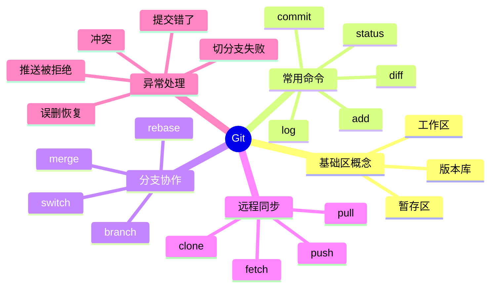

# Git 常用命令与常见异常处理

## 1. 知识点简介

Git 是最常用的版本管理工具。

你可以先把它理解成一套“代码时间机器 + 协作记录系统”：

- 它记录代码每次修改
- 它允许你在不同分支并行开发
- 它帮助你和远程仓库同步代码
- 它也提供了很多“后悔药”命令，用来撤销、恢复、修正错误操作

日常开发里，大部分 Git 使用都围绕几件事展开：

- 查看当前改动
- 把改动加入暂存区并提交
- 创建和切换分支
- 同步远程仓库
- 处理冲突、误提交、误删除、推送失败等异常情况

如果你把这些主线掌握住，Git 基本就能满足大多数工作场景。

## 2. 脑图



## 3. 相关知识点的关系

- 前置依赖：先理解工作区、暂存区、版本库，再去学 `add`、`commit`、`reset`、`restore` 会更顺。
- 并列概念：`status`、`diff`、`log` 都是查看类命令，一个看当前状态，一个看差异，一个看历史。
- 实现关系：`git add` 是把改动放进暂存区，`git commit` 才是真正生成一次提交记录。
- 包含关系：分支协作通常包含创建分支、切换分支、合并分支、解决冲突几个动作。
- 对比关系：`merge` 更像把一条分支合进来，`rebase` 更像把提交“重新排队”到新的基线上。
- 常见混淆点：`git fetch` 只拉远程更新但不改当前工作内容，`git pull` 通常等于 `fetch + merge/rebase`。
- 常见混淆点：`git restore` 更偏恢复文件内容，`git reset` 更偏移动提交指针或调整暂存状态。

## 4. 详细介绍每个知识点

### 4.1 基础查看类命令

它是什么

这类命令用来判断“我现在到底改了什么、在哪个分支、历史到哪里了”。

它解决什么问题

很多 Git 异常，本质上不是命令不会，而是不知道当前状态。先看状态，才能做对处理。

核心机制 / 核心用法

```bash
git status
git diff
git diff --staged
git log --oneline --graph --decorate -10
git reflog
```

- `git status`：查看工作区、暂存区、当前分支状态
- `git diff`：查看工作区相对暂存区的差异
- `git diff --staged`：查看已经 `add` 但还没提交的差异
- `git log --oneline --graph --decorate -10`：简洁查看最近提交历史
- `git reflog`：查看 HEAD 变动记录，很多“误操作恢复”都靠它

注意事项

- 出问题先跑 `git status`，这是最高频排查入口。
- 想找“刚刚丢掉的提交”时，优先想到 `git reflog`。

### 4.2 提交相关命令

它是什么

这类命令负责把代码改动从本地工作区变成一条正式提交记录。

它解决什么问题

它让你能够有节奏地保存开发过程，也方便回滚、对比和协作。

核心机制 / 核心用法

```bash
git add <file>
git add .
git commit -m "feat: add login api"
git commit --amend
```

- `git add <file>`：只暂存指定文件
- `git add .`：暂存当前目录下所有改动
- `git commit -m "..."`：生成一次新提交
- `git commit --amend`：修改最近一次提交的 message 或把漏掉的改动补进去

常见异常与处理

1. 提交时漏了文件

```bash
git add <漏掉的文件>
git commit --amend
```

适用场景：最近一次提交还没有推送，或者你明确知道改写最近提交没有风险。

2. `add` 了不该提交的文件

```bash
git restore --staged <file>
```

作用：把文件从暂存区拿出来，但保留工作区改动。

3. 提交 message 写错了

```bash
git commit --amend -m "fix: correct message"
```

注意事项

- 已经推送到共享分支的提交，不要轻易 `amend` 后强推，除非团队明确允许。
- 大多数情况下优先小步提交，问题更容易回退。

### 4.3 分支操作命令

它是什么

分支是 Git 里最核心的协作能力之一，可以理解为一条独立开发线。

它解决什么问题

你可以在不影响主线代码的情况下开发新功能、修 Bug、做实验。

核心机制 / 核心用法

```bash
git branch
git switch -c feature/login
git switch main
git merge feature/login
git rebase main
```

- `git branch`：查看本地分支
- `git switch -c feature/login`：创建并切到新分支
- `git switch main`：切回主分支
- `git merge feature/login`：把功能分支合并进当前分支
- `git rebase main`：把当前分支提交重放到最新 `main` 之后

常见异常与处理

1. 切换分支时报错：本地改动会被覆盖

```bash
git status
git stash
git switch <target-branch>
git stash pop
```

如果改动本来就应该提交，也可以先 `git add` + `git commit` 再切分支。

2. 进入 detached HEAD 状态

```bash
git status
git switch <已有分支>
```

如果你在 detached HEAD 下已经做了提交，想保住它：

```bash
git switch -c temp-save-branch
```

3. 提交到了错误分支

做法一：提交还没推远程时，把提交摘到正确分支。

```bash
git log --oneline
git switch <正确分支>
git cherry-pick <commit-id>
git switch <错误分支>
git reset --soft HEAD~1
```

注意事项

- 团队协作中，主分支通常只放稳定代码。
- `rebase` 很好用，但不要随便改写别人正在使用的公共历史。

### 4.4 远程同步命令

它是什么

这类命令负责本地仓库和远程仓库之间的同步。

它解决什么问题

你需要拉代码、推代码、查看远程分支，这些都属于远程同步。

核心机制 / 核心用法

```bash
git clone <repo-url>
git remote -v
git fetch origin
git pull --rebase origin main
git push -u origin feature/login
```

- `git clone <repo-url>`：克隆远程仓库到本地
- `git remote -v`：查看远程仓库地址
- `git fetch origin`：拉取远程更新到本地引用
- `git pull --rebase origin main`：拉取并基于远程最新提交重放本地提交
- `git push -u origin feature/login`：首次把本地分支推到远程并建立跟踪关系

常见异常与处理

1. 推送被拒绝：`non-fast-forward`

说明远程分支比你本地更新，你不能直接推。

```bash
git fetch origin
git pull --rebase origin <branch>
git push origin <branch>
```

如果 rebase 过程中有冲突，先解决冲突再继续：

```bash
git add <冲突文件>
git rebase --continue
```

2. `git pull` 后历史很乱，出现很多无意义 merge commit

可以改用：

```bash
git pull --rebase origin <branch>
```

3. 推错远程分支

先确认远程和本地状态，再决定是否回退。最常见是重新推到正确分支：

```bash
git push origin HEAD:<correct-branch>
```

注意事项

- 首次推分支通常用 `git push -u origin <branch>`。
- 日常同步更推荐先 `fetch` 或 `pull --rebase`，再处理自己的提交。

### 4.5 恢复、撤销与异常排查

它是什么

这是 Git 最像“后悔药”的一组命令，处理误修改、误提交、误删除、冲突恢复。

它解决什么问题

开发里最常见的问题不是不会提交，而是“做错了以后怎么安全撤回来”。

核心机制 / 核心用法

```bash
git restore <file>
git restore --staged <file>
git reset --soft HEAD~1
git reset --hard HEAD
git rm <file>
git revert <commit-id>
```

- `git restore <file>`：丢弃工作区未暂存修改
- `git restore --staged <file>`：撤销暂存
- `git reset --soft HEAD~1`：撤销最近一次提交，但保留改动和暂存状态
- `git reset --hard HEAD`：直接丢弃当前工作区和暂存区改动
- `git rm <file>`：从 Git 跟踪中删除文件
- `git revert <commit-id>`：通过反向提交撤销某次已提交历史，适合共享分支

常见异常与处理

1. 想放弃某个文件的本地修改

```bash
git restore <file>
```

2. 想撤回最近一次提交，但保留代码

```bash
git reset --soft HEAD~1
```

3. 想撤回最近一次提交，也不想保留代码

```bash
git reset --hard HEAD~1
```

4. 已经推送到公共分支的错误提交要撤销

```bash
git revert <commit-id>
```

这比 `reset` 更安全，因为它不会改写公共历史。

5. 合并冲突后不知道下一步做什么

```bash
git status
```

通常你会看到冲突文件。处理流程是：

```bash
git add <已解决的文件>
git commit
```

如果你是在 rebase 过程中处理冲突，则用：

```bash
git add <已解决的文件>
git rebase --continue
```

6. 误删提交或切换后找不到刚才的记录

```bash
git reflog
git reset --hard <reflog里的commit-id>
```

注意事项

- `git reset --hard` 风险很高，会直接丢掉未保存改动，执行前一定确认。
- 如果改动已经共享给别人，优先用 `git revert`，少用改写历史的方式。

### 4.6 一组最常用的日常命令清单

如果你只想先记住高频命令，下面这一组最实用：

```bash
git config --global user.name "your-name"
git config --global user.email "your-email"
git init
git clone <repo-url>
git status
git add .
git commit -m "message"
git log --oneline --graph --decorate -10
git switch -c <branch-name>
git switch <branch-name>
git pull --rebase origin main
git push -u origin <branch-name>
git stash
git stash pop
git restore <file>
git restore --staged <file>
git reflog
```

## 5. 实际案例讲解

场景背景

你要开发一个登录功能，仓库已经存在 `main` 分支，团队要求你在功能分支开发，开发完成后再合并。

目标

- 新建功能分支
- 提交代码
- 同步远程最新改动
- 解决一次冲突
- 推送远程

步骤拆解

1. 先从主分支拉最新代码

```bash
git switch main
git pull --rebase origin main
```

2. 创建功能分支并开发

```bash
git switch -c feature/login
git status
```

3. 改完代码后提交

```bash
git add .
git commit -m "feat: add login page and api call"
```

4. 准备推送时发现远程主分支更新了

```bash
git fetch origin
git rebase origin/main
```

5. 如果出现冲突，打开冲突文件，保留正确内容，然后继续

```bash
git add <冲突文件>
git rebase --continue
```

6. 最后把功能分支推到远程

```bash
git push -u origin feature/login
```

案例里对应的知识点

- `switch`：切换和创建分支
- `add`、`commit`：保存开发过程
- `fetch`、`rebase`：同步远程最新基线
- 冲突处理：编辑文件后 `add` 再 `rebase --continue`
- `push -u`：首次建立远程跟踪关系

最终结果

你会得到一条干净的功能分支提交链，并且能把代码安全推到远程等待合并。

## 6. Demo 指导

前置准备

- 本机已安装 Git
- 打开终端
- 在一个临时目录中练习，避免影响真实项目

第 1 步：初始化一个本地仓库

```bash
mkdir git-demo
cd git-demo
git init
echo "# demo" > README.md
git add README.md
git commit -m "init: add readme"
```

第 2 步：创建分支并模拟开发

```bash
git switch -c feature/a
echo "line from feature a" >> app.txt
git add app.txt
git commit -m "feat: add line from feature a"
```

第 3 步：回到主分支制造一处冲突

```bash
git switch master
echo "line from master" >> app.txt
git add app.txt
git commit -m "feat: add line from master"
```

如果你的默认分支是 `main`，把上面的 `master` 换成 `main` 即可。

第 4 步：把功能分支变基到主分支上

```bash
git switch feature/a
git rebase master
```

如果默认分支是 `main`：

```bash
git rebase main
```

第 5 步：处理冲突

- 打开 `app.txt`
- 你会看到冲突标记
- 手动保留你想要的内容
- 删除冲突标记后继续执行

```bash
git add app.txt
git rebase --continue
```

第 6 步：体验撤销与恢复

```bash
echo "temp line" >> app.txt
git status
git restore app.txt
git reflog
```

验证方式

- `git status` 最终应该显示工作区干净
- `git log --oneline --graph --decorate` 能看到提交历史
- `git reflog` 能看到你切分支、rebase、提交的动作

你完成后应该看到什么

- 你能区分工作区、暂存区、提交记录
- 你能自己完成一次分支开发和冲突处理
- 你知道误提交、误修改、推送失败时应该优先用哪些命令
- 你看到 `reflog` 后，会理解 Git 其实比想象中更容易“救回来”
