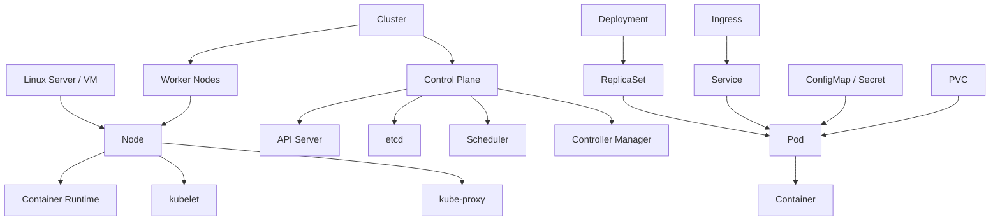

# Kubernetes（K8s）知识文档

## 1. 先用一句话理解 K8s

Kubernetes，简称 `K8s`，是一套运行在多台 Linux 机器上的 **容器编排系统**。

它不负责写业务代码，也不主要负责构建镜像。它最核心的工作是：

- 决定应用跑在哪台机器上
- 维护应用应该有几个副本
- 在实例异常时自动恢复
- 给一组实例提供稳定访问入口
- 在升级、扩容、缩容时尽量不中断服务

如果你只有一个容器，`docker run` 就能解决问题。
如果你有很多服务、很多机器、很多副本、还需要自动恢复和滚动发布，K8s 才真正开始体现价值。

---

## 2. K8s、Linux、Docker 到底是什么关系

很多初学者会把这几个概念混在一起。最清楚的理解方式是把它们放在不同层级里看。

### 2.1 分层理解

```text
业务应用代码
↓
容器镜像（image）
↓
容器运行时（containerd / CRI-O）
↓
Kubernetes（调度和管理这些容器）
↓
Linux 服务器 / 虚拟机 / 物理机
```

### 2.2 它们各自负责什么

#### Linux

Linux 是操作系统，是最底层的运行环境。

它提供：

- 进程管理
- 文件系统
- 网络栈
- cgroups / namespaces 等容器基础能力

没有 Linux，K8s 集群里的大多数节点就没有运行基础。

#### Docker

Docker 更偏向开发和打包体验，最常见的用途是：

- 写 `Dockerfile`
- `docker build` 构建镜像
- `docker run` 启动容器

今天的 K8s 已经 **不要求直接依赖 Docker**，更常见的是直接用：

- `containerd`
- `CRI-O`

但你仍然需要学 Docker，因为：

- 镜像怎么构建
- 容器怎么工作
- 端口、卷、环境变量这些概念

这些都是理解 K8s 的基础。

#### Kubernetes

K8s 是“管理很多容器和很多机器”的系统。

它更关心：

- 你想跑多少个副本
- 这些副本是否健康
- 它们应该跑在哪些节点
- 应该怎么对外提供访问
- 升级时怎么平滑替换旧版本

### 2.3 一句话总结

- Linux：运行地基
- Docker：容器打包和单机运行体验
- K8s：集群级的容器管理平台

---

## 3. 先建立最核心的关系图



这个图里最重要的几条关系是：

- **Cluster** 是整个 K8s 集群
- **Cluster** 里有很多 **Node**
- **Node** 通常就是一台 Linux 机器
- **Pod** 跑在 **Node** 上
- **Container** 跑在 **Pod** 里
- **Deployment** 不直接跑业务，它负责管理 Pod 副本
- **Service** 给一组 Pod 提供稳定访问入口
- **Ingress** 给 HTTP/HTTPS 请求提供集群外入口
- **ConfigMap / Secret** 给 Pod 提供配置
- **PVC** 给 Pod 提供持久化存储

---

## 4. K8s 里最容易混淆的几个概念

### 4.1 Cluster、Node、Pod、Container

这是最基础的一组关系。

#### Cluster

Cluster 就是整个 Kubernetes 环境。

它包含：

- 控制面组件
- 多个节点
- 网络能力
- 存储能力
- 调度和控制逻辑

#### Node

Node 是集群里的一个节点，通常对应一台 Linux 机器。

它可以是：

- 云服务器
- 虚拟机
- 物理机

Node 上会运行：

- `kubelet`
- `kube-proxy`
- 容器运行时（如 `containerd`）

#### Pod

Pod 是 K8s 里最小的调度单元。

K8s 不直接调度单个容器，而是调度 Pod。

一个 Pod 里通常有：

- 1 个主业务容器
- 也可能有 1 个或多个辅助容器

Pod 内的容器会共享：

- 网络命名空间
- IP 地址
- 部分存储卷

#### Container

Container 就是实际运行你应用进程的地方。

比如：

- Java 进程
- Node.js 进程
- Nginx 进程

最终还是运行在容器里，但 K8s 管理容器时，不是直接盯着 container，而是通过 Pod 这个更高一层的对象来管理。

### 4.2 Deployment、ReplicaSet、Pod

#### Pod

Pod 是实例本身。

#### ReplicaSet

ReplicaSet 的职责很单纯：

- 保证某一组 Pod 的副本数量符合预期

比如你想要 3 个 Pod，如果现在只剩 2 个，ReplicaSet 会想办法再补 1 个。

#### Deployment

Deployment 是更上层的无状态应用管理对象。

它负责：

- 声明副本数
- 创建和管理 ReplicaSet
- 滚动更新
- 回滚版本

最常见的关系是：

```text
Deployment -> ReplicaSet -> Pod -> Container
```

所以日常工作里你通常操作的是 Deployment，而不是手工维护裸 Pod。

### 4.3 Service、Ingress

#### Service

Service 是给一组 Pod 提供稳定入口的对象。

它解决的问题是：

- Pod 会重建
- Pod IP 会变化
- 不能让调用方直接记 Pod IP

Service 通过 label 选择一组 Pod，然后提供：

- 稳定的虚拟 IP
- 稳定的 DNS 名称
- 基础负载均衡能力

#### Ingress

Ingress 是更靠近“外部 HTTP/HTTPS 入口”的对象。

它通常做的是：

- 根据域名转发
- 根据路径转发
- 统一 TLS/HTTPS 接入

常见链路是：

```text
外部用户 -> Ingress -> Service -> Pod
```

### 4.4 ConfigMap、Secret、PVC

#### ConfigMap

存普通配置，比如：

- 环境名
- API 地址
- 开关项

#### Secret

存敏感配置，比如：

- 数据库密码
- Token
- 证书

#### PVC

PVC 是持久化存储申请单。

应用一般不是直接绑定磁盘，而是声明：

- 我需要 10Gi 存储
- 我需要某种存储类

然后 K8s 帮你把它和底层存储资源绑定起来。

---

## 5. K8s 控制面和工作节点分别在干什么

这部分是理解“K8s 为什么会自动工作”的关键。

### 5.1 控制面（Control Plane）

控制面可以理解成 K8s 的大脑。

### API Server

它是整个集群的统一入口。

无论你执行的是：

```bash
kubectl apply -f deployment.yaml
```

还是别的控制器在改资源，本质上都要经过 API Server。

它的作用是：

- 接收请求
- 校验请求是否合法
- 把资源对象写入存储
- 提供查询接口给其他组件

### etcd

etcd 是 K8s 的状态数据库。

它保存的是集群的关键元数据，比如：

- 有哪些 Deployment
- Deployment 想要几个副本
- 现在有哪些 Pod
- Pod 当前是什么状态
- 哪些 Service 对应哪些 Selector

可以把它理解成：

- **期望状态** 和 **当前状态** 的核心存储位置

### Scheduler

Scheduler 负责给尚未分配节点的 Pod 选择一个 Node。

它考虑的因素包括：

- 资源是否够
- 节点标签 / 污点 / 亲和性规则
- 是否满足调度约束

它做的事情不是“启动容器”，而是“决定这个 Pod 应该去哪里”。

### Controller Manager

Controller Manager 里运行着很多控制器。

控制器的共同思路是：

1. 读取当前状态
2. 对比期望状态
3. 如果不一致，就推动系统向期望状态靠拢

例如：

- Deployment Controller 发现你想要 3 个 Pod，实际只有 2 个，就继续创建
- Node Controller 发现某个节点失联，就更新节点状态并触发后续处理
- Endpoint Controller 发现某些 Pod Ready 了，就把它们加入 Service 后端

K8s 的核心思想就是这种 **声明式 + 控制循环**。

### 5.2 工作节点（Worker Node）

工作节点是真正跑业务容器的地方。

### kubelet

kubelet 是每个 Node 上最关键的 agent。

它的职责是：

- 监听分配到本节点的 Pod
- 调用容器运行时启动容器
- 挂载卷
- 执行健康检查
- 向 API Server 回报状态

### container runtime

容器运行时真正负责：

- 拉镜像
- 创建容器
- 启动进程
- 停止容器

常见的是：

- `containerd`
- `CRI-O`

### kube-proxy

kube-proxy 负责 Service 的网络转发规则。

它会根据 Service 和 Endpoint 信息，配置 iptables 或 ipvs，让请求能够从 Service 转发到后端 Pod。

### CNI 插件

K8s 自己不直接实现所有网络细节，通常依赖 CNI 插件完成：

- 给 Pod 分配 IP
- 打通 Pod 间网络
- 有时还包含网络策略能力

常见如：

- Calico
- Flannel
- Cilium

---

## 6. 从“部署一个服务”看 K8s 的完整工作流程

这一节最重要。很多人知道很多名词，但不知道真正发生了什么。

我们用一个实际场景来串起来。

### 6.1 场景设定

你有一个订单服务 `order-service`，它是一个无状态 HTTP 服务。

你的目标是：

- 跑 3 个副本
- 外部用户通过域名访问
- 配置从镜像里拆出来
- 只有健康实例才能接流量
- 流量上涨时可以扩容
- 发布新版本时尽量不中断服务

### 6.2 你会创建哪些 K8s 对象

通常至少有这些：

- `Deployment`
- `Service`
- `Ingress`
- `ConfigMap`
- `Secret`
- 可选：`HPA`

### 6.3 一个最小但真实的示例

#### ConfigMap

```yaml
apiVersion: v1
kind: ConfigMap
metadata:
  name: order-config
data:
  APP_ENV: production
  LOG_LEVEL: info
  ORDER_DB_HOST: mysql.default.svc.cluster.local
```

#### Secret

```yaml
apiVersion: v1
kind: Secret
metadata:
  name: order-secret
type: Opaque
stringData:
  ORDER_DB_PASSWORD: "123456"
```

#### Deployment

```yaml
apiVersion: apps/v1
kind: Deployment
metadata:
  name: order-service
spec:
  replicas: 3
  selector:
    matchLabels:
      app: order-service
  template:
    metadata:
      labels:
        app: order-service
    spec:
      containers:
        - name: app
          image: my-registry/order-service:v1
          ports:
            - containerPort: 8080
          envFrom:
            - configMapRef:
                name: order-config
            - secretRef:
                name: order-secret
          readinessProbe:
            httpGet:
              path: /ready
              port: 8080
            initialDelaySeconds: 5
            periodSeconds: 5
          livenessProbe:
            httpGet:
              path: /health
              port: 8080
            initialDelaySeconds: 10
            periodSeconds: 10
          resources:
            requests:
              cpu: "200m"
              memory: "256Mi"
            limits:
              cpu: "500m"
              memory: "512Mi"
```

#### Service

```yaml
apiVersion: v1
kind: Service
metadata:
  name: order-service
spec:
  selector:
    app: order-service
  ports:
    - port: 80
      targetPort: 8080
```

#### Ingress

```yaml
apiVersion: networking.k8s.io/v1
kind: Ingress
metadata:
  name: order-ingress
spec:
  rules:
    - host: order.example.com
      http:
        paths:
          - path: /
            pathType: Prefix
            backend:
              service:
                name: order-service
                port:
                  number: 80
```

#### HPA

```yaml
apiVersion: autoscaling/v2
kind: HorizontalPodAutoscaler
metadata:
  name: order-service-hpa
spec:
  scaleTargetRef:
    apiVersion: apps/v1
    kind: Deployment
    name: order-service
  minReplicas: 3
  maxReplicas: 10
  metrics:
    - type: Resource
      resource:
        name: cpu
        target:
          type: Utilization
          averageUtilization: 70
```

### 6.4 当你执行 `kubectl apply -f` 后，到底发生了什么

假设你执行：

```bash
kubectl apply -f order-service.yaml
```

下面是典型的完整链路。

#### 第 1 步：kubectl 把配置提交给 API Server

`kubectl` 只是客户端工具。

它会把 YAML 中的对象发送给 API Server。

### 第 2 步：API Server 做校验并写入 etcd

API Server 会：

- 校验资源格式是否合法
- 校验字段是否符合 schema
- 把 Deployment、Service、Ingress 等对象存到 etcd

这时候可以理解成：

- “期望状态”已经被正式记录到了集群里

### 第 3 步：Deployment Controller 发现有新的 Deployment

Controller Manager 里的 Deployment Controller 会看到：

- 你新建了一个 Deployment
- 它想要 3 个副本

于是它会创建一个 ReplicaSet。

### 第 4 步：ReplicaSet 创建 Pod

ReplicaSet 再根据副本数要求创建 3 个 Pod。

这时 Pod 刚创建出来，通常还处于 `Pending` 状态，因为它们还没被真正放到某台节点上。

### 第 5 步：Scheduler 给 Pod 选择 Node

Scheduler 发现有 3 个还没分配节点的 Pod，于是开始为它们选 Node。

它会考虑：

- 哪些节点资源足够
- 有没有调度约束
- 是否命中污点、亲和性、反亲和性规则

最终，它会把每个 Pod 绑定到某个 Node。

### 第 6 步：Node 上的 kubelet 接手

某个 Node 被分到 Pod 后，这个 Node 上的 `kubelet` 会发现：

- 有新的 Pod 归我负责了

于是 kubelet 会：

- 拉取镜像 `my-registry/order-service:v1`
- 创建 Pod 沙箱
- 挂载卷
- 注入环境变量
- 启动容器

### 第 7 步：容器运行时真正启动容器

容器运行时会完成实际动作：

- 下载镜像层
- 创建容器
- 启动你的应用进程

到这一步，应用代码才真正开始运行。

### 第 8 步：网络插件给 Pod 分配 IP

CNI 插件会给 Pod 配置网络。

此后：

- Pod 有了自己的 IP
- Pod 可以和集群里其他 Pod 通信

### 第 9 步：readinessProbe 决定它能不能接流量

容器虽然启动了，但不代表它已经准备好处理请求。

K8s 会持续探测：

```text
GET /ready
```

只有当 readinessProbe 成功后，这个 Pod 才会被加入 Service 的可用后端列表。

这也是为什么：

- “容器起来了”
- 不等于“用户流量已经打到它上面了”

### 第 10 步：Service 把流量转发给就绪 Pod

Service 根据 label 选中这 3 个 Pod。

只有 Ready 的 Pod 会进入 Service 的后端 endpoint 列表。

kube-proxy 会更新转发表，使得访问 Service 的请求能被转发到这些 Pod。

### 第 11 步：Ingress 把外部流量导入 Service

外部用户访问：

```text
https://order.example.com
```

Ingress Controller 根据规则把流量转发到：

- `order-service` 这个 Service
- 再由 Service 转发到后端 Pod

到这里，一条完整的外部访问链路就闭环了：

```text
用户请求
-> Ingress
-> Service
-> Ready Pod
-> 容器进程
```

---

## 7. 如果服务出问题，K8s 是怎么处理的

这一节专门回答你提到的“服务出问题、扩容”等实际场景。

## 7.1 场景一：容器进程崩了

例如你的 Java 进程 OOM 退出，或者 Node.js 进程崩溃。

### 发生了什么

- 容器退出
- kubelet 会感知到容器状态异常
- 根据 Pod 的重启策略，容器会被重新拉起

### 你要抓住的重点

- **Pod 不一定马上消失**
- 很多时候是 **Pod 还在，但容器在 Pod 内反复重启**

这时你常看到的是：

- `CrashLoopBackOff`

### 处理思路

- `kubectl describe pod`
- `kubectl logs`
- 看探针配置、启动参数、内存限制、应用日志

## 7.2 场景二：容器活着，但暂时不能接流量

例如应用刚启动完成一半，线程池没准备好，数据库连接还没建立好。

### 发生了什么

如果 `readinessProbe` 失败：

- Pod 仍然可能是 Running
- 但不会被加入 Service 的可用后端
- 用户请求不会打到它身上

### 这解决了什么问题

它避免了“刚启动但还没准备好”的实例过早接流量。

这就是 readinessProbe 的核心价值。

## 7.3 场景三：Pod 被删除了

假设你手工执行：

```bash
kubectl delete pod xxx
```

### 发生了什么

- Pod 被删掉
- ReplicaSet 发现副本少了 1 个
- ReplicaSet 会再创建一个新的 Pod
- Scheduler 再次为它选节点
- kubelet 再次拉起

### 重点

你删除的是“实例”，但 Deployment 管理的是“目标状态”。

只要 Deployment 还要求 3 个副本，系统就会补回来。

## 7.4 场景四：某台 Node 宕机了

这是更接近真实生产的场景。

### 发生了什么

- Node Controller 发现某个节点心跳异常
- 这个 Node 会被标记为 `NotReady`
- 跑在这个节点上的 Pod 会被视为不可用
- 控制器会在其他健康节点上补新的 Pod

### 用户流量会怎样

只要这些 Pod 不再 Ready，它们就会从 Service 后端被移除。

这样流量会逐步转到其他健康副本。

### 这解决了什么问题

这就是 K8s 的高可用价值之一：

- 单个节点挂了，不等于整个服务挂了

前提是：

- 你本来就有多个副本
- 副本分布在多个节点

## 7.5 场景五：应用流量上涨，需要扩容

### 手工扩容

例如你把副本数从 3 改成 6：

```bash
kubectl scale deployment order-service --replicas=6
```

### 发生了什么

- Deployment 的期望副本数变成 6
- ReplicaSet 发现现在不够 6 个
- 它再创建 3 个新 Pod
- Scheduler 给新 Pod 选节点
- kubelet 启动新 Pod
- 新 Pod 通过 readinessProbe 后加入 Service

### 重点

扩容不是“把原来的 Pod 变大”，而是：

- **增加更多 Pod 副本**

这叫 **水平扩容**。

## 7.6 场景六：根据 CPU 自动扩容

这时 HPA 会介入。

### HPA 做了什么

它会持续观察指标，例如：

- CPU 使用率
- Memory 使用率
- 自定义业务指标

当发现平均 CPU 持续高于阈值时，HPA 会修改 Deployment 的副本数。

### 链路是这样的

```text
指标升高
-> HPA 判断超阈值
-> 调大 Deployment replicas
-> ReplicaSet 创建更多 Pod
-> 新 Pod Ready 后加入 Service
```

### 注意

自动扩容的前提通常包括：

- 指标链路正常
- 应用支持水平扩展
- 镜像启动速度不要太慢
- readinessProbe 不要乱配

## 7.7 场景七：发布新版本

例如你要把：

```text
my-registry/order-service:v1
```

更新成：

```text
my-registry/order-service:v2
```

### 发生了什么

Deployment 会触发滚动更新。

典型过程是：

- 创建一批新版本 Pod
- 等新 Pod Ready
- 再逐步删除旧版本 Pod
- 重复直到全部替换完成

### 重点

这不是“把旧 Pod 原地改成新 Pod”。

而是：

- 新建新版本实例
- 确认健康
- 再淘汰旧版本实例

### 为什么这样做

这样能尽量保证发布时还有可用实例接流量。

## 7.8 场景八：新版本有问题，要回滚

如果你发现 `v2` 有 bug，可以回滚 Deployment。

K8s 会：

- 让旧 ReplicaSet 重新成为主版本
- 再按滚动方式把 Pod 切回旧版本

这也是 Deployment 的核心价值之一。

---

## 8. 用一个完整链路把所有组件串起来

这部分把你最容易问的“谁和谁是什么关系”彻底串起来。

### 8.1 你写了什么

你写了这些 YAML：

- Deployment：声明我要跑几个应用副本
- Service：声明我要怎么访问这一组副本
- Ingress：声明外部域名怎么进来
- ConfigMap / Secret：声明配置
- PVC：声明存储
- HPA：声明何时自动扩缩容

### 8.2 K8s 控制面做了什么

- API Server：收下这些声明
- etcd：存起来
- Controller Manager：盯着声明是不是被满足
- Scheduler：给 Pod 找机器

### 8.3 Node 做了什么

- kubelet：把本机应该跑的 Pod 启起来
- container runtime：真正启动容器
- CNI：配网络
- kube-proxy：配转发规则

### 8.4 请求是怎么流动的

集群外访问时：

```text
浏览器 / App
-> Ingress Controller
-> Service
-> 一个 Ready 的 Pod
-> 容器里的应用进程
```

集群内服务互调时：

```text
order-service Pod
-> user-service Service
-> user-service Pod
```

### 8.5 故障和恢复是怎么流动的

如果 Pod 挂掉：

```text
Pod 异常
-> kubelet / 控制器发现
-> ReplicaSet 发现副本不足
-> 创建新 Pod
-> Scheduler 选节点
-> kubelet 拉起新实例
-> Readiness 成功后重新接流量
```

如果 Node 挂掉：

```text
Node 心跳异常
-> Node 被标记 NotReady
-> 原 Pod 不再可用
-> 控制器在其他 Node 补新 Pod
-> 新 Pod Ready 后继续服务
```

如果流量上涨：

```text
指标升高
-> HPA 调整 replicas
-> Deployment / ReplicaSet 补 Pod
-> Service 后端增加
```

---

## 9. 什么场景该用什么对象

### 9.1 无状态 Web 服务

通常用：

- `Deployment`
- `Service`
- `Ingress`
- `ConfigMap / Secret`
- `HPA`

例如：

- 用户服务
- 订单服务
- 网关服务
- 后台管理服务

### 9.2 有状态服务

通常更常见：

- `StatefulSet`
- `Headless Service`
- `PVC`

例如：

- MySQL
- Redis（某些场景）
- Kafka
- ZooKeeper

### 9.3 每台机器都要跑一个实例

通常用：

- `DaemonSet`

例如：

- 日志采集 agent
- 监控 agent
- 节点级网络组件

### 9.4 一次性任务或定时任务

通常用：

- `Job`
- `CronJob`

例如：

- 数据修复脚本
- 夜间批处理
- 定时备份

---

## 10. 初学者最常见的误区

### 10.1 误区一：K8s 就是 Docker 的替代品

不是。

更准确地说：

- Docker 偏单机容器操作和镜像构建
- K8s 偏集群级管理和调度

### 10.2 误区二：Pod 就是容器

不是完全等价。

- 容器是运行进程的环境
- Pod 是 K8s 的调度单位

### 10.3 误区三：Service 会创建 Pod

不会。

Service 只负责把流量导向 Pod。
创建 Pod 的通常是：

- Deployment
- StatefulSet
- Job
- DaemonSet

### 10.4 误区四：Pod Running 就说明服务可用

不一定。

只有：

- 容器启动成功
- readinessProbe 通过
- Pod 被加入 Service 后端

这个实例才真正准备好接流量。

### 10.5 误区五：扩容就是给 Pod 多分点资源

不完全是。

扩容分两种：

- 垂直扩容：给单个实例更多 CPU / 内存
- 水平扩容：增加更多 Pod 副本

K8s 最典型的是水平扩容。

---

## 11. 学习 K8s 的推荐顺序

建议按这个顺序学，会更顺：

1. Linux 基础
   - 进程、端口、文件系统、网络
2. Docker / 容器基础
   - 镜像、容器、卷、网络
3. K8s 基础对象
   - Pod、Node、Cluster
4. 应用部署链路
   - Deployment、ReplicaSet、Service、Ingress
5. 稳定性相关
   - readiness/liveness、资源限制、滚动更新、回滚
6. 配置与存储
   - ConfigMap、Secret、PVC、StatefulSet
7. 运维能力
   - HPA、日志、监控、故障排查
8. 控制面原理
   - API Server、etcd、Scheduler、Controller Manager

---

## 12. 你学完这篇后应该能回答的问题

如果下面这些问题你都能自己讲清楚，说明这篇内容你已经吃下去了。

1. K8s 和 Linux 服务器是什么关系
2. K8s 和 Docker 是合作关系还是替代关系
3. 一个 Node 为什么通常对应一台 Linux 机器
4. Pod、Deployment、Service 三者分别负责什么
5. 为什么 Pod IP 不适合作为稳定访问入口
6. 一个 `kubectl apply` 发出去以后，控制面和节点分别干了什么
7. readinessProbe 为什么会影响服务是否接流量
8. 服务挂了以后，K8s 是怎么恢复的
9. 扩容时 K8s 是怎么把更多副本加进来的
10. 发布新版本时 K8s 是怎么做到滚动更新的

---

## 13. 最后用最短的话总结一次

如果只保留最关键的认知，可以记这几句：

- K8s 是运行在多台 Linux 机器上的容器管理系统
- Node 通常就是集群里的一台 Linux 机器
- Pod 是 K8s 最小调度单位，容器跑在 Pod 里
- Deployment 负责维护副本和发布版本
- Service 负责稳定访问 Pod
- Ingress 负责把外部 HTTP/HTTPS 流量引进来
- API Server、Scheduler、Controller Manager、etcd 构成控制面的核心
- kubelet、container runtime、kube-proxy 让 Node 真的把 Pod 跑起来
- K8s 的本质不是“启动一次容器”，而是“持续把系统维持在你声明的目标状态”
