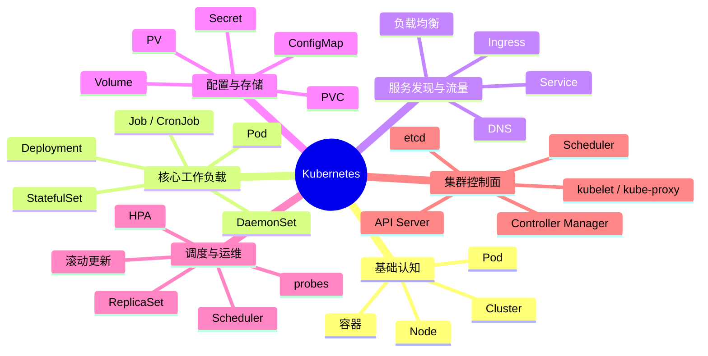

# Kubernetes（K8s）知识文档

## 1. 知识点简介

Kubernetes，简称 `K8s`，你可以先把它理解成一个“容器编排平台”。

如果你只有一个容器，用 `docker run` 就够了；但当你的系统里有很多服务，比如：

- 用户服务
- 订单服务
- 支付服务
- 网关服务
- 数据库
- 缓存

这时候你会遇到很多问题：

- 这些容器应该跑在哪台机器上
- 某个服务挂了谁来拉起
- 怎么扩容
- 怎么做服务间访问
- 怎么滚动发布新版本
- 怎么做配置管理和密钥管理

K8s 就是专门解决这些问题的。

它本质上不是“运行容器”的工具，而是“管理大量容器化应用”的系统。更准确地说，它管理的核心对象不是单个容器，而是“一组应用实例及其生命周期”。

通常你会在这些场景里遇到 K8s：

- 微服务系统部署
- 高可用服务管理
- 自动扩缩容
- 灰度发布 / 滚动更新
- 云原生基础设施

## 2. 脑图



## 3. 相关知识点的关系

### 前置依赖

学习 K8s 前，最好先有这些基础：

- `Docker / 容器基础`
- `Linux 基础`
- `网络基础`
- `YAML 基础`

因为 K8s 的很多配置都是 YAML，底层运行依赖容器，服务通信又离不开网络。

### 包含关系

- `Cluster` 包含多个 `Node`
- `Node` 上运行多个 `Pod`
- `Pod` 里通常包含一个或多个容器
- `Deployment` 管理 Pod 的副本和更新策略
- `Service` 为一组 Pod 提供稳定访问入口

### 实现关系

- 你想“部署一个无状态服务”，通常用 `Deployment`
- 你想“让 Pod 稳定暴露出去”，通常配 `Service`
- 你想“从集群外访问 HTTP 服务”，通常再加 `Ingress`
- 你想“保存配置”，用 `ConfigMap`
- 你想“保存敏感信息”，用 `Secret`
- 你想“持久化数据”，用 `PV/PVC`

### 并列概念

这些工作负载对象是并列的，但用途不同：

- `Deployment`：无状态应用
- `StatefulSet`：有状态应用
- `DaemonSet`：每台机器跑一个
- `Job/CronJob`：一次性任务 / 定时任务

### 常见混淆点

- `Pod` 和 `Container`：容器是运行单元，Pod 是 K8s 调度单元
- `Deployment` 和 `Pod`：Pod 是实例，Deployment 是管理器
- `Service` 和 `Ingress`：Service 解决集群内访问，Ingress 更偏集群外 HTTP 入口
- `ConfigMap` 和 `Secret`：都能存配置，但 Secret 用于敏感信息
- `PV` 和 `PVC`：PV 是实际存储资源，PVC 是存储申请单

### 学习路径建议

比较顺的顺序是：

1. 容器 -> Pod -> Node -> Cluster
2. Deployment -> Service -> Ingress
3. ConfigMap / Secret
4. Volume / PV / PVC
5. 健康检查、滚动更新、扩缩容
6. 控制面原理

## 4. 详细介绍每个知识点

### 4.1 Pod

**它是什么**

Pod 是 K8s 里最小的部署单元。

**它解决什么问题**

K8s 不直接调度单个容器，而是调度 Pod。这样可以把强关联的容器放在一起运行。

**核心机制 / 核心用法**

- 一个 Pod 里通常一个主容器
- 也可以多个容器共享网络和存储
- Pod 有自己的 IP，但这个 IP 不稳定

最小示例：

```yaml
apiVersion: v1
kind: Pod
metadata:
  name: nginx-pod
spec:
  containers:
    - name: nginx
      image: nginx:1.27
      ports:
        - containerPort: 80
```

**注意事项**

- 不要手工长期维护裸 Pod
- 真实项目里通常用 `Deployment` 来管理 Pod

### 4.2 Deployment

**它是什么**

Deployment 是管理无状态应用的常用对象。

**它解决什么问题**

当 Pod 挂掉、扩容、升级时，Deployment 帮你自动维护期望状态。

**核心机制 / 核心用法**

- 指定副本数
- 维护 Pod 副本
- 支持滚动更新
- 支持回滚

示例：

```yaml
apiVersion: apps/v1
kind: Deployment
metadata:
  name: web-deploy
spec:
  replicas: 3
  selector:
    matchLabels:
      app: web
  template:
    metadata:
      labels:
        app: web
    spec:
      containers:
        - name: nginx
          image: nginx:1.27
          ports:
            - containerPort: 80
```

**注意事项**

- `selector` 和 `template.labels` 必须对应
- Deployment 适合无状态应用，不适合数据库这类强状态服务

### 4.3 Service

**它是什么**

Service 是一层稳定访问入口。

**它解决什么问题**

Pod 会重建，IP 会变。Service 给一组 Pod 提供稳定地址和负载均衡。

**核心机制 / 核心用法**

- 通过 label 选择 Pod
- 提供稳定虚拟 IP
- 自动做流量分发

示例：

```yaml
apiVersion: v1
kind: Service
metadata:
  name: web-svc
spec:
  selector:
    app: web
  ports:
    - port: 80
      targetPort: 80
```

**注意事项**

- Service 不创建 Pod，它只是把流量转发给匹配到的 Pod
- 核心在于 `selector`

### 4.4 Ingress

**它是什么**

Ingress 是 HTTP/HTTPS 入口规则。

**它解决什么问题**

如果多个服务都要从外部访问，不能每个服务都随便暴露端口。Ingress 统一管理域名和路由。

**核心机制 / 核心用法**

- 基于域名或路径转发
- 通常用于 Web 服务
- 需要 Ingress Controller 才能真正工作

**注意事项**

- 只写 Ingress 规则不够，还要有 Ingress Controller
- 它更像“流量入口层”

### 4.5 ConfigMap 和 Secret

**它们是什么**

- `ConfigMap`：普通配置
- `Secret`：敏感配置

**它们解决什么问题**

把配置从镜像里拆出来，避免每次改配置都重打镜像。

**核心机制 / 核心用法**

- 通过环境变量注入
- 通过文件挂载到容器里

ConfigMap 示例：

```yaml
apiVersion: v1
kind: ConfigMap
metadata:
  name: app-config
data:
  APP_ENV: production
  APP_NAME: weather-app
```

**注意事项**

- Secret 默认只是 base64 编码，不等于真正加密
- 敏感数据还要结合权限和加密方案

### 4.6 Volume / PV / PVC

**它们是什么**

- `Volume`：Pod 内部挂载卷
- `PV`：集群里的存储资源
- `PVC`：对存储资源的申请

**它们解决什么问题**

容器是易失的，Pod 重建后本地数据可能没了。持久化存储解决数据保留问题。

**核心机制 / 核心用法**

- 数据库、上传文件、日志等都可能需要持久化
- 应用通常声明 PVC，不直接绑定底层磁盘细节

**注意事项**

- 有状态应用通常要重点理解这一块
- 不同云厂商的存储类实现不同

### 4.7 Probe

**它是什么**

Probe 是健康检查机制。

**它解决什么问题**

K8s 要知道容器是否“活着”、是否“准备好接流量”。

**核心机制 / 核心用法**

- `livenessProbe`：活着没
- `readinessProbe`：能接流量没
- `startupProbe`：启动阶段是否正常

**注意事项**

- 健康检查配错，会导致服务反复重启或一直不接流量
- 这是线上稳定性很关键的一环

### 4.8 HPA

**它是什么**

HPA 是水平自动扩缩容。

**它解决什么问题**

流量大了自动扩，流量小了自动缩。

**核心机制 / 核心用法**

- 通常基于 CPU / Memory
- 也可以结合自定义指标

**注意事项**

- 自动扩容不是万能的
- 如果应用本身有状态或初始化很慢，扩容效果未必理想

### 4.9 API Server、Scheduler、Controller Manager、etcd

**它们是什么**

这是 K8s 控制面的核心组件。

**它们解决什么问题**

负责接收指令、保存状态、调度 Pod、维持期望状态。

**核心机制 / 核心用法**

- `API Server`：所有请求入口
- `etcd`：存储集群状态
- `Scheduler`：决定 Pod 放在哪个 Node
- `Controller Manager`：不断把“当前状态”拉回“期望状态”

**注意事项**

- 学习早期不用死抠源码
- 先理解“声明式系统 + 控制循环”的思想更重要

## 5. 实际案例讲解

### 场景背景

你现在有一个简单 Web 服务，提供天气查询页面。希望达到这些目标：

- 运行 3 个副本，避免单点故障
- 集群内部能稳定访问
- 外部用户能通过域名访问
- 配置和代码分离
- 后续支持滚动更新

### 目标

把一个简单的 Nginx Web 应用部署到 K8s 中。

### 步骤拆解

1. 先写一个 `Deployment`
   - 用来声明跑 3 个 Nginx Pod
   - 如果某个 Pod 挂了，K8s 自动补齐
2. 再写一个 `Service`
   - 给这 3 个 Pod 一个稳定访问入口
   - 集群内部别的服务可以用 Service 名访问它
3. 如果需要公网访问，再加 `Ingress`
   - 比如访问 `weather.example.com`
   - 把流量转到这个 Service
4. 如果应用有配置项，再加 `ConfigMap`
   - 例如运行环境、接口地址等
5. 更新版本时改 Deployment 镜像
   - K8s 会滚动替换旧 Pod
   - 保证不中断服务

### 案例里对应的知识点

- `Pod`：真实运行的 Nginx 实例
- `Deployment`：负责维护副本和升级
- `Service`：负责稳定访问
- `Ingress`：负责外部入口
- `ConfigMap`：负责配置管理
- `Probe`：保证只有健康实例才接流量

### 最终结果

你得到的不是“一个手工启动的容器”，而是一套可恢复、可扩容、可更新、可暴露访问的应用运行方案。

这就是 K8s 和单纯 Docker 最大的差异：

- Docker 更像“启动一个容器”
- K8s 更像“持续管理一个应用系统”

## 6. Demo 指导

这里给你一个最小 demo：在本地 K8s 环境部署一个 Nginx 服务。

### 前置准备

你至少准备一个本地 K8s 环境，三选一即可：

- `minikube`
- `kind`
- `Docker Desktop` 自带 Kubernetes

并确认命令可用：

```bash
kubectl version --client
kubectl get nodes
```

### 第 1 步：创建目录

```bash
mkdir k8s-demo
cd k8s-demo
```

### 第 2 步：创建 `deployment.yaml`

```yaml
apiVersion: apps/v1
kind: Deployment
metadata:
  name: web-deploy
spec:
  replicas: 2
  selector:
    matchLabels:
      app: web
  template:
    metadata:
      labels:
        app: web
    spec:
      containers:
        - name: nginx
          image: nginx:1.27
          ports:
            - containerPort: 80
```

### 第 3 步：创建 `service.yaml`

```yaml
apiVersion: v1
kind: Service
metadata:
  name: web-svc
spec:
  selector:
    app: web
  ports:
    - port: 80
      targetPort: 80
  type: NodePort
```

### 第 4 步：应用配置

```bash
kubectl apply -f deployment.yaml
kubectl apply -f service.yaml
```

### 第 5 步：查看资源

```bash
kubectl get pods
kubectl get deployments
kubectl get svc
```

你应该能看到：

- 一个 `Deployment`
- 两个 Pod 副本
- 一个 `Service`

### 第 6 步：查看 Pod 详情

```bash
kubectl describe pod <pod-name>
```

这一步可以帮助你理解：

- Pod 跑在哪个 Node
- 镜像是什么
- 端口是什么
- 事件日志是什么

### 第 7 步：验证访问

如果你用的是 `minikube`：

```bash
minikube service web-svc
```

如果你用的是其他环境，就查看 `NodePort` 后自行访问对应地址。

### 第 8 步：做一次扩容

把副本从 2 改到 4：

```bash
kubectl scale deployment web-deploy --replicas=4
kubectl get pods
```

你会看到 Pod 数量增加。

### 第 9 步：做一次滚动更新

更新镜像版本：

```bash
kubectl set image deployment/web-deploy nginx=nginx:1.27.1
kubectl rollout status deployment/web-deploy
```

你会看到 K8s 逐步替换旧 Pod。

### 验证方式

你可以通过这些命令验证整个流程走通了：

```bash
kubectl get all
kubectl get pods -o wide
kubectl rollout history deployment web-deploy
```

### 你完成后应该看到什么

完成后你应该建立这几个关键认知：

- K8s 不是直接管单个容器，而是管 Pod 和更高层对象
- Deployment 负责维护副本和升级
- Service 负责稳定访问
- 扩容和更新不需要手工一个个重启容器
- K8s 的核心思想是“声明你想要什么状态，然后系统自动帮你维持”
