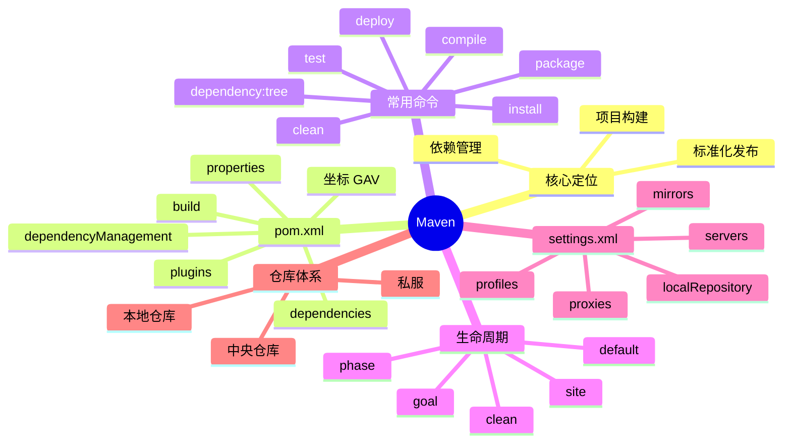

# Maven 知识文档

## 1. 知识点简介

`Maven` 是 Java 生态里最常见的项目构建和依赖管理工具之一。

如果用一句白话来理解：

> Maven 负责帮你把 Java 项目的“依赖下载、编译、测试、打包、发布”这些重复工作标准化。

它通常出现在这些场景里：

- 你需要管理很多第三方依赖，比如 `spring-boot-starter-web`、`mysql-connector-j`
- 你想把“编译 -> 测试 -> 打包”变成一套固定命令
- 你希望团队里每个人用同样的方式构建项目
- 你要把产物发布到公司私服或中央仓库

学习 Maven 时，最核心的四个抓手是：

- `pom.xml`：描述这个项目是什么、依赖什么、怎么构建
- 命令：告诉 Maven 现在要做什么
- 生命周期：规定一套标准构建流程
- `settings.xml`：配置 Maven 自己的行为，比如镜像、仓库、认证信息

## 2. 脑图



## 3. 相关知识点的关系

`Maven` 的学习顺序很适合按“配置文件 -> 执行命令 -> 理解流程 -> 理解环境配置”来走。

- 前置依赖：先知道 Maven 是做构建和依赖管理的，再看 `pom.xml` 才容易理解每个字段为什么存在
- 包含关系：`pom.xml` 是项目级配置，`settings.xml` 是 Maven 工具级配置；前者描述“这个项目怎么构建”，后者描述“Maven 去哪下载依赖、用什么账号、走什么镜像”
- 实现关系：命令本质上是在触发生命周期阶段，例如 `mvn package` 会一路执行到 `package` 阶段
- 包含关系：生命周期由多个 `phase` 组成，`phase` 底层又会绑定一个或多个 `goal`
- 并列概念：依赖管理和插件管理都在 `pom.xml` 中配置，但依赖解决“项目要用什么库”，插件解决“构建过程要做什么动作”
- 常见混淆点：很多人会把 `install` 和 `deploy` 混在一起；`install` 是安装到本地仓库，`deploy` 是发布到远程仓库
- 常见混淆点：很多人以为 `settings.xml` 可以代替 `pom.xml`，其实不行；`settings.xml` 更像是当前机器上的 Maven 运行环境配置

如果把 Maven 当成一条流水线来理解，会更直观：

```text
settings.xml 决定 Maven 去哪拿材料
pom.xml 决定这个项目要加工什么、按什么规则加工
mvn 命令 触发具体动作
生命周期 决定动作执行顺序
最终得到 jar/war 等构建产物
```

## 4. 详细介绍每个知识点

### 4.1 Maven 是什么

#### 它是什么

Maven 是一个基于约定优于配置思想的构建工具。它约定了标准目录结构、构建流程和依赖坐标格式。

典型目录结构通常长这样：

```text
demo-project/
├── pom.xml
└── src/
    ├── main/
    │   ├── java/
    │   └── resources/
    └── test/
        ├── java/
        └── resources/
```

#### 它解决什么问题

- 不再手动下载一堆 jar 包到项目里
- 不再靠人记“先编译、再测试、再打包”的步骤
- 不同项目可以复用同一套构建习惯
- 更容易接入 CI/CD、制品库、私服

#### 核心机制 / 核心用法

Maven 的核心机制可以记成三件事：

1. 通过 GAV 坐标定位依赖
2. 通过生命周期定义构建顺序
3. 通过插件真正执行编译、测试、打包等动作

其中 GAV 指的是：

- `groupId`：组织或公司
- `artifactId`：项目名或模块名
- `version`：版本号

#### 注意事项

- Maven 不是只会“下依赖”，它更完整的定位是“项目构建管理工具”
- Java 初学者常把 Maven 和 JDK 混在一起；JDK 是运行和编译 Java 的环境，Maven 是构建管理工具

### 4.2 `pom.xml`

#### 它是什么

`pom.xml` 的全称是 Project Object Model，它是 Maven 项目的核心配置文件。

你可以把它理解成：

> 这个项目的说明书 + 依赖清单 + 构建规则。

#### 它解决什么问题

- 标识项目是谁
- 声明项目依赖什么库
- 定义编译参数，比如 Java 版本
- 控制打包方式和插件行为

#### 核心结构

一个最小的 `pom.xml` 示例：

```xml
<project xmlns="http://maven.apache.org/POM/4.0.0"
         xmlns:xsi="http://www.w3.org/2001/XMLSchema-instance"
         xsi:schemaLocation="http://maven.apache.org/POM/4.0.0
         https://maven.apache.org/xsd/maven-4.0.0.xsd">
  <modelVersion>4.0.0</modelVersion>

  <groupId>com.example</groupId>
  <artifactId>demo-project</artifactId>
  <version>1.0.0-SNAPSHOT</version>
  <packaging>jar</packaging>

  <properties>
    <maven.compiler.source>17</maven.compiler.source>
    <maven.compiler.target>17</maven.compiler.target>
    <project.build.sourceEncoding>UTF-8</project.build.sourceEncoding>
  </properties>

  <dependencies>
    <dependency>
      <groupId>org.junit.jupiter</groupId>
      <artifactId>junit-jupiter</artifactId>
      <version>5.10.2</version>
      <scope>test</scope>
    </dependency>
  </dependencies>
</project>
```

常见字段解释：

- `modelVersion`：POM 模型版本，几乎都写 `4.0.0`
- `groupId` / `artifactId` / `version`：项目坐标
- `packaging`：打包类型，常见有 `jar`、`war`
- `properties`：统一管理变量，常用来放 Java 版本和依赖版本
- `dependencies`：依赖列表
- `build`：构建相关配置
- `plugins`：构建插件

#### 依赖相关重点

`dependencies` 里每个依赖都可以带 `scope`，常见作用域如下：

- `compile`：默认值，编译和运行都需要
- `provided`：编译需要，但运行环境会提供，比如 Servlet 容器
- `runtime`：运行需要，编译时不强依赖
- `test`：只在测试阶段使用

依赖冲突也是 Maven 高频问题。Maven 默认会按“最近路径优先”来选择版本，所以看依赖问题时常用：

```bash
mvn dependency:tree
```

#### 插件相关重点

Maven 真正执行构建动作，靠的是插件，例如：

- `maven-compiler-plugin`：编译 Java 代码
- `maven-surefire-plugin`：执行单元测试
- `maven-jar-plugin`：打包 jar
- `spring-boot-maven-plugin`：Spring Boot 打包和运行

一个常见插件配置示例：

```xml
<build>
  <plugins>
    <plugin>
      <groupId>org.apache.maven.plugins</groupId>
      <artifactId>maven-compiler-plugin</artifactId>
      <version>3.11.0</version>
      <configuration>
        <source>17</source>
        <target>17</target>
      </configuration>
    </plugin>
  </plugins>
</build>
```

#### 进阶但很常见的几个块

- `parent`：继承父 POM，常见于 Spring Boot 项目
- `dependencyManagement`：统一管理依赖版本，常见于多模块项目
- `modules`：定义聚合工程
- `profiles`：按环境切换配置

#### 注意事项

- `dependencyManagement` 不会自动引入依赖，它只是“统一版本”，真正使用时还要在 `dependencies` 里声明
- 插件版本最好显式指定，避免环境差异导致行为不一致
- `SNAPSHOT` 表示开发中版本，发布正式版本时一般用稳定版本号

### 4.3 Maven 常用命令

#### 它是什么

Maven 命令的基本格式通常是：

```bash
mvn <phase>
```

或：

```bash
mvn <plugin>:<goal>
```

#### 它解决什么问题

通过统一命令，让团队每个人都按同样的方式构建项目。

#### 常用命令速查

查看版本：

```bash
mvn -v
```

清理旧产物：

```bash
mvn clean
```

编译主代码：

```bash
mvn compile
```

运行测试：

```bash
mvn test
```

打包：

```bash
mvn package
```

安装到本地仓库：

```bash
mvn install
```

发布到远程仓库：

```bash
mvn deploy
```

查看依赖树：

```bash
mvn dependency:tree
```

跳过测试打包：

```bash
mvn clean package -DskipTests
```

指定 `settings.xml`：

```bash
mvn clean package -s /path/to/settings.xml
```

激活某个 profile：

```bash
mvn clean package -Pprod
```

#### 注意事项

- `-DskipTests` 是跳过测试执行，但测试代码仍可能参与编译
- 如果想连测试编译也跳过，很多场景会看到 `-Dmaven.test.skip=true`
- `dependency:tree` 这种命令不是生命周期阶段，而是插件 goal

### 4.4 生命周期、Phase 和 Goal

#### 它是什么

生命周期是 Maven 预定义好的一套构建流程。你可以把它理解成流水线模板。

Maven 主要有 3 套生命周期：

- `clean`
- `default`
- `site`

最常用的是 `clean` 和 `default`。

#### 它解决什么问题

让“编译、测试、打包、安装、发布”这套动作有标准顺序，而不是每个项目各自定义。

#### 核心机制 / 核心用法

最常见的 `default` 生命周期里，有这些高频阶段：

- `validate`：校验项目是否正确
- `compile`：编译主代码
- `test`：执行测试
- `package`：打包
- `verify`：做进一步检查
- `install`：安装到本地仓库
- `deploy`：发布到远程仓库

关键理解：

> 当你执行 `mvn package` 时，Maven 不只是执行 `package`，而是会把它前面的阶段也按顺序执行完。

例如：

```text
mvn package
=> validate -> compile -> test -> package
```

再例如：

```text
mvn install
=> validate -> compile -> test -> package -> install
```

`goal` 可以理解成插件暴露出来的具体动作，而 `phase` 是生命周期里的阶段。通常是“某个 phase 绑定了某些插件的 goal”。

#### 注意事项

- `clean` 生命周期和 `default` 生命周期是两条不同链路，所以常见写法是 `mvn clean package`
- 不是每个项目都需要执行 `deploy`，只有要发布制品时才需要
- 面试或排障时，分清 `phase` 和 `goal` 很重要

### 4.5 `settings.xml`

#### 它是什么

`settings.xml` 是 Maven 的全局或用户级配置文件，不是某个项目专属。

常见位置：

- Maven 安装目录下：`MAVEN_HOME/conf/settings.xml`
- 用户目录下：`~/.m2/settings.xml`

通常用户目录下的配置优先级更高，也更常改。

#### 它解决什么问题

- 指定本地仓库放哪里
- 配置镜像，加速下载依赖
- 配置私服地址和认证信息
- 配置代理
- 配置 profile

#### 一个常见示例

```xml
<settings xmlns="http://maven.apache.org/SETTINGS/1.0.0"
          xmlns:xsi="http://www.w3.org/2001/XMLSchema-instance"
          xsi:schemaLocation="http://maven.apache.org/SETTINGS/1.0.0
          https://maven.apache.org/xsd/settings-1.0.0.xsd">

  <localRepository>/Users/zyb/.m2/repository</localRepository>

  <mirrors>
    <mirror>
      <id>aliyunmaven</id>
      <mirrorOf>central</mirrorOf>
      <name>aliyun maven</name>
      <url>https://maven.aliyun.com/repository/public</url>
    </mirror>
  </mirrors>

  <servers>
    <server>
      <id>company-nexus</id>
      <username>your_username</username>
      <password>your_password</password>
    </server>
  </servers>

  <profiles>
    <profile>
      <id>jdk-17</id>
      <properties>
        <maven.compiler.source>17</maven.compiler.source>
        <maven.compiler.target>17</maven.compiler.target>
      </properties>
    </profile>
  </profiles>

  <activeProfiles>
    <activeProfile>jdk-17</activeProfile>
  </activeProfiles>
</settings>
```

#### 常见配置块解释

- `localRepository`：本地仓库路径，默认一般在 `~/.m2/repository`
- `mirrors`：镜像源配置，常用于加速下载
- `servers`：远程仓库认证信息，常和 `deploy` 配合
- `profiles`：环境化配置
- `proxies`：网络代理配置

#### 注意事项

- `settings.xml` 里经常会放账号密码，真实项目里不要把敏感信息随便提交到代码仓库
- `server.id` 要和 `pom.xml` 里仓库配置的 `id` 对应，否则认证不会生效
- 镜像是“下载代理”，不是“仓库定义”的完全替代，概念上要区分开

### 4.6 Maven 仓库机制

#### 它是什么

Maven 下载依赖时，一般会经过三层仓库体系：

1. 本地仓库
2. 公司私服
3. 远程公共仓库，比如 Maven Central

#### 它解决什么问题

- 避免每次都从公网重复下载
- 团队共享内部依赖和构建产物
- 统一依赖来源和版本策略

#### 核心机制 / 核心用法

大多数请求路径可以粗略理解成：

```text
先查本地仓库
没有则查镜像/私服
还没有再去远程仓库下载
下载后缓存到本地仓库
```

#### 注意事项

- 排查依赖下载失败时，不只看 `pom.xml`，还要看 `settings.xml`
- 本地仓库缓存损坏时，可能需要删除局部目录后重新拉取

## 5. 实际案例讲解

### 场景背景

你要新建一个 Java 小项目，对外提供一个简单工具方法，并且希望：

- 用 Maven 管理依赖
- 可以本地执行测试
- 可以最终打成 jar 包

### 目标

把一个最小 Maven 项目从“空目录”跑到“成功打包”。

### 步骤拆解

第一步，创建项目并写 `pom.xml`。

在 `pom.xml` 里先声明项目坐标和 JUnit 测试依赖，再配置 Java 版本。

第二步，把代码放到 Maven 约定目录里。

- 主代码放 `src/main/java`
- 测试代码放 `src/test/java`

第三步，执行命令：

```bash
mvn test
```

这一步会：

- 解析 `pom.xml`
- 下载依赖到本地仓库
- 编译主代码和测试代码
- 执行测试

第四步，执行：

```bash
mvn package
```

这一步会继续生成 `target/xxx.jar`。

第五步，如果你本地还想让其他项目依赖这个包，可以执行：

```bash
mvn install
```

这样 jar 会被安装到本地仓库。

### 案例里对应的知识点

- `pom.xml`：定义项目坐标、依赖和 Java 版本
- 生命周期：`test`、`package`、`install` 对应不同构建阶段
- 命令：通过 `mvn xxx` 触发阶段执行
- `settings.xml`：如果下载慢或要走私服，会影响依赖获取过程
- 仓库机制：依赖和构建产物会和本地仓库发生交互

### 最终结果

你会得到：

- 一个结构标准的 Maven 项目
- 一个可执行测试流程
- 一个打包后的 jar 文件
- 对 Maven “配置 + 命令 + 生命周期 + 仓库”协作方式的整体理解

## 6. Demo 指导

### 前置准备

先确认本机有：

- JDK 17 或以上
- Maven 3.8+ 或 3.9+

验证命令：

```bash
java -version
mvn -v
```

### 第 1 步：创建目录结构

```bash
mkdir -p hello-maven/src/main/java/com/example
mkdir -p hello-maven/src/test/java/com/example
cd hello-maven
```

### 第 2 步：创建 `pom.xml`

```xml
<project xmlns="http://maven.apache.org/POM/4.0.0"
         xmlns:xsi="http://www.w3.org/2001/XMLSchema-instance"
         xsi:schemaLocation="http://maven.apache.org/POM/4.0.0
         https://maven.apache.org/xsd/maven-4.0.0.xsd">
  <modelVersion>4.0.0</modelVersion>

  <groupId>com.example</groupId>
  <artifactId>hello-maven</artifactId>
  <version>1.0.0-SNAPSHOT</version>

  <properties>
    <maven.compiler.source>17</maven.compiler.source>
    <maven.compiler.target>17</maven.compiler.target>
    <project.build.sourceEncoding>UTF-8</project.build.sourceEncoding>
    <junit.version>5.10.2</junit.version>
  </properties>

  <dependencies>
    <dependency>
      <groupId>org.junit.jupiter</groupId>
      <artifactId>junit-jupiter</artifactId>
      <version>${junit.version}</version>
      <scope>test</scope>
    </dependency>
  </dependencies>

  <build>
    <plugins>
      <plugin>
        <groupId>org.apache.maven.plugins</groupId>
        <artifactId>maven-surefire-plugin</artifactId>
        <version>3.2.5</version>
      </plugin>
    </plugins>
  </build>
</project>
```

### 第 3 步：写主代码

创建 `src/main/java/com/example/App.java`：

```java
package com.example;

public class App {
    public static int add(int a, int b) {
        return a + b;
    }
}
```

### 第 4 步：写测试代码

创建 `src/test/java/com/example/AppTest.java`：

```java
package com.example;

import org.junit.jupiter.api.Test;

import static org.junit.jupiter.api.Assertions.assertEquals;

class AppTest {
    @Test
    void shouldAddTwoNumbers() {
        assertEquals(5, App.add(2, 3));
    }
}
```

### 第 5 步：执行构建命令

先跑测试：

```bash
mvn test
```

再打包：

```bash
mvn package
```

如果你想看依赖树：

```bash
mvn dependency:tree
```

### 第 6 步：可选配置 `settings.xml`

如果你下载依赖比较慢，可以在 `~/.m2/settings.xml` 中配置镜像，例如：

```xml
<settings>
  <mirrors>
    <mirror>
      <id>aliyunmaven</id>
      <mirrorOf>central</mirrorOf>
      <name>aliyun maven</name>
      <url>https://maven.aliyun.com/repository/public</url>
    </mirror>
  </mirrors>
</settings>
```

### 验证方式

你完成后，检查这几个结果：

- 执行 `mvn test` 时测试通过
- 执行 `mvn package` 后生成 `target/hello-maven-1.0.0-SNAPSHOT.jar`
- 执行 `mvn dependency:tree` 时能看到 JUnit 依赖树
- 本地仓库 `~/.m2/repository` 里出现下载后的依赖缓存

### 你完成后应该看到什么

你应该已经能回答这些问题：

- `pom.xml` 是做什么的
- `mvn package` 为什么会顺带执行前面的阶段
- `install` 和 `deploy` 的区别是什么
- `settings.xml` 为什么不应该和项目配置混为一谈

如果这些问题你都能说清楚，说明你已经把 Maven 入门主干串起来了。
